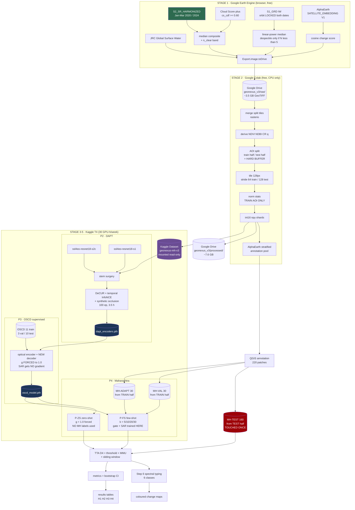
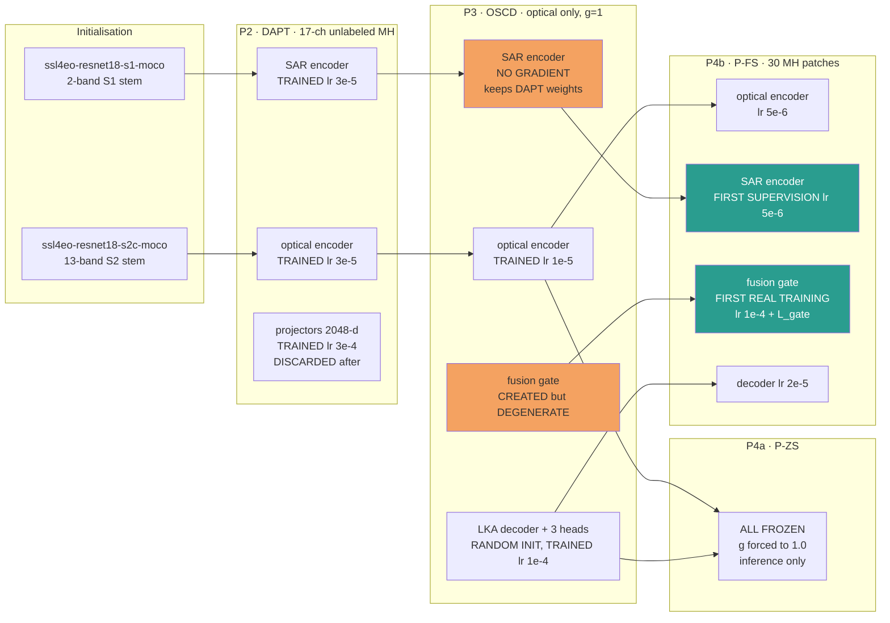
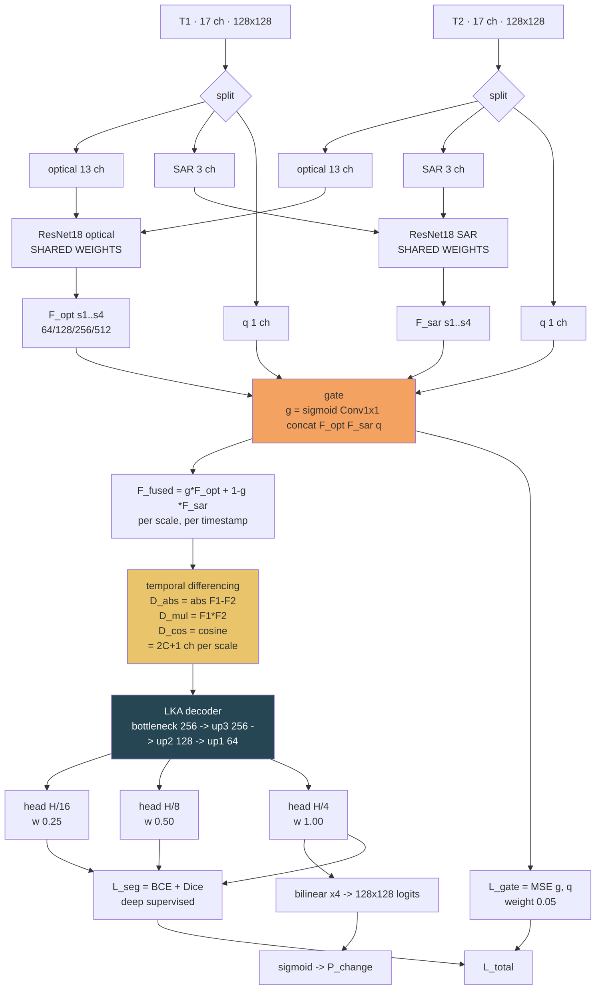
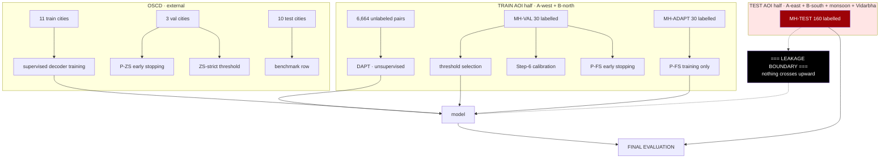
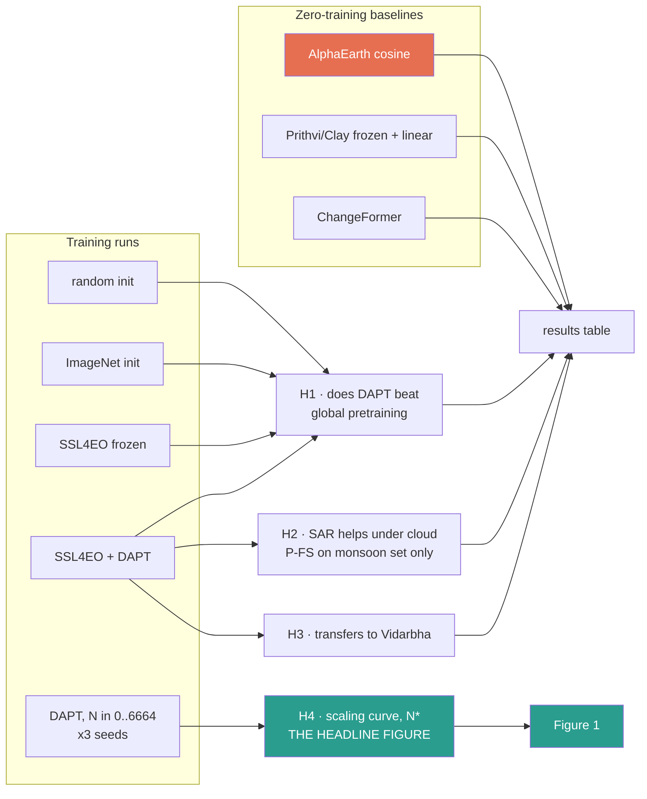

# FINAL ARCHITECTURE v3 — "Geo-Nexus"
## Multi-Modal Change Detection for Maharashtra, India
### Codename: **MH-DAPT-CD** (Maharashtra Domain-Adaptive Pretraining for Change Detection)

> **Supersedes:** `FINAL_ARCH_2.md` (frozen 2026-09-13)
> **Date:** 2026-09-16 | **Revised:** v3.1
>
> **v3.1 AMENDMENT NOTICE.** Ten implementation questions were raised against v3.0.
> Three exposed genuine errors, which are corrected in place below:
>   * **A1** — v3.0 defined all 160 annotated patches as *test* data and then told P4 to
>     "fine-tune on 160 annotated". There was no Maharashtra train or validation split.
>     **Fixed:** see Part 13 Q1/Q2 and the revised AOI budget in §3.5.
>   * **A2** — the OSCD split was stated as "14 train / 5 val / 5 test". The real OSCD
>     split is **14 train / 10 test**. **Fixed** in §6.3 and Part 13 Q4.
>   * **A3** — Step 6 said "6 classes" while the annotation vocabulary had 7 types.
>     Those are two different things. **Fixed** with an explicit mapping in Part 13 Q5.
>
> **Parts 13–20 are new** and contain the full answers, the end-to-end Mermaid flow,
> and every piece of runnable code: GEE export, Colab preprocessing on Drive,
> Drive→Kaggle transfer, model definitions, DAPT, fine-tuning and evaluation.
> **Status:** v2 must NOT be built as written. Six defects below are blocking.
> **Verdict on v2:** the engineering discipline is good, the honesty about novelty is
> good, and most of the review responses were correct. But v2 contains one
> project-killing data bug, one geometric impossibility, and one internal
> contradiction that silently deletes a third of the paper's contribution.

---

# PART 0 — EXECUTIVE SUMMARY

## 0.1 The six blocking defects in v2

| # | Defect | Severity | Consequence if not fixed |
|---|--------|----------|--------------------------|
| **D1** | Sentinel-2 collection not pinned to `HARMONIZED` | **FATAL** | Every forest and crop pixel in Zone B is labelled "vegetation loss". Results are garbage but *look plausible*. |
| **D2** | 5,000 non-overlapping 256×256 pairs cannot exist in 2×0.5° AOIs | **FATAL** | Maximum is 840 pairs; 420 after the train/test split. SSL corpus is 12× smaller than planned. |
| **D3** | Cloud gate trained on cloud-free median composites | **SEVERE** | Gate collapses to a constant. Contribution #2 and hypothesis H2 become untestable. Ablation 5 returns null. |
| **D4** | Storage arithmetic wrong: 22.3 GB, not 11 GB | **SEVERE** | Exceeds Kaggle's 20 GB working disk. Session dies mid-training. |
| **D5** | Lee 5×5 speckle filter applied to a 10–23 image median | **MODERATE** | Destroys the 1–3 px roads the multi-scale design exists to detect. |
| **D6** | SSL from scratch on ~5K patches, in 2026 | **STRATEGIC** | Will lose to a 5-minute foundation-model baseline a reviewer can run. |

## 0.2 The six upgrades

| # | Change | Why |
|---|--------|-----|
| **U1** | Initialise both encoders from **SSL4EO-S12** weights, then do **domain-adaptive continued pretraining (DAPT)** on Maharashtra | Keeps the research question, but starts from 1M globally-pretrained images instead of zero |
| **U2** | Replace cross-modal Barlow Twins with **DeCUR** (common + unique dimension split) | Plain cross-modal BT forces *all* dimensions to agree, which destroys exactly the SAR-unique cloud-penetration signal H2 depends on |
| **U3** | Quality signal = **clear-observation count** `n_clear`, not a binary cloud mask | With median composites, "is this a cloud?" is meaningless. "How many clear looks did this pixel get?" is the real per-pixel uncertainty, and it *does* vary spatially |
| **U4** | Add **AlphaEarth / Satellite Embedding** as (a) mandatory baseline, (b) active-sampling tool for annotation | A 2026 reviewer will ask "why not just use AlphaEarth?" You need an answer with numbers |
| **U5** | **128×128 patches, 50% overlap inside the SSL AOI only** | Resolves D2 and D4 simultaneously: 6,800 pairs at 7.6 GB |
| **U6** | Add **Zone C (Vidarbha)** as a never-trained geographic holdout | Currently you train and test in the same two zones. That is not evidence of geographic generalisation |

## 0.3 What survives from v2 unchanged

Keep these — they were right:

- Two-branch modality-specific encoders (not early channel concat)
- Multi-scale temporal differencing with `|F1−F2|` and `F1⊙F2`
- AOI-level spatial split before patching
- Binary network + physics-based spectral change typing (Step 6)
- TTA / learned threshold / MMU post-processing stack
- BCE + Dice default, Focal Tversky as ablation
- The honesty section (§2 of v2). Do not re-inflate the novelty claims.
- Conv+LKA fallback decoder if Mamba won't compile

---

# PART 1 — THE BLOCKING DEFECTS, IN DETAIL

## D1 — The harmonization bug (fix this before anything else)

### What is wrong

ESA's Sentinel-2 **Processing Baseline 04.00**, operational from **25 January 2022**,
shifted the L2A reflectance dynamic range by a band-dependent offset
(`BOA_ADD_OFFSET`, nominally **−1000 DN**) so that dark-surface negative values
would not be clipped during quantisation.

Your temporal pairs straddle that boundary exactly:

```
T1 = Jan–Mar 2020   ->  Processing Baseline < 04.00   ->  no offset
T2 = Jan–Mar 2024   ->  Processing Baseline >= 04.00  ->  offset applied
```

If you call `ee.ImageCollection('COPERNICUS/S2_SR')`, every band of every T2 pixel
sits **+1000 DN above** its T1 counterpart for purely instrumental reasons.

### Why it is worse than a constant offset

An additive offset does not cancel in a normalised difference index. For NDVI:

```
                 (B8 + c) − (B4 + c)         B8 − B4
NDVI_biased  =  ─────────────────────  =  ───────────────
                 (B8 + c) + (B4 + c)       B8 + B4 + 2c
```

The numerator is preserved; the denominator inflates by `2c = 2000`. NDVI is
therefore **compressed toward zero**, and the compression is strongest where
NDVI is highest — i.e. over exactly the vegetation you care about.

Computed for realistic Maharashtra surface reflectances:

| Cover type | B8 | B4 | True NDVI | Biased NDVI | ΔNDVI | Step-6 rule fires? |
|---|---|---|---|---|---|---|
| Dense forest | 3000 | 400 | 0.765 | 0.481 | **−0.283** | **YES → "VEGETATION LOSS"** |
| Irrigated crop | 2800 | 600 | 0.647 | 0.407 | **−0.240** | **YES → "VEGETATION LOSS"** |
| Scrub | 1800 | 900 | 0.333 | 0.191 | −0.142 | no |
| Bare soil | 2000 | 1800 | 0.053 | 0.034 | −0.018 | no |
| Built-up | 2200 | 2000 | 0.048 | 0.032 | −0.015 | no |

Your Step-6 rule is `IF ΔNDVI < −0.20 → VEGETATION LOSS`. **Every dense-forest and
every irrigated-crop pixel in Zone B crosses that threshold from the bug alone.**
You would produce a red deforestation map of the entire Western Ghats and it would
look completely convincing.

NDBI is also shifted (forest NDBI moves +0.138, close to your +0.15 construction
threshold), and the NDVI/NDBI **input channels** to the encoder carry the same bias,
so the network learns the offset as the dominant "change" feature.

### The fix

```javascript
// WRONG
var s2 = ee.ImageCollection('COPERNICUS/S2_SR');

// RIGHT — the HARMONIZED collection back-shifts post-2022 scenes
// into the pre-04.00 range, so a single /10000 is valid for all dates
var s2 = ee.ImageCollection('COPERNICUS/S2_SR_HARMONIZED');
```

Do **not** additionally subtract 1000 — the harmonized collection has already done it.
Double-correcting is the second most common version of this bug.

### Verification gate (run this before exporting anything)

```javascript
// Sample the same pixel in both periods over a stable target
// (a rock outcrop, a large building roof, a runway).
// Mean reflectance difference must be < 0.02 in every band.
// If you see a uniform ~0.10 shift, you are on the wrong collection.
var stable = ee.Geometry.Point([73.9, 18.55]);   // replace with a real invariant target
print('T1 profile', c1.reduceRegion(ee.Reducer.mean(), stable, 10));
print('T2 profile', c2.reduceRegion(ee.Reducer.mean(), stable, 10));
```

Put this check in the repo as `data/verify_harmonization.js` and run it every time
you regenerate data. This is a pseudo-invariant-feature check — it is also a
legitimate methods-section sentence.

---

## D2 — 5,000 patches geometrically cannot exist

### The arithmetic

Your AOIs are 0.5° × 0.5°:

```
Zone A (18.30–18.80 N, 73.70–74.20 E)  =  52.8 km × 55.7 km  =  5277 × 5566 px @ 10 m
Zone B (17.50–18.00 N, 73.50–74.00 E)  =  53.0 km × 55.7 km  =  5301 × 5566 px @ 10 m
```

Non-overlapping 256×256 tiles:

```
floor(5277/256) × floor(5566/256)  =  20 × 21  =  420 per zone
                                      420 × 2  =  840 total bi-temporal pairs
```

Then §4.3 of v2 holds out half of each zone for testing:

```
SSL training corpus  ≈  420 pairs        (not 5,000)
```

**You are 12× short, and the shortfall is geometric, not a budget problem.**
No amount of GEE quota produces more non-overlapping 256-px tiles from a fixed box.

### Where v2 went wrong conceptually

v2 banned overlap globally because the reviewer flagged "50% overlap causes data
leakage". That criticism was correct **for supervised train/test splits** and wrong
as a global rule. Leakage is a property of the *evaluation boundary*, not of the
patch grid.

```
Overlap between SSL corpus and TEST AOI      ->  leakage. Forbidden.
Overlap between two patches inside SSL corpus ->  not leakage. Standard practice.
```

SeCo, SSL4EO-S12 and CACo all sample densely within their pretraining regions.
There are no labels in the SSL corpus, so there is nothing to leak.

### The fix — three levers

| Lever | Effect | Cost |
|---|---|---|
| Patch 128×128 instead of 256×256 | 4× more patches | Less context per patch (1.28 km still covers any building/road/clearing) |
| 50% overlap **inside the SSL half only** | 4× more patches | None — this is legitimate |
| Keep AOIs as they are | — | No extra GEE spend |

Yield with all three:

| Config | Pairs/zone | Total | Storage (17 ch, fp16, ×2 dates) |
|---|---|---|---|
| 256, no overlap (v2 plan) | 210 | **420** | 1.9 GB |
| 256, 50% overlap | 798 | 1,596 | 7.1 GB |
| 192, 50% overlap | 1,456 | 2,912 | 7.3 GB |
| **128, 50% overlap (recommended)** | **3,400** | **6,800** | **7.6 GB** |

**Decision: train at 128×128 with stride 64 inside the SSL AOI.
Evaluate with sliding-window inference on full tiles at native size.**

Secondary benefits of 128×128:
- 4× cheaper per forward pass → batch 64 instead of 16 on a single T4
- Matches the scale GFM encoders were pretrained at (Galileo 96 px, SSL4EO 264 px)
- At H/4 the decoder sequence is 32×32 = 1,024 tokens, which trains fast

---

## D3 — The cloud gate has nothing to learn

### The contradiction

v2 makes three decisions that are individually reasonable and jointly fatal:

1. §4.2 — "T1 = Jan–Mar 2020 **dry season median composite**"
2. §4.2 — "monsoon Oct 2023 removed, dry season only, saves GEE tokens"
3. §5 Step 2 — "cloud-aware fusion gate takes SCL cloud mask as input"
   and §8 — "H2: SAR+Optical > Optical-only on **cloudy** patches"

A **3-month median composite over the Maharashtra dry season is essentially
cloud-free by construction.** The median is precisely the operator that removes
clouds. So:

```
C(x,y)        ~ 0 everywhere
q_spatial     = AvgPool(1 − C) ~ 1.0 everywhere
G(x,y)        = sigmoid(W·[F_opt, F_sar, 1.0]) -> spatially constant
```

Consequences, all of which will actually happen:

- The gate degenerates to a learned scalar. Your "spatial" upgrade is inert.
- **Ablation 5** (spatial gate vs scalar gate vs concat) returns three identical numbers.
- **H2 is untestable** — you deleted the cloudy data it needs.
- **Contribution #2** ("cloud/quality-aware fusion using explicit SCL information")
  is unsupported by any experiment.

That is one of three stated contributions and one of three stated hypotheses, gone.

### Fix, part 1 — change the quality signal to something that actually varies

For composite-based CD the meaningful per-pixel quality measure is not
"is this a cloud" but **how many clear observations went into this pixel's median**.
That varies spatially even in a dry season — from cloud shadow, haze, cirrus,
tile-edge geometry and orbit overlap.

```javascript
// In GEE, after masking with Cloud Score+:
var nClear = maskedCollection.select('B4').count().rename('n_clear').unmask(0);
```

```python
# In preprocessing:
q = np.clip(n_clear / N_TARGET, 0.0, 1.0)     # N_TARGET = 8 clear scenes
```

Interpretation: `q = 1` means a well-observed pixel with a trustworthy median;
`q → 0` means a pixel reconstructed from one or two looks, where the optical
composite is unreliable and SAR should dominate. This is defensible, it is novel
enough to be a real contribution ("observation-density-aware fusion for
composite-based change detection"), and **it is a signal that genuinely varies.**

### Fix, part 2 — synthetic occlusion curriculum during training

Even with `n_clear`, the dynamic range in a dry season is narrow. Force the gate
to learn by simulating occlusion:

```python
import torch, torch.nn.functional as F

# Per-band cloud-top reflectance, in the order of S2_BANDS (11 RAW bands only).
# Optically thick water cloud is bright in VIS/NIR and much darker in SWIR.
# Derive empirically: sample ~200 Cloud-Score+-flagged pixels from a monsoon
# scene over your own AOI and take the per-band median. Put it in config.yaml.
CLOUD_RHO = [0.78, 0.80, 0.79, 0.76, 0.74, 0.72, 0.70, 0.69, 0.55, 0.36, 0.30]


def _cloud_alpha(B, H, W, device, max_frac=0.7):
    """Smooth [B,1,H,W] occlusion field in [0,1]: 1 = fully occluded."""
    # low-frequency noise upsampled -> blobby, cloud-like, no extra dependency
    lo    = torch.rand(B, 1, H // 16, W // 16, device=device)
    field = F.interpolate(lo, size=(H, W), mode='bicubic', align_corners=False)
    lo_v  = field.amin(dim=(2, 3), keepdim=True)
    hi_v  = field.amax(dim=(2, 3), keepdim=True)
    field = (field - lo_v) / (hi_v - lo_v + 1e-6)          # per-sample [0,1]

    # per-sample target cloud fraction -> per-sample threshold.
    # torch.quantile does NOT broadcast a per-sample q over a batch dim, so
    # take the quantile per sample via sort+index. This is the bug-prone line.
    frac   = torch.rand(B, device=device) * max_frac        # [B]
    flat   = field.view(B, -1).sort(dim=1).values           # ascending
    k      = ((1.0 - frac) * (flat.shape[1] - 1)).long()    # [B]
    thresh = flat.gather(1, k.unsqueeze(1)).view(B, 1, 1, 1)

    m      = (field > thresh).float()                       # hard cloud core
    m_soft = F.avg_pool2d(m, 9, stride=1, padding=4)        # haze halo
    return torch.clamp(m + 0.6 * m_soft, 0.0, 1.0)


def synthetic_occlusion(x_raw, p_apply=0.5, max_frac=0.7):
    """
    x_raw : [B, 11, H, W]  RAW reflectance bands ONLY (not NDVI/NDBI).
    returns (occluded raw bands, quality map q in [0,1]).

    IMPORTANT: occlude the RAW bands, then recompute NDVI/NDBI from the
    occluded bands downstream. A clouded pixel's NDVI is the CLOUD's NDVI,
    not the ground's. Occluding the index channels directly would let the
    network detect the inconsistency and shortcut the whole objective.
    """
    B, C, H, W = x_raw.shape
    assert C == 11, f'pass the 11 raw bands, got {C}'
    if torch.rand(1).item() > p_apply:
        return x_raw, torch.ones(B, 1, H, W, device=x_raw.device)

    alpha = _cloud_alpha(B, H, W, x_raw.device, max_frac)
    rho   = torch.tensor(CLOUD_RHO, device=x_raw.device).view(1, C, 1, 1)
    return (1 - alpha) * x_raw + alpha * rho, 1.0 - alpha


def rebuild_input(raw11, sar3, q):
    """Recompute derived channels AFTER occlusion -> the 17-ch model input."""
    eps  = 1e-6
    B4, B8, B11 = raw11[:, 2], raw11[:, 6], raw11[:, 9]     # S2_BANDS order
    ndvi = ((B8  - B4 ) / (B8  + B4  + eps)).unsqueeze(1)
    ndbi = ((B11 - B8 ) / (B11 + B8  + eps)).unsqueeze(1)
    return torch.cat([raw11, ndvi, ndbi, sar3, q], dim=1)   # [B, 17, H, W]
```

### Fix, part 3 — build a genuinely cloudy test set (small, cheap, decisive)

You do not need a monsoon *training* corpus. You need a monsoon *test* set to
falsify H2. This costs one extra pair of GEE exports.

```
Zone A-monsoon test:
  T1 = single-date S2 acquisition, Aug 2020, 30–70% cloud   (NOT a composite)
  T2 = single-date S2 acquisition, Aug 2024, 30–70% cloud
  S1 = nearest-date descending pass, same relative orbit
  Count: 30 annotated patches
```

Because it is single-date, real clouds are present, `q` genuinely varies, and H2
becomes a real experiment with a real answer.

### Revised H2

```
H2: On patches with mean q < 0.5, the quality-gated SAR+optical model
    achieves higher F1 than the optical-only model.

    Test:   paired comparison on the monsoon test set (n=30),
            stratified into q>0.8 / 0.4<q<=0.8 / q<=0.4
    Stat:   paired bootstrap over patches, 10,000 resamples,
            report median ΔF1 and 95% CI
    Falsified if the 95% CI for ΔF1 includes 0.
```

---

## D4 — Storage arithmetic

v2 §4.2 states: *"Storage: ~11GB (17 channels x 256 x 256 x float16 x 5000 x 2 times)"*.

Evaluate the stated formula:

```
256 × 256                 =     65,536 px
× 17 channels             =  1,114,112 values
× 2 bytes (float16)       =  2,228,224 B   =  2.23 MB   per patch per timestamp
× 2 timestamps            =  4.46 MB                    per bi-temporal pair
× 5,000 pairs             =  22.28 GB
```

**22.3 GB, not 11 GB — and Kaggle's working disk is 20 GB.** The ×2 for timestamps
was dropped somewhere in the estimate.

### Fix

The 128×128 redesign from D2 solves this on its own (**7.6 GB for 6,800 pairs**).
Three further reductions, in order of preference:

1. **Store raw, derive on GPU.** NDVI, NDBI and VH/VV are deterministic functions of
   the raw bands. Store 11 optical + 2 SAR + `n_clear` = 14 channels; compute the
   3 derived channels in the dataloader. Saves 18%, costs ~0 time.
2. **Use a mounted Kaggle Dataset, not the working disk.** Upload the preprocessed
   array as a private Kaggle Dataset; it mounts read-only at `/kaggle/input/` and
   does **not** count against the 20 GB working quota. This is the single most
   important Kaggle-specific trick for this project.
3. **int16 with an explicit scale factor** instead of float16. Same 2 bytes, but
   lossless for reflectance (`ρ × 10000`) and exactly reproducible.

Recommended layout:

```
/kaggle/input/geonexus-mh-v3/          (mounted read-only, does not consume 20 GB)
    zoneA_ssl_128.npy        int16  [N, 2, 14, 128, 128]
    zoneA_ssl_meta.parquet          patch_id, lon, lat, n_clear_mean, orbit, tile
    zoneB_ssl_128.npy
    zoneB_ssl_meta.parquet
    test_dry_full.npz               full tiles, not patched
    test_monsoon_full.npz
    norm_stats_trainonly.json       per-band mean/std, TRAIN AOIs ONLY

/kaggle/working/                       (20 GB, checkpoints + logs only)
```

---

## D5 — The speckle filter is deleting your targets

v2 applies a **Lee 5×5** filter per-scene before the temporal median, and notes
Zone B has 19 (T1) and 23 (T2) images, Zone A has 10 (T1) and 5 (T2).

Two problems.

**Problem 1 — it is largely redundant.** Multi-temporal compositing is itself a
speckle reducer. For `N` independent looks, speckle standard deviation falls
roughly as `1/√N`:

```
N = 10  ->  σ reduced ~3.2×
N = 19  ->  σ reduced ~4.4×
N = 23  ->  σ reduced ~4.8×
```

**Problem 2 — it destroys the signal you built a multi-scale decoder to capture.**
A 5×5 window at 10 m is a **50 m × 50 m** box. v2 §5 Step 3 says, correctly:

> *"Roads are 1-3 pixels wide at 10m; lost by Stage 4"*

A Lee 5×5 removes them at Stage 0. You cannot spend architecture complexity
recovering detail you filtered out during preprocessing.

### Fix — make filtering conditional on look count

```javascript
function despeckleIfNeeded(img, nScenes) {
  // Below 5 scenes the median is not enough; use a small edge-preserving window.
  // At or above 5, the temporal median already does the work.
  if (nScenes >= 5) return img;                    // no spatial filter
  return img.focal_median(1.5, 'circle', 'pixels');  // ~3x3, 30 m, minimal loss
}
```

Apply in **linear power**, never in dB — averaging decibels is averaging logarithms
and biases the result low:

```javascript
function toNatural(img) { return ee.Image(10).pow(img.divide(10)); }
function toDB(img)      { return img.log10().multiply(10); }

var composite = toDB(collection.map(toNatural).median());
```

Zone A T2 has only 5 scenes, so it sits exactly at the boundary. Widen that window
to Dec 2023 – Apr 2024 to get more looks rather than filtering harder.

**Ablation 8 (new, cheap):** Lee 5×5 vs 3×3 median vs none. Report F1 on thin
linear features specifically (skeletonise GT, dilate by 1, evaluate on that mask).
This becomes a genuinely useful figure — almost no CD paper reports it.

---

## D6 — SSL from scratch is the wrong bet in 2026

### The honest problem

v2 trains two ResNet-18 encoders from random init on ~5K Maharashtra pairs
(really ~420, per D2). Meanwhile:

- **SSL4EO-S12** ships ResNet-18/50 encoders pretrained with MoCo/DINO on
  Sentinel-1 **and** Sentinel-2 from 251,079 global locations × 4 seasons — free,
  on HuggingFace, and *exactly* your two-branch layout.
- Benchmarks through 2025–26 consistently show EO-pretrained encoders
  (TerraMind, Prithvi, Clay, Galileo) beating both from-scratch and
  ImageNet-pretrained models on multispectral tasks, including change detection —
  though no single model dominates every task, which is itself useful for you.
- **AlphaEarth / Satellite Embedding** gives free 64-D, 10 m, annual embeddings in
  GEE, explicitly designed so that the angle between two years' vectors indicates
  change. Cosine distance between 2020 and 2024 embeddings is a ~20-line
  change detector with zero training.

A reviewer can run that last baseline in an afternoon. If your 12-week pipeline
does not beat it, the paper does not survive review.

### But the research question is still good — just reframe it

**Do not abandon the question. Change the starting point.**

```
v2:  random init  ->  SSL on Maharashtra  ->  fine-tune
v3:  SSL4EO-S12   ->  DAPT on Maharashtra ->  fine-tune
     (global EO)      (domain-adaptive
                       continued pretraining)
```

Old question:
> "Does domain-specific multi-modal SSL improve CD robustness vs generic
> supervised and ImageNet-pretrained baselines?"

New question:
> **"Given a globally-pretrained multi-modal EO encoder, does domain-adaptive
> continued pretraining on local Sentinel-1/2 data improve change-detection
> robustness under Indian monsoon seasonal and geographic distribution shift —
> and how much local data is needed before it pays off?"**

Why this is a *stronger* paper:

| | v2 framing | v3 framing |
|---|---|---|
| Baseline strength | weak (ImageNet, random) | strong (SSL4EO, AlphaEarth, Prithvi) |
| Reviewer's obvious objection | "why not use a GFM?" | pre-empted, it *is* the starting point |
| Practical relevance | low — nobody trains from scratch | high — everyone asks "should I adapt locally?" |
| Negative result still publishable | yes but weak | yes and genuinely useful ("local adaptation does not pay below N patches") |
| Novelty | crowded | the **data-scaling curve for local DAPT** is not published for South Asia |

The scaling curve is the headline figure. Run DAPT with
`{0, 250, 500, 1000, 2000, 4000, 6800}` local pairs and plot Maharashtra F1
against corpus size. That single plot answers a question practitioners across
the Global South actually have, and nobody has answered it for this region.

---

# PART 2 — REVISED ARCHITECTURE

## 2.1 Input specification

Per timestamp, per patch (128 × 128 @ 10 m):

| Block | Channels | Source | Storage |
|---|---|---|---|
| Optical raw | 11 | S2 L2A: B2 B3 B4 B5 B6 B7 B8 B8A B9 B11 B12 | int16, ρ×10000 |
| SAR raw | 2 | S1 GRD: VV, VH (γ⁰ or σ⁰ dB) | int16, dB×100 |
| Quality | 1 | `n_clear` count | uint8 |
| **Stored** | **14** | | **on disk** |
| Optical derived | 2 | NDVI, NDBI | computed in dataloader |
| SAR derived | 1 | VH−VV (dB) = cross-pol ratio | computed in dataloader |
| **Model input** | **17** | 13 optical + 3 SAR + 1 quality | fp16 on GPU |

Formulas, all on surface reflectance ρ (not DN):

```
NDVI   = (ρ_B8  − ρ_B4 ) / (ρ_B8  + ρ_B4  + ε)
NDBI   = (ρ_B11 − ρ_B8 ) / (ρ_B11 + ρ_B8  + ε)
MNDWI  = (ρ_B3  − ρ_B11) / (ρ_B3  + ρ_B11 + ε)      # Step 6 only, not an input
CR     = σ⁰_VH(dB) − σ⁰_VV(dB)                       # = 10·log10(σ⁰_VH / σ⁰_VV)
q      = clip(n_clear / 8, 0, 1)
ε      = 1e-6
```

**Normalisation — compute on TRAIN AOIs only.** This is a real leakage vector that
almost everyone gets wrong:

```python
# norm_stats_trainonly.json is built from SSL-half patches only.
# Test-half pixels never touch the statistics.
x = (x - mu[:, None, None]) / (sigma[:, None, None] + 1e-6)
```

Indices are already bounded in [−1, 1]; do not z-score them, just pass them through.
`q` is already in [0, 1]; pass through.

---

## 2.2 Encoder — dual branch, SSL4EO-initialised

```
OPTICAL BRANCH                        SAR BRANCH
ResNet-18, 13-ch stem                 ResNet-18, 3-ch stem
init: ssl4eo-resnet18-s2c-moco        init: ssl4eo-resnet18-s1-moco
                                      
stage1 -> F1  (H/4,  W/4,   64)       same
stage2 -> F2  (H/8,  W/8,  128)       same
stage3 -> F3  (H/16, W/16, 256)       same
stage4 -> F4  (H/32, W/32, 512)       same
```

> Note on scale naming: v2's §5 listed "Stage 2: H/2" and "Stage 3 and 4 both at H/4",
> which does not match ResNet's actual stride schedule (conv1 /2, maxpool /2, then
> stages at /4, /8, /16, /32). The table above is the real geometry. Fix this in the
> paper figure or a reviewer will catch it.

### Weight surgery — exact procedure

The SSL4EO S2 checkpoint expects 13 L1C bands in this order:

```
[B1, B2, B3, B4, B5, B6, B7, B8, B8A, B9, B10, B11, B12]
   0   1   2   3   4   5   6   7   8    9   10   11   12
```

You use 11 of them (dropping B1 and B10) plus 2 derived channels. Map the stem:

```python
import torch, torch.nn as nn

SSL4EO_S2_ORDER = ['B1','B2','B3','B4','B5','B6','B7','B8','B8A','B9','B10','B11','B12']
OUR_S2_BANDS    = ['B2','B3','B4','B5','B6','B7','B8','B8A','B9','B11','B12']
DERIVED         = ['NDVI','NDBI']

def adapt_s2_stem(pretrained_conv1: torch.Tensor) -> nn.Conv2d:
    """
    pretrained_conv1: [64, 13, 7, 7] from ssl4eo-resnet18-s2c
    returns         : Conv2d(13 -> 64) where 13 = 11 real bands + 2 indices
    """
    keep_idx = [SSL4EO_S2_ORDER.index(b) for b in OUR_S2_BANDS]
    drop_idx = [i for i in range(13) if i not in keep_idx]      # B1, B10

    W_keep = pretrained_conv1[:, keep_idx].clone()              # [64, 11, 7, 7]

    # Redistribute the dropped bands' contribution so the stem's total
    # response magnitude is preserved. Without this the first-layer
    # activations shrink and early fine-tuning is unstable.
    W_drop_sum = pretrained_conv1[:, drop_idx].sum(dim=1, keepdim=True)   # [64,1,7,7]
    W_keep = W_keep + W_drop_sum / len(keep_idx)

    # Derived-index channels start at zero: they contribute nothing at step 0
    # and the network learns their weight from the local data.
    W_derived = torch.zeros(64, len(DERIVED), 7, 7, dtype=W_keep.dtype)

    conv = nn.Conv2d(len(OUR_S2_BANDS) + len(DERIVED), 64,
                     kernel_size=7, stride=2, padding=3, bias=False)
    with torch.no_grad():
        conv.weight.copy_(torch.cat([W_keep, W_derived], dim=1))
    return conv


def adapt_s1_stem(pretrained_conv1: torch.Tensor) -> nn.Conv2d:
    """
    pretrained_conv1: [64, 2, 7, 7] from ssl4eo-resnet18-s1 (VV, VH)
    returns         : Conv2d(3 -> 64) where ch2 = VH-VV cross ratio
    """
    conv = nn.Conv2d(3, 64, kernel_size=7, stride=2, padding=3, bias=False)
    with torch.no_grad():
        conv.weight[:, :2].copy_(pretrained_conv1)
        conv.weight[:, 2].zero_()
    return conv
```

**Sanity check that must pass before you train anything:**

```python
# With derived channels zeroed, an 11-band input through the adapted stem
# must reproduce the original 13-band stem's output on the same pixels
# to within redistribution error. Assert cosine similarity > 0.98.
```

### Why ResNet-18 and not a ViT foundation model

Given a 16 GB T4 and a 12 h session cap, ResNet-18 is the right call, and it has a
concrete advantage the ViT GFMs do not: **SSL4EO ships matched S1 *and* S2
checkpoints for the identical architecture**, which is exactly what a two-branch
design needs. Prithvi/Clay/TerraMind are optical-first and would force you to train
the SAR branch from scratch anyway.

Keep a **Prithvi-2.0-300M or Clay-v1.5 frozen-encoder + linear-decoder run as a
baseline row** (it fits in inference mode on a T4 and needs no backprop through the
encoder). That is the reviewer's question, answered, for about 2 GPU-hours.

---

## 2.3 DAPT objective — DeCUR, not cross-modal Barlow Twins

### Why v2's objective is self-defeating

v2 Objective 1 applies Barlow Twins across modalities: push the cross-correlation
diagonal to 1 for *all* 512 dimensions. That instructs the network:

> "every dimension of the SAR representation must be predictable from optical"

But the entire justification for carrying SAR is that **SAR sees what optical cannot**.
Forcing full alignment provably discards the modality-unique subspace — the
cloud-penetration information H2 depends on. You would be optimising against your
own hypothesis.

**DeCUR** (Wang et al., ECCV 2024) fixes precisely this by splitting the embedding
into a common block and a unique block. For SAR-optical the paper's grid search
found **87.5% common / 12.5% unique** optimal, and it beats plain Barlow Twins,
SimCLR-cross, CLIP and VICReg on SAR-optical transfer.

### Formulation

Let `z^o, z^s ∈ R^{B×K}` be batch-normalised projector outputs (K = 2048 after a
3-layer MLP projector; keep the projector, discard it after pretraining).
Split dimension indices into `C` (common, |C| = 0.875K) and `U` (unique, |U| = 0.125K).

**Cross-correlation matrix** between modalities:

```
                Σ_b  z^o_{b,i} · z^s_{b,j}
  R_ij  =  ────────────────────────────────────────
           sqrt(Σ_b (z^o_{b,i})²) · sqrt(Σ_b (z^s_{b,j})²)
```

**Common loss** — align, then decorrelate (standard Barlow Twins on the common block):

```
  L_com  =  Σ_{i∈C} (1 − R_ii)²  +  λ · Σ_{i∈C} Σ_{j∈C, j≠i} R_ij²
```

**Unique loss** — explicitly *forbid* alignment on the unique block:

```
  L_uni  =  Σ_{i∈U} R_ii²  +  λ · Σ_{i∈U} Σ_{j∈U, j≠i} R_ij²
```

**Intra-modal loss** — without this the unique dims collapse to noise. Standard
Barlow Twins between two augmentations of the *same* modality, over **all** K dims:

```
  L_intra^m  =  Σ_i (1 − R^{mm}_ii)²  +  λ · Σ_i Σ_{j≠i} (R^{mm}_ij)²     m ∈ {o, s}
```

**Total:**

```
  L_DeCUR  =  L_com + L_uni + L_intra^o + L_intra^s
  λ = 0.0051   (Barlow Twins default)
```

### Implementation

```python
import torch, torch.nn as nn

class DeCUR(nn.Module):
    def __init__(self, dim=2048, common_ratio=0.875, lambd=0.0051):
        super().__init__()
        self.kc    = int(dim * common_ratio)
        self.dim   = dim
        self.lambd = lambd
        self.bn    = nn.BatchNorm1d(dim, affine=False)

    def _xcorr(self, a, b):
        a, b = self.bn(a), self.bn(b)
        return (a.T @ b) / a.shape[0]                     # [K, K]

    @staticmethod
    def _off_diag(x):
        n = x.shape[0]
        return x.flatten()[:-1].view(n - 1, n + 1)[:, 1:].flatten()

    def _bt(self, R, align=True):
        on  = torch.diagonal(R)
        on  = (on - 1).pow(2).sum() if align else on.pow(2).sum()
        off = self._off_diag(R).pow(2).sum()
        return on + self.lambd * off

    def forward(self, zo1, zo2, zs1, zs2):
        """zo*: optical projections of 2 augmentations; zs*: SAR projections."""
        kc = self.kc
        R_cross = self._xcorr(zo1, zs1)

        L_com = self._bt(R_cross[:kc, :kc], align=True)    # common  -> diag to 1
        L_uni = self._bt(R_cross[kc:, kc:], align=False)   # unique  -> diag to 0

        L_o = self._bt(self._xcorr(zo1, zo2), align=True)  # intra-optical, all dims
        L_s = self._bt(self._xcorr(zs1, zs2), align=True)  # intra-SAR,     all dims

        return L_com + L_uni + L_o + L_s, {
            'com': L_com.item(), 'uni': L_uni.item(),
            'opt': L_o.item(),   'sar': L_s.item()
        }
```

### Objective 2 — temporal change-aware contrastive (keep, with fixes)

v2's design is sound but the weights are asserted, not derived. Make it explicit
and ablatable:

```
  Positive (w=1.0):  same patch, two augmentations              -> definitely no change
  Soft pos (w=γ):    same location, 2020 vs 2024                -> maybe change
  Negative:          different location, same date              -> different place

  L_temp = − (1/N) Σ_i  log  [  Σ_{p∈P(i)} w_p · exp(sim(z_i, z_p)/τ)          ]
                             [ ─────────────────────────────────────────────── ]
                             [  Σ_{k≠i}     exp(sim(z_i, z_k)/τ)               ]

  sim(u,v) = uᵀv / (‖u‖‖v‖)
  τ = 0.1          (temperature)
  γ = 0.3          (v2's value — now ABLATED over {0.0, 0.15, 0.3, 0.5, 1.0})
```

`γ = 0` reduces to plain SimCLR (temporal pairs are pure negatives);
`γ = 1` says 4-year-apart patches are as similar as augmentations of the same image.
The truth is in between and **the value of γ is a small, defensible finding**.

### Objective 3 — drop it

v2's Objective 3 ("augmentation invariance, MSE(z_A1, z_A2), weight 0.1") is
already implied by `L_intra` in DeCUR and by the `w=1.0` positives in `L_temp`.
It is a third copy of the same gradient with a third hyperparameter. Remove it and
say so in the ablation table — removing a redundant term is a legitimate finding.

### Total DAPT loss

```
  L_DAPT  =  1.0 · L_DeCUR  +  0.5 · L_temp

  Init:       ssl4eo-resnet18-s2c-moco / ssl4eo-resnet18-s1-moco
  Epochs:     100 (DAPT converges faster from a pretrained init than from scratch)
  Batch:      96 at 128×128 on one T4 (fp16 AMP)
  Optimizer:  AdamW, lr=3e-4 head / 3e-5 backbone (10× lower — this matters),
              wd=0.05, cosine schedule, 5-epoch warmup
  Time:       ~3.5 h on one T4 for 6,800 pairs
```

**The discriminative lr is not optional.** Fine-tuning a pretrained backbone at the
same lr as a fresh projector destroys the pretrained features in the first few
hundred steps — the classic "catastrophic forgetting during DAPT" failure. If your
DAPT model underperforms the frozen SSL4EO baseline, check this first.

---

## 2.4 Quality-aware fusion (revised)

```
  Inputs at scale s:
    F_opt^s  ∈ R^{Cs × Hs × Ws}
    F_sar^s  ∈ R^{Cs × Hs × Ws}
    q        ∈ R^{1 × H × W}      ->  q^s = AvgPool(q, to Hs×Ws)

  Gate:
    g^s = σ( Conv1x1( [ F_opt^s ; F_sar^s ; q^s ] ) )          g ∈ (0,1)^{1×Hs×Ws}

  Fusion:
    F_fused^s = g^s ⊙ F_opt^s  +  (1 − g^s) ⊙ F_sar^s
```

### Gate supervision — the piece v2 was missing

Nothing in a pure BCE+Dice loss forces `g` to track `q`. Add a light auxiliary term
so the gate is provably cloud-aware rather than incidentally so:

```
  L_gate = (1/|S|) Σ_s  ‖ g^s − q^s ‖²₂ / (Hs · Ws)
  weight λ_gate = 0.05
```

This is a prior, not a constraint — the main loss can override it where SAR
genuinely helps on clear pixels. But it guarantees a non-degenerate gate and gives
you a figure: **plot mean(g) against mean(q) across the test set**. If the
correlation is strong and positive, Contribution #2 is empirically demonstrated in
one scatter plot. That figure is worth more than a paragraph of claims.

### OSCD bypass (keep from v2, one correction)

OSCD is optical-only. Set `g = 1.0`, zero the SAR branch. But note a subtlety v2
missed: **OSCD L1C has B10; your L2A pipeline does not.** Dropping B1 and B10 from
OSCD's 13 bands leaves exactly your 11, so the stem is directly compatible. Say this
explicitly in the paper — it is the kind of detail reviewers check.

---

## 2.5 Temporal differencing (one addition)

Keep v2's two modes, add a third that costs almost nothing:

```
  D_abs^s = | F1^s − F2^s |                                   (Cs channels)
  D_mul^s =   F1^s ⊙ F2^s                                     (Cs channels)
  D_cos^s = ( F1^s · F2^s ) / ( ‖F1^s‖ · ‖F2^s‖ + ε )         (1 channel, per-pixel
                                                               over the channel axis)

  D^s = Concat[ D_abs^s , D_mul^s , D_cos^s ]                 (2Cs + 1 channels)
```

`D_cos` is **magnitude-invariant**. `|F1−F2|` fires on illumination and gain
differences; cosine distance fires only on *directional* change in feature space.
This is exactly the operator AlphaEarth uses for change detection, and it costs one
extra channel. It is also the natural bridge to your AlphaEarth baseline — same
mathematical operator, one on learned features and one on GFM embeddings.

---

## 2.6 Decoder — demote Mamba to an ablation

### The honest assessment

At 128×128 input, the decoder's deepest sequence is `H/32 × W/32 = 4 × 4 = 16`
tokens; even at `H/4` it is `32 × 32 = 1,024`. Mamba's linear-complexity advantage
over attention materialises at tens of thousands of tokens. **At 1,024 tokens,
self-attention is cheap and better understood.** Mamba-based CD models do report
strong benchmark numbers, but that comes from the selective-scan inductive bias,
not from the complexity argument v2 implies.

Meanwhile Mamba costs you: a CUDA compilation risk, a hard Linux dependency, and a
component you cannot ablate cleanly because swapping it changes parameter count.

### Recommendation

```
  DEFAULT   : UNet++-style decoder + Large Kernel Attention (LKA, k=7) at H/16
              + deep supervision at H/4, H/8, H/16
  ABLATION 3: { LKA decoder | Bidirectional Mamba (2 layers) | plain UNet | ViT-tiny }
```

Build the LKA decoder first, get the full pipeline working end to end, then try
Mamba as a swap. If Mamba wins, report it and make it the default. If it does not,
you have a clean ablation row and you lost nothing. **Do not make your paper's
critical path depend on a package that may not compile.**

### Deep supervision (add — reliably worth 1–3% F1, costs nothing)

```
  L_seg = Σ_{s ∈ {H/4, H/8, H/16}}  w_s · L_BCE-Dice( up(ŷ^s), y )
  w = [1.0, 0.5, 0.25]   normalised to sum 1
```

---

## 2.7 Loss

```
  L_total = L_seg  +  λ_gate · L_gate

  L_BCE-Dice = 0.5 · BCE(ŷ, y)  +  0.5 · (1 − Dice(ŷ, y))

                2 Σ ŷ y + s
  Dice     =  ─────────────────          s = 1.0 (smoothing)
              Σ ŷ + Σ y + s

  λ_gate   = 0.05

  Ablation 6:  Focal Tversky, α=0.3 β=0.7 γ=1.33
                            Σ ŷ y + s
      TI  =  ───────────────────────────────────────
             Σ ŷ y + α Σ (1−ŷ) y + β Σ ŷ (1−y) + s
      FTL =  (1 − TI)^γ
```

Note the α/β convention: with `β > α`, false positives are penalised more than
false negatives. v2's comment says the opposite ("penalizes missed changes more
than false alarms"), which would require `α > β`. **Decide which you want and fix
the comment**, or a reviewer will assume you did not understand your own loss.
For change detection with heavy class imbalance and noisy boundaries, `α=0.7,
β=0.3` (recall-favouring) is the more common choice.

---

## 2.8 Inference stack

Keep all of v2's Step 5. Two corrections and one addition.

```
  1. TTA over D4 dihedral group (4 rotations × 2 flips = 8 views)
     ŷ = (1/8) Σ_k  T_k⁻¹( f( T_k(x) ) )
     Average in PROBABILITY space, not logit space.

  2. Threshold: grid search t ∈ [0.05, 0.95] step 0.01, maximise F1
     ** ON THE VALIDATION SPLIT, then frozen and applied to test **
     v2 does not state this. Tuning the threshold on test is the single most
     common silent cheat in CD papers. State explicitly that you did not.

  3. MMU filter: morphological opening (3×3) then remove connected
     components < 4 px (400 m²).
     CAUTION: at 128×128 you will also have to re-tune this. A 4-px minimum is
     reasonable for buildings; it may delete 1-px-wide road segments, which are
     4+ px in area only if longer than 4 px. Verify on the linear-feature
     sub-metric from Ablation 8.

  4. NEW — sliding-window full-tile inference:
     window 128, stride 64, Hann-weighted overlap-add. Patch-wise inference with
     hard boundaries produces visible grid artefacts in the change maps,
     which look bad in figures and cost real F1 at patch edges.
```

**Report threshold-free metrics too.** With n=100–130 test patches, F1 at the
argmax threshold has a wide confidence interval. Also report **Average Precision
(area under the precision-recall curve)**, which requires no threshold and is far
more stable at this sample size.

---

## 2.9 Step 6 — spectral change typing (keep, with a correction)

The rule cascade is fine and the priority ordering argument is correct. Two fixes:

**Fix 1 — thresholds must be calibrated, not asserted.** v2's values (0.20, 0.15)
come from literature on other regions. Basalt-derived black cotton soil in
Maharashtra has very different SWIR behaviour from the soils these thresholds were
tuned on. Calibrate on your validation annotations:

```python
# 6 SPECTRAL classes (not the 7 annotation types -- see Part 13 Q5 for the
# mapping). Only 5 have annotation support; VEGETATION GAIN keeps its
# literature default and that is stated in the paper.
# on the VALIDATION patches. Report the calibrated values in a table
# alongside the literature defaults, and show the sensitivity.
for tau in np.arange(0.05, 0.45, 0.01):
    ...
```

**Fix 2 — the reservoir problem.** Zone B contains Koyna reservoir / Shivsagar.
Between Jan 2020 and Jan 2024 the water level will differ for purely hydrological
reasons. Your MNDWI rule fires first in the priority order, so a large fraction of
detected "change" in Zone B will be reservoir drawdown.

This is not a bug — it *is* a real surface change — but it confounds the
"environmental degradation" framing. Handle it explicitly:

```
- Annotate reservoir margin change as a separate class during QGIS labelling
- Report Zone B metrics BOTH with and without the reservoir buffer masked
- Use JRC Global Surface Water (JRC/GSW1_4/GlobalSurfaceWater, free in GEE)
  'seasonality' band to define the mask. One line of GEE.
```

That turns a confound into a paragraph of good analysis.

---

# PART 3 — DATA PIPELINE

## 3.1 GEE quota — you are leaving 6.7× on the table

Your console shows the **Community Tier**: 540,000 EECU-seconds/month
(= 150 EECU-hours), 25,119 used (4.65%).

Since 27 April 2026, noncommercial Earth Engine projects sit in one of three tiers:

| Tier | Monthly quota | Requirement |
|---|---|---|
| Community | 150 EECU-h (540,000 s) | default, no requirements |
| **Contributor** | **1,000 EECU-h (3,600,000 s)** | **attach a billing account — noncommercial EE usage is still not charged** |
| Partner | 100,000 EECU-h | separate application, climate/nature impact, weeks to approve |

**Action: move `geo-nexus` to the Contributor Tier.** It is a 6.7× quota increase
for free. Attaching a billing account does not bill you for noncommercial Earth
Engine use — only for *other* Google Cloud services if you use them on the same
project. Do not use other GCP services on this project and the bill stays at zero.

Also note the row you did not flag: **average concurrent batch tasks = 2.** Your
exports run essentially serially. Plan for that — it is the real wall-clock
constraint, not EECU.

### Realistic EECU budget

v2 estimates *"~2,500 EECU-sec out of 540,000"*. You have already burned 25,119 on
prototyping — 10× that estimate before the real exports. A grounded budget:

| Task | Est. EECU-sec | Note |
|---|---|---|
| Already consumed (prototyping) | 25,119 | actual |
| 4 × optical composite export (2 zones × 2 dates) | 8,000–24,000 | Cloud Score+ join is the expensive part |
| 4 × SAR composite export | 3,000–9,000 | cheaper, fewer scenes |
| 2 × monsoon single-date export | 1,000–3,000 | |
| Zone C (Vidarbha) holdout | 4,000–12,000 | |
| AlphaEarth embedding export | 2,000–6,000 | 64 bands but no compositing |
| Re-runs, debugging, failed tasks (assume 2×) | 20,000–50,000 | **budget for this** |
| **Total** | **65,000–130,000** | 12–24% of Community, 2–4% of Contributor |

Community Tier is survivable. Contributor removes the anxiety entirely. Take it.

### Measure, do not estimate

```javascript
// Code Editor: use "Run with Profiler" — shows EECU-seconds per script element.
```
```python
# Python API:
import ee
profile_id = ee.data.getTaskStatus(task_id)[0].get('profile_id')
# Or monitor in Cloud Console: Earth Engine -> Project -> Completed EECU-seconds
```

Check the Cloud Console EECU chart after **every** export batch. Do not discover a
quota problem at week 8.

---

## 3.2 Export strategy — tiles, not patches

**Do not export 6,800 individual patches.** With 2 concurrent batch tasks that is
weeks of wall-clock, and each task carries fixed overhead.

```
Export 8 large GeoTIFFs total:
    zoneA_T1_optical.tif   (5277 × 5566 × 12 bands int16)   ~700 MB
    zoneA_T1_sar.tif       (5277 × 5566 ×  2 bands int16)   ~120 MB
    zoneA_T2_optical.tif
    zoneA_T2_sar.tif
    zoneB_T1_optical.tif  ... etc

Then patch LOCALLY with rasterio. Patching is free, instant, and re-runnable
when you change patch size or stride.
```

Total raw export: **~3.5 GB before compression**, ~1.5 GB as deflate-compressed
COG. Fits in Google Drive's 15 GB free tier with room for the AlphaEarth export.

---

## 3.3 Complete GEE export script

`data/gee_export.js` — one script, parameterised by zone.

```javascript
/**** Geo-Nexus v3 | Sentinel-1/2 export  ****
 *   FIXES vs v2:
 *     - S2_SR_HARMONIZED (D1)
 *     - Cloud Score+ instead of SCL
 *     - n_clear quality band exported (D3)
 *     - relative orbit LOCKED across both dates
 *     - despeckle only when look count is low (D5)
 *     - linear-domain SAR compositing
 */

// ============ CONFIG ============
var ZONE = 'A';                                   // 'A' | 'B' | 'C'
var CFG = {
  A: {name:'pune',      geom: ee.Geometry.Rectangle([73.70, 18.30, 74.20, 18.80])},
  B: {name:'satara',    geom: ee.Geometry.Rectangle([73.50, 17.50, 74.00, 18.00])},
  C: {name:'vidarbha',  geom: ee.Geometry.Rectangle([78.90, 20.90, 79.30, 21.30])}
};
var AOI    = CFG[ZONE].geom;
var NAME   = CFG[ZONE].name;
var CRS    = 'EPSG:32643';      // UTM 43N — correct for 72–78 E. Zone C at 79 E
                                // is in 44N; set 'EPSG:32644' for Zone C.
var SCALE  = 10;
var CLEAR_THRESHOLD = 0.60;     // Cloud Score+ cs_cdf; 0.50–0.65 is the usable band

var PERIODS = {
  T1: ['2020-01-01', '2020-03-31'],
  T2: ['2024-01-01', '2024-03-31']
};

var S2_BANDS = ['B2','B3','B4','B5','B6','B7','B8','B8A','B9','B11','B12'];

// ============ OPTICAL ============
function opticalComposite(d0, d1) {
  var s2 = ee.ImageCollection('COPERNICUS/S2_SR_HARMONIZED')   // <<<< D1 FIX
             .filterBounds(AOI)
             .filterDate(d0, d1);

  var csp = ee.ImageCollection('GOOGLE/CLOUD_SCORE_PLUS/V1/S2_HARMONIZED');

  var masked = s2.linkCollection(csp, ['cs_cdf']).map(function(img) {
    var clear = img.select('cs_cdf').gte(CLEAR_THRESHOLD);
    return img.updateMask(clear)
              .select(S2_BANDS)
              .divide(10000)                 // harmonized: no offset to subtract
              .copyProperties(img, ['system:time_start']);
  });

  // D3 FIX: per-pixel clear-observation count = the real quality signal
  var nClear = masked.select('B4').count().rename('n_clear').unmask(0);

  print('S2 scenes ' + d0 + ':', s2.size());
  return masked.median().addBands(nClear).clip(AOI);
}

// ============ SAR ============
// Lock to ONE relative orbit present in BOTH periods.
// Different relative orbits => different incidence angle => systematic
// backscatter difference => false change. Orbit DIRECTION alone is not enough.
function s1Base(d0, d1) {
  return ee.ImageCollection('COPERNICUS/S1_GRD')
    .filterBounds(AOI).filterDate(d0, d1)
    .filter(ee.Filter.eq('instrumentMode', 'IW'))
    .filter(ee.Filter.listContains('transmitterReceiverPolarisation', 'VV'))
    .filter(ee.Filter.listContains('transmitterReceiverPolarisation', 'VH'));
}

function pickCommonOrbit() {
  var o1 = s1Base(PERIODS.T1[0], PERIODS.T1[1])
             .aggregate_array('relativeOrbitNumber_start').distinct();
  var o2 = s1Base(PERIODS.T2[0], PERIODS.T2[1])
             .aggregate_array('relativeOrbitNumber_start').distinct();
  var common = o1.filter(ee.Filter.inList('item', o2));
  print('T1 orbits:', o1, 'T2 orbits:', o2, 'COMMON:', common);
  // Choose the common orbit with the most T1 scenes
  var counts = ee.List(common).map(function(o) {
    return ee.Dictionary({
      orbit: o,
      n: s1Base(PERIODS.T1[0], PERIODS.T1[1])
           .filter(ee.Filter.eq('relativeOrbitNumber_start', o)).size()
    });
  });
  print('orbit scene counts (T1):', counts);
  return ee.Number(ee.List(common).get(0));      // inspect the print, then hardcode
}

function toNatural(img) { return ee.Image(10).pow(img.divide(10)); }
function toDB(img)      { return img.log10().multiply(10); }

function sarComposite(d0, d1, orbit) {
  var col = s1Base(d0, d1).filter(ee.Filter.eq('relativeOrbitNumber_start', orbit))
                          .select(['VV','VH']);
  var n = col.size();
  print('S1 scenes ' + d0 + ' orbit ' + orbit + ':', n);

  // D5 FIX: composite in LINEAR power, not dB
  var med = toDB(col.map(toNatural).median());

  // D5 FIX: spatial despeckle only if look count is low
  var lowLooks = n.lt(5);
  var out = ee.Image(ee.Algorithms.If(
      lowLooks,
      med.focal_median(1.5, 'circle', 'pixels'),   // ~3x3, 30 m
      med                                          // temporal median suffices
  ));
  return ee.Image(out).clip(AOI);
}

// ============ BUILD & EXPORT ============
var ORBIT = pickCommonOrbit();     // inspect console, then replace with a literal

['T1','T2'].forEach(function(t) {
  var opt = opticalComposite(PERIODS[t][0], PERIODS[t][1]);

  // reflectance x10000 -> int16 (max 32767, safe for rho <= 3.2)
  var optOut = opt.select(S2_BANDS).multiply(10000).toInt16()
                  .addBands(opt.select('n_clear').toUint8());

  Export.image.toDrive({
    image: optOut, description: NAME + '_' + t + '_optical',
    folder: 'geonexus_v3', fileNamePrefix: NAME + '_' + t + '_optical',
    region: AOI, scale: SCALE, crs: CRS, maxPixels: 1e10,
    fileFormat: 'GeoTIFF', formatOptions: {cloudOptimized: true}
  });

  var sar = sarComposite(PERIODS[t][0], PERIODS[t][1], ORBIT);

  // dB x100 -> int16. dB range ~[-35, +5] -> [-3500, +500]. Safe.
  // NOTE: do NOT use x10000 here; -25 dB x 10000 = -250000 overflows int16.
  Export.image.toDrive({
    image: sar.multiply(100).toInt16(),
    description: NAME + '_' + t + '_sar',
    folder: 'geonexus_v3', fileNamePrefix: NAME + '_' + t + '_sar',
    region: AOI, scale: SCALE, crs: CRS, maxPixels: 1e10,
    fileFormat: 'GeoTIFF', formatOptions: {cloudOptimized: true}
  });
});

// ============ ALPHAEARTH BASELINE + ACTIVE SAMPLING ============
var emb = ee.ImageCollection('GOOGLE/SATELLITE_EMBEDDING/V1/ANNUAL');
var e20 = emb.filterDate('2020-01-01','2021-01-01').filterBounds(AOI).mosaic().clip(AOI);
var e24 = emb.filterDate('2024-01-01','2025-01-01').filterBounds(AOI).mosaic().clip(AOI);

// Embeddings are unit-length -> dot product IS cosine similarity
var cos  = e20.multiply(e24).reduce(ee.Reducer.sum()).rename('cos_sim');
var dist = ee.Image(1).subtract(cos).rename('change_score');   // in [0, 2]

Export.image.toDrive({
  image: dist.multiply(10000).toInt16(),
  description: NAME + '_alphaearth_change',
  folder: 'geonexus_v3', fileNamePrefix: NAME + '_alphaearth_change',
  region: AOI, scale: SCALE, crs: CRS, maxPixels: 1e10,
  fileFormat: 'GeoTIFF', formatOptions: {cloudOptimized: true}
});

// ============ RESERVOIR MASK (Zone B confound, §2.9) ============
var gsw = ee.Image('JRC/GSW1_4/GlobalSurfaceWater').select('seasonality');
Export.image.toDrive({
  image: gsw.gte(1).toUint8(), description: NAME + '_watermask',
  folder: 'geonexus_v3', region: AOI, scale: SCALE, crs: CRS, maxPixels: 1e10
});
```

**Run order:** run `pickCommonOrbit()` first, read the console, hardcode the chosen
orbit number, then submit exports. Do not let an `ee.Algorithms.If` decide your
orbit silently — you need that number in the methods section.

---

## 3.4 Monsoon test export (for H2)

Separate script, `data/gee_export_monsoon.js`. The key difference is **no
compositing** — you want real clouds.

```javascript
// Pick ONE acquisition per period with 30-70% cloud over the AOI.
function pickCloudyScene(d0, d1) {
  var col = ee.ImageCollection('COPERNICUS/S2_SR_HARMONIZED')
    .filterBounds(AOI).filterDate(d0, d1)
    .filter(ee.Filter.rangeContains('CLOUDY_PIXEL_PERCENTAGE', 30, 70))
    .sort('CLOUDY_PIXEL_PERCENTAGE');
  print('candidate cloudy scenes:', col.size(),
        col.aggregate_array('system:index'));
  return col.first();
}

var m20 = pickCloudyScene('2020-08-01','2020-09-30');
var m24 = pickCloudyScene('2024-08-01','2024-09-30');

// Quality band from Cloud Score+ on the SAME scene
var csp = ee.ImageCollection('GOOGLE/CLOUD_SCORE_PLUS/V1/S2_HARMONIZED');
function withQ(img) {
  var cs = csp.filter(ee.Filter.eq('system:index', img.get('system:index'))).first();
  return img.select(S2_BANDS).divide(10000)
            .addBands(ee.Image(cs).select('cs_cdf').rename('q'));
}
// export withQ(m20), withQ(m24), plus S1 from the nearest pass on the same orbit
```

Here `q = cs_cdf` directly — a continuous per-pixel usability score in [0,1], which
is exactly the gate input. On this test set `q` genuinely spans the full range and
H2 becomes falsifiable.

---

## 3.5 Zone selection — what to change and why

### Zone A — Pune peri-urban: **keep exactly as specified**

The three corridors v2 names are the right choices. Hinjewadi–Wakad, Wagholi–Kharadi
and Undri–NIBM are among the most actively constructed areas in Maharashtra over
2020–2024, the change is unambiguous at 10 m, and it is verifiable against public
imagery. No change needed.

### Zone B — Western Ghats Satara: **keep the box, change the target description**

The box (17.50–18.00 N, 73.50–74.00 E) contains:

- **Chalkewadi wind farm plateau** (~17.59 N, 73.83 E) — one of India's largest;
  access roads, turbine pads and transmission corridors expand continuously
- **Koyna / Shivsagar reservoir** and Koyna Wildlife Sanctuary (~17.55 N, 73.75 E) —
  the sanctuary has documented turbine installation, resort construction and
  tree felling inside its boundary

**But be honest about the change rate.** Satara is not a deforestation frontier.
Between 2020 and 2024 the real detectable changes are:

| Change type | Prevalence | Detectability at 10 m |
|---|---|---|
| Reservoir level fluctuation | high | very high — but hydrological, not land-cover (see §2.9) |
| Wind farm road/pad expansion | moderate | moderate — linear, 1–3 px |
| Quarrying | moderate | high |
| Resort / hill-station construction | low–moderate | high |
| Actual forest clearing | **low** | low — gradual, sub-pixel |

If you label Zone B as "deforestation" and the truth is "reservoir drawdown plus a
few new roads", your F1 will be poor and — worse — uninterpretable.

**Reframe Zone B as "Western Ghats infrastructure encroachment and hydrological
change"**, not deforestation. Then the labels match the physics and the numbers
mean something.

### Zone C — NEW, Vidarbha holdout: **add this**

The single biggest weakness in v2's evaluation design: it trains SSL on Zones A/B
and tests on held-out halves of **the same Zones A/B**. That measures *spatial*
generalisation within a region. It does not measure **geographic distribution
shift**, which is what Contribution #3 claims.

```
Zone C: Vidarbha — Chandrapur / Wardha corridor
        (20.90–21.30 N, 78.90–79.30 E)    [CRS: EPSG:32644, UTM 44N]

Why this specific region:
  - Black cotton (regur) soil, not Deccan laterite -> completely different
    SWIR/NIR soil signature. This is a REAL spectral domain shift.
  - Different rainfall regime (~1100 mm vs Ghats ~4000+ mm)
  - Different dominant change process: coal mining + thermal power +
    agricultural intensification, vs construction (A) and infrastructure (B)
  - Far enough (~500 km) that no spatial autocorrelation with A or B

Protocol:
  - NEVER used in DAPT. NEVER used in fine-tuning. NEVER used for threshold
    selection or any hyperparameter choice.
  - 30 manually annotated patches, evaluated exactly once, at the end.
  - Report as the headline geographic-generalisation number.
```

This costs you ~5 extra hours of annotation and one GEE export, and it upgrades
Contribution #3 from an assertion to a measurement. **It is the highest
value-per-hour change in this entire document.**

### Final AOI budget  *(v3.1 — corrected)*

The v3.0 table listed all 160 annotations as *test* and left no labelled
Maharashtra train or validation split. Corrected budget:

| Split | Zone / AOI half | Unlabeled patches | Annotated | Used for |
|---|---|---|---|---|
| **DAPT corpus** | A-west | 3,400 | 0 | unsupervised pretraining |
| **DAPT corpus** | B-north | 3,400 | 0 | unsupervised pretraining |
| **MH-VAL** | A-west + B-north | — | **30** (15+15) | threshold, early stop, Step-6 calibration |
| **MH-ADAPT** | A-west + B-north | — | **30** (15+15) | few-shot protocol ONLY |
| MH-TEST dry | A-east | — | 50 | final eval |
| MH-TEST dry | B-south | — | 50 | final eval |
| MH-TEST monsoon | A-monsoon | — | 30 | H2 |
| **MH-TEST geo** | **C Vidarbha** | — | **30** | H3, evaluated once |
| | **Total** | **6,800** | **220** | |

**MH-VAL and MH-ADAPT are drawn from the TRAIN AOI half**, which is spatially
disjoint from every test patch. They share pixels with the DAPT corpus, which is
correct and standard: the boundary that matters is *labelled train vs labelled
test*, and that boundary is intact. Pretraining on pixels you later validate on is
exactly what every SSL→downstream pipeline does.

Annotation cost: 220 patches × ~8 min ≈ **29 hours** (~4 focused days).

**Minimum viable variant** if time is short — cut to 180 patches (~24 h):
MH-VAL 20, MH-ADAPT 20, A-dry 40, B-dry 40, monsoon 30, Vidarbha 30.
Do **not** cut Vidarbha or monsoon: those two carry H3 and H2.

---

## 3.6 Preprocessing

`data/preprocess.py`

```python
"""
Tile GeoTIFF exports into training arrays.
CRITICAL INVARIANTS:
  1. Normalisation statistics computed on TRAIN AOI patches ONLY
  2. Test AOI patches never enter any statistic, threshold or hyperparameter
  3. Overlap (stride < size) permitted ONLY inside the train AOI
"""
import numpy as np, rasterio, json
from rasterio.windows import Window
from pathlib import Path

PATCH, STRIDE_TRAIN, STRIDE_TEST = 128, 64, 128
S2_SCALE, SAR_SCALE = 10000.0, 100.0
N_TARGET = 8.0                     # clear-observation count for q = 1.0


def load_stack(zone, period, root):
    """Return (opt[11,H,W] float32 reflectance, sar[2,H,W] float32 dB, nclear[H,W])."""
    with rasterio.open(root / f'{zone}_{period}_optical.tif') as src:
        arr = src.read().astype(np.float32)
        opt, nclear = arr[:11] / S2_SCALE, arr[11]
    with rasterio.open(root / f'{zone}_{period}_sar.tif') as src:
        sar = src.read().astype(np.float32) / SAR_SCALE
    return opt, sar, nclear


def derive(opt, sar, nclear):
    """11 opt + 2 SAR + nclear  ->  17-channel model input."""
    eps = 1e-6
    B3, B4, B8, B11 = opt[1], opt[2], opt[6], opt[9]      # index into S2_BANDS order
    ndvi = (B8  - B4 ) / (B8  + B4  + eps)
    ndbi = (B11 - B8 ) / (B11 + B8  + eps)
    cr   = sar[1] - sar[0]                                # VH - VV in dB
    q    = np.clip(nclear / N_TARGET, 0.0, 1.0)
    return np.concatenate([
        opt,                                   # 11  raw reflectance
        ndvi[None], ndbi[None],                #  2  indices        -> 13 optical
        sar,                                   #  2  VV, VH dB
        cr[None],                              #  1  cross-ratio    ->  3 SAR
        q[None].astype(np.float32),            #  1  quality        -> 17 total
    ], axis=0)


def split_mask(H, W, zone):
    """AOI-level split. A: west=train/east=test. B: north=train/south=test."""
    m = np.zeros((H, W), bool)
    if zone.startswith('pune'):   m[:, :W // 2] = True      # west half trains
    else:                          m[:H // 2, :] = True      # north half trains
    return m


def tile(zone, root, out):
    o1, s1, n1 = load_stack(zone, 'T1', root)
    o2, s2, n2 = load_stack(zone, 'T2', root)
    x1, x2 = derive(o1, s1, n1), derive(o2, s2, n2)
    _, H, W = x1.shape
    train = split_mask(H, W, zone)

    def collect(is_train):
        stride = STRIDE_TRAIN if is_train else STRIDE_TEST
        out_p, out_m = [], []
        for r in range(0, H - PATCH + 1, stride):
            for c in range(0, W - PATCH + 1, stride):
                blk = train[r:r+PATCH, c:c+PATCH]
                # a patch belongs to a split only if it is ENTIRELY inside it.
                # Patches straddling the boundary are DISCARDED -> a hard buffer,
                # which is what actually prevents leakage.
                if is_train and not blk.all():  continue
                if not is_train and blk.any():  continue
                p1, p2 = x1[:, r:r+PATCH, c:c+PATCH], x2[:, r:r+PATCH, c:c+PATCH]
                if np.isnan(p1).any() or np.isnan(p2).any():  continue
                out_p.append(np.stack([p1, p2]))
                out_m.append({'row': r, 'col': c, 'zone': zone,
                              'q_mean': float(p1[16].mean())})
        return np.asarray(out_p, np.float16), out_m

    tr, tr_meta = collect(True)
    te, te_meta = collect(False)
    print(f'{zone}: train {tr.shape}  test {te.shape}')

    np.save(out / f'{zone}_train.npy', tr)
    np.save(out / f'{zone}_test.npy',  te)
    json.dump({'train': tr_meta, 'test': te_meta},
              open(out / f'{zone}_meta.json', 'w'))
    return tr


def compute_norm_stats(train_arrays, out):
    """TRAIN ONLY. Raw bands + SAR are z-scored; indices and q are left alone."""
    allx = np.concatenate([a.reshape(-1, 17, PATCH, PATCH) for a in train_arrays])
    mu    = allx.astype(np.float32).mean(axis=(0, 2, 3))
    sigma = allx.astype(np.float32).std (axis=(0, 2, 3))
    mu[11:13] = 0.0;  sigma[11:13] = 1.0     # NDVI, NDBI already in [-1,1]
    mu[16]    = 0.0;  sigma[16]    = 1.0     # q already in [0,1]
    json.dump({'mean': mu.tolist(), 'std': sigma.tolist()},
              open(out / 'norm_stats_trainonly.json', 'w'))
    print('norm stats written (TRAIN AOIs only)')
```

Note the **hard buffer**: patches straddling the train/test boundary are discarded
entirely. Without it, a stride-64 train patch and a test patch can share 64 columns
of pixels. That is exactly the leakage the original reviewer flagged, and it
reappears the moment you reintroduce overlap unless you handle the boundary.

---

# PART 4 — ANNOTATION: ALPHAEARTH-GUIDED ACTIVE SAMPLING

## 4.1 The problem v2 does not address

If you sample 220 patches uniformly at random from Maharashtra, roughly **90–95%
will contain no change at all.** You would spend 29 hours to produce mostly empty
masks, and your test set would be dominated by trivially-correct negatives — which
inflates accuracy, deflates F1 variance in a misleading way, and wastes the most
expensive resource in the project (your time).

## 4.2 The fix — rank patches by AlphaEarth change score first

You exported `{zone}_alphaearth_change.tif` in §3.3. Use it to build a stratified
annotation pool:

```python
import numpy as np, rasterio

def build_annotation_pool(change_tif, test_patch_meta, n_total=50, seed=0):
    """
    Stratified sample across the AlphaEarth change-score distribution.
    Ensures the annotation budget covers high-change, ambiguous and
    stable areas in known proportion -- which makes the test set
    INTERPRETABLE, not just non-empty.
    """
    with rasterio.open(change_tif) as src:
        chg = src.read(1).astype(np.float32) / 10000.0

    scores = np.array([
        chg[m['row']:m['row']+128, m['col']:m['col']+128].mean()
        for m in test_patch_meta
    ])

    # Percentile strata over the TEST-AOI score distribution
    q60, q85, q95 = np.percentile(scores, [60, 85, 95])
    strata = {
        'high_change':  (scores >= q95,               int(n_total * 0.40)),
        'moderate':     ((scores >= q85) & (scores < q95), int(n_total * 0.30)),
        'ambiguous':    ((scores >= q60) & (scores < q85), int(n_total * 0.20)),
        'stable':       (scores <  q60,               int(n_total * 0.10)),
    }

    rng, chosen = np.random.default_rng(seed), []
    for name, (mask, k) in strata.items():
        idx = np.flatnonzero(mask)
        pick = rng.choice(idx, size=min(k, len(idx)), replace=False)
        chosen += [(int(i), name, float(scores[i])) for i in pick]
    return chosen
```

### Why this is methodologically sound, not cheating

The obvious objection: *"you used a model to choose your test set, so the test set
is biased toward that model."*

Three defences, all of which belong in the paper:

1. **The stratum is recorded and reported.** You report F1 per stratum, not just
   pooled. A reviewer can see exactly how performance varies with prior change
   likelihood. This is *more* informative than uniform sampling, not less.
2. **The sampling model is a published baseline you also evaluate against.** Any
   bias toward AlphaEarth-detectable change works *against* your method, not for it.
   If you beat AlphaEarth on a set AlphaEarth chose, that is a strong result.
3. **The 10% stable stratum is retained specifically to measure false-positive rate
   on easy negatives.** Without it you could not report that number honestly.

This is standard stratified sampling with a known inclusion probability. Say so
explicitly, report the strata proportions, and it is bulletproof.

## 4.3 QGIS annotation protocol

Keep v2's §4.3 workflow. Additions:

```
Display layers (unchanged):
  L1  True colour     R=B4  G=B3  B=B2        stretch 0-0.30 reflectance
  L2  False colour    R=B8  G=B4  B=B3        vegetation bright red
  NEW:
  L3  SWIR composite  R=B12 G=B8  B=B4        bare soil / burn / construction
  L4  AlphaEarth change score (0-1 colour ramp, 40% opacity overlay)
  L5  SAR RGB         R=VV_T2 G=VH_T2 B=VV_T1  new hard structures glow

Label classes (BINARY for the network, but record type for analysis):
  0  no change
  1  change      + attribute field 'type' in {construction, road, clearing,
                                             water_gain, water_loss, quarry, other}

Rules to write down BEFORE starting (and not change afterwards):
  - Minimum mappable object: 4 px (400 m^2). Smaller -> do not label.
  - Agricultural crop rotation / harvest state -> NOT change (both dates are
    dry-season; a fallow-vs-planted difference is phenology, not land change)
  - Reservoir margin -> label as water_loss/water_gain, analysed separately
  - Shadow-only differences -> NOT change
  - If uncertain after 60 s -> mark 'uncertain' and EXCLUDE the patch

Quality control (do not skip):
  - Re-annotate 20 random patches after a 1-week gap.
  - Report intra-annotator Cohen's kappa. If kappa < 0.75, your labels are too
    noisy to support the F1 differences you are claiming and you must
    tighten the rules and redo.
  - This single number is what separates "manually annotated" from
    "manually annotated, and here is the evidence it is reliable".
```

---

# PART 5 — TRAINING PIPELINE

## 5.1 Phase table

| Phase | What | Data | Time (T4) | Output |
|---|---|---|---|---|
| **P0** | Verify harmonization, orbit, storage | — | 2 h | `verify_*.log` |
| **P1** | GEE export + local tiling | — | 3 d wall-clock (2 concurrent tasks) | 6,800 pairs, 7.6 GB |
| **P2** | DAPT (DeCUR + temporal) from SSL4EO init | 6,800 unlabeled | 3.5 h | `dapt_encoders.pth` |
| **P3** | OSCD fine-tune (optical-only, g=1) | OSCD 11 train / 3 val cities | 2.5 h | `oscd_model.pth` |
| **P4a** | MH **zero-shot** eval (no MH labels used in training) | MH-TEST 160 | 0.5 h | ZS metrics |
| **P4b** | MH **few-shot** adapt (gate + SAR get supervision here) | MH-ADAPT 30, MH-VAL 30 | 1.0 h | FS metrics, k-curve |
| **P5** | Baselines (AlphaEarth, SSL4EO-frozen, ChangeFormer, Prithvi-linear) | — | 6 h | baseline table |
| **P6** | Ablations (8 experiments) | — | 12 h | ablation table |
| **P7** | DAPT scaling curve (7 corpus sizes) | — | 10 h | **headline figure** |
| | **Total GPU** | | **~38 h** | ≈ 1.3 weeks of Kaggle quota |

At 30 GPU-h/week this is comfortable. Budget 2× for failed runs → 3 weeks of quota.

## 5.2 Configs

`training/config.yaml`

```yaml
data:
  patch_size: 128
  stride_train: 64
  stride_test: 128
  channels: 17          # 13 optical + 3 SAR + 1 quality
  norm_stats: /kaggle/input/geonexus-mh-v3/norm_stats_trainonly.json

encoder:
  arch: resnet18
  optical_init: ssl4eo-resnet18-s2c-moco
  sar_init:     ssl4eo-resnet18-s1-moco
  freeze_bn_stats: false

dapt:
  epochs: 100
  batch_size: 96
  amp: true
  lr_backbone: 3.0e-5        # 10x lower than head -- CRITICAL
  lr_head:     3.0e-4
  weight_decay: 0.05
  warmup_epochs: 5
  schedule: cosine
  decur:
    proj_dim: 2048
    common_ratio: 0.875      # DeCUR SAR-optical optimum
    lambd: 0.0051
  temporal:
    tau: 0.1
    gamma: 0.3               # ablated over {0, 0.15, 0.3, 0.5, 1.0}
  loss_weights: {decur: 1.0, temporal: 0.5}
  occlusion:
    p_apply: 0.5
    max_cloud_frac: 0.7
    cloud_reflectance: [0.78,0.80,0.79,0.76,0.74,0.72,0.70,0.69,0.55,0.36,0.30]

finetune:
  epochs: 80
  batch_size: 32
  lr_backbone: 1.0e-5
  lr_decoder:  1.0e-4
  loss: {bce: 0.5, dice: 0.5, gate: 0.05}
  deep_supervision: [1.0, 0.5, 0.25]
  early_stop_patience: 15
  monitor: val_f1

decoder:
  type: lka                  # lka | mamba | unet | vit_tiny
  channels: [256, 128, 64]
  lka_kernel: 7

inference:
  tta: d4                    # 8 views
  threshold: val_optimised   # NEVER test-optimised
  mmu_min_pixels: 4
  sliding_window: {size: 128, stride: 64, blend: hann}
```

## 5.3 DAPT loop

`ssl/pretrain_dapt.py`

```python
import torch, torch.nn.functional as F
from torch.cuda.amp import autocast, GradScaler

def dapt_epoch(model, loader, opt, scaler, decur, cfg, rng, device):
    model.train()
    totals = {'decur': 0.0, 'temporal': 0.0}

    for batch in loader:
        # x: [B, 2, 17, 128, 128]  (2 = T1, T2)
        x = batch['x'].to(device, non_blocking=True).float()
        t1, t2 = x[:, 0], x[:, 1]

        # two augmented views of T1 (intra-modal + change-aware positives)
        v1, v2 = augment(t1, rng), augment(t1, rng)

        # Synthetic occlusion on ONE view only. If both views are occluded the
        # model satisfies the objective by learning "occluded looks like
        # occluded"; occluding one forces the SAR branch to carry the content.
        # Occlude RAW bands (0:11), then rebuild NDVI/NDBI and q.
        raw_occ, q2 = synthetic_occlusion(
            v2[:, :11],
            p_apply=cfg['occlusion']['p_apply'],
            max_frac=cfg['occlusion']['max_cloud_frac'])
        v2 = rebuild_input(raw_occ, v2[:, 13:16], q2)      # SAR passes through
                                                            # unoccluded -- that
                                                            # is the whole point

        opt.zero_grad(set_to_none=True)
        with autocast():
            zo1, zs1 = model.project(v1)          # [B, 2048] each
            zo2, zs2 = model.project(v2)
            zoT2, _  = model.project(t2)

            L_decur, parts = decur(zo1, zo2, zs1, zs2)

            # temporal: v1 <-> v2 are hard positives (w=1)
            #           v1 <-> t2 are soft positives (w=gamma)
            L_temp = weighted_info_nce(
                anchor = zo1,
                hard_pos = zo2,  w_hard = 1.0,
                soft_pos = zoT2, w_soft = cfg['temporal']['gamma'],
                tau = cfg['temporal']['tau'])

            loss = cfg['loss_weights']['decur'] * L_decur + \
                   cfg['loss_weights']['temporal'] * L_temp

        scaler.scale(loss).backward()
        scaler.unscale_(opt)
        torch.nn.utils.clip_grad_norm_(model.parameters(), 1.0)
        scaler.step(opt); scaler.update()

        totals['decur']    += L_decur.item()
        totals['temporal'] += L_temp.item()

    return {k: v / len(loader) for k, v in totals.items()}


def weighted_info_nce(anchor, hard_pos, soft_pos, w_hard, w_soft, tau):
    a  = F.normalize(anchor,   dim=1)
    hp = F.normalize(hard_pos, dim=1)
    sp = F.normalize(soft_pos, dim=1)

    l_hard = (a * hp).sum(1) / tau                    # [B]
    l_soft = (a * sp).sum(1) / tau                    # [B]
    l_neg  = a @ torch.cat([hp, sp]).T / tau          # [B, 2B] all cross pairs

    num = w_hard * l_hard.exp() + w_soft * l_soft.exp()
    den = l_neg.exp().sum(1)
    return -(num / (den + 1e-8)).log().mean()
```

**Two-view occlusion note:** occluding only one view is deliberate. If you occlude
both, the model can satisfy the objective by learning "occluded images look like
occluded images". Occluding one forces the SAR branch to carry the shared content,
which is exactly the behaviour the gate needs to exploit.

## 5.4 Kaggle session template

Kaggle sessions die. Design for that from the start.

```python
# notebooks/02_dapt.ipynb -- cell 1
import os, torch, time
CKPT = '/kaggle/working/dapt_last.pth'
DRIVE_BACKUP = True          # also push to a Kaggle Dataset every N epochs

def save_ckpt(model, opt, scaler, epoch, best):
    torch.save({'model': model.state_dict(), 'opt': opt.state_dict(),
                'scaler': scaler.state_dict(), 'epoch': epoch, 'best': best}, CKPT)

def maybe_resume(model, opt, scaler):
    if not os.path.exists(CKPT):
        return 0, 0.0
    s = torch.load(CKPT, map_location='cpu')
    model.load_state_dict(s['model']); opt.load_state_dict(s['opt'])
    scaler.load_state_dict(s['scaler'])
    print(f"resumed from epoch {s['epoch']}")
    return s['epoch'] + 1, s['best']

# Hard wall-clock guard: Kaggle kills at 12 h with no warning.
# Stop at 11 h, save, and exit cleanly so the checkpoint is valid.
START, WALL = time.time(), 11 * 3600
def out_of_time(): return (time.time() - START) > WALL
```

Also: **use both T4s if offered.** Kaggle's "T4 x2" accelerator gives 2×16 GB.
`torch.nn.DataParallel` is enough at this scale and roughly halves DAPT wall-clock.
Check `torch.cuda.device_count()` at the top of every notebook.

---

# PART 6 — EVALUATION

## 6.1 The sample-size problem

With 160 annotated TEST patches split across four sets (50/50/30/30), **F1
differences smaller than about 4–6 points are not statistically distinguishable.**
v2's H1 expects "+8–15% F1" and H3 expects "+5–10%" — the bottom of the H3 range is
inside the noise floor.

You must report uncertainty or the paper is not defensible.

## 6.2 Required metrics

```python
def evaluate(pred_probs, gt, threshold, n_boot=10000, seed=0):
    """
    pred_probs: list of [H,W] float arrays, one per patch
    gt:         list of [H,W] uint8 arrays
    Returns pooled metrics + bootstrap CIs + per-patch distribution.
    """
    rng = np.random.default_rng(seed)
    n = len(gt)

    def f1_from(idx):
        tp = fp = fn = 0
        for i in idx:
            p = pred_probs[i] >= threshold
            g = gt[i].astype(bool)
            tp += np.logical_and( p,  g).sum()
            fp += np.logical_and( p, ~g).sum()
            fn += np.logical_and(~p,  g).sum()
        return 2*tp / (2*tp + fp + fn + 1e-9)

    point = f1_from(range(n))
    boots = np.array([f1_from(rng.integers(0, n, n)) for _ in range(n_boot)])

    return {
        'F1':        point,
        'F1_CI95':   (np.percentile(boots, 2.5), np.percentile(boots, 97.5)),
        'F1_perpatch_mean': np.mean([f1_from([i]) for i in range(n)]),
        'AP':        average_precision(pred_probs, gt),   # threshold-free
        'IoU':       ..., 'Precision': ..., 'Recall': ..., 'Kappa': ...,
        'n_patches': n,
    }
```

**Report both pooled F1 and per-patch mean F1.** Under heavy class imbalance they
diverge substantially, and quoting only the favourable one is a recognised problem
in the CD literature. Reporting both signals that you know this.

For comparing two models, use a **paired** bootstrap — resample patch indices once
and evaluate both models on the same resample. Paired CIs are much tighter than
independent ones because they cancel patch-difficulty variance.

## 6.3 Evaluation matrix

| Test set | n | Purpose | Reported |
|---|---|---|---|
| OSCD test (10 cities) | 10 | benchmark comparability | F1, IoU, Kappa |
| MH Zone A dry | 50 | in-domain urban | F1 ± CI, AP, per-stratum |
| MH Zone B dry | 50 | in-domain Ghats | F1 ± CI, AP, ± reservoir mask |
| MH Zone A monsoon | 30 | **H2** — cloud robustness | F1 by q-stratum, ΔF1 vs optical-only |
| **MH Zone C Vidarbha** | 30 | **H3** — geographic shift | F1 ± CI, **evaluated once** |

## 6.4 Revised hypotheses

```
H1  DAPT(local) > SSL4EO-frozen  on MH test sets.
    Test:      paired bootstrap, pooled over A-dry + B-dry (n=100)
    Success:   95% CI for ΔF1 excludes 0
    Expected:  +2 to +6 F1   (v2's +8-15 was over-optimistic against a
                              STRONG baseline; it was plausible only against
                              random init)

H2  Quality-gated SAR+optical > optical-only on low-q patches.
    Test:      paired bootstrap on A-monsoon, stratum q <= 0.4
    Success:   95% CI for ΔF1 excludes 0 AND corr(mean g, mean q) > 0.5
    Expected:  +6 to +18 F1 on the low-q stratum specifically

H3  DAPT transfers to unseen geography (Zone C) better than SSL4EO-frozen
    and better than OSCD-only fine-tuning.
    Test:      single evaluation on Zone C, bootstrap CI
    Success:   CI excludes 0 vs the OSCD-only model
    Expected:  +3 to +8 F1

H4 (NEW, the headline)
    There exists a corpus size N* below which local DAPT does not
    outperform the global-pretrained baseline.
    Test:      scaling curve over N in {0,250,500,1000,2000,4000,6800},
               3 seeds each, on A-dry + B-dry
    Output:    F1 vs log(N) with CI band; report N* and its CI.
    This is publishable whether N* is 500 or 5,000 -- and it is the
    number practitioners actually want.
```

## 6.5 Revised OSCD targets

v2 targets 58–65% F1. Published SSL methods on OSCD with ResNet backbones land
around **47–53% F1** (SeCo ~46.9, DINO-MC ~52.5, supervised ResNet-50 ~48.6).
Methods reporting much higher numbers generally use a different protocol
(different splits, all bands, heavier supervision) and are not directly comparable.

**Realistic target: 52–58% F1, with an explicit statement of the exact split
protocol used.** Overclaiming here is the fastest way to a desk reject, because
OSCD numbers are heavily scrutinised and protocol-dependent.

---

# PART 7 — BASELINES AND ABLATIONS

## 7.1 Baselines — five, not four

| # | Baseline | Cost | Why a reviewer demands it |
|---|---|---|---|
| 1 | **AlphaEarth cosine distance + tuned threshold** | 30 min, no GPU | The "why not just use the free thing" question. **Non-negotiable.** |
| 2 | **SSL4EO-frozen encoder + trained decoder** | 2 h | Isolates the value of DAPT specifically |
| 3 | Random-init, same architecture | 2 h | Isolates the value of any pretraining |
| 4 | ChangeFormer (`wgcban/ChangeFormer`) | 4 h | Standard transformer CD baseline |
| 5 | Prithvi-2.0 / Clay frozen + linear head | 2 h | The GFM comparison, in inference mode only |

ChangeMamba as a sixth is optional — if `mamba-ssm` compiles, run it; if not, cite
published numbers and note the compilation failure honestly. That is a legitimate
reproducibility observation, not a weakness.

**Baseline 1 in full — this is 20 lines and it must be in your paper:**

```python
def alphaearth_baseline(emb2020, emb2024, gt, val_idx, test_idx):
    """
    AlphaEarth embeddings are unit-length, so dot product == cosine similarity.
    Change score = 1 - cos. Threshold tuned on val, applied to test.
    """
    score = 1.0 - (emb2020 * emb2024).sum(axis=0)        # [H, W], in [0, 2]

    best_t, best_f1 = 0.0, -1.0
    for t in np.arange(0.02, 1.00, 0.01):
        f1 = f1_score_pooled(score[val_idx] > t, gt[val_idx])
        if f1 > best_f1:
            best_t, best_f1 = t, f1

    return evaluate([score[i] for i in test_idx],
                    [gt[i]    for i in test_idx],
                    threshold=best_t)
```

## 7.2 Ablations — eight

| # | Ablation | Variants | Tests |
|---|---|---|---|
| 1 | Initialisation | random / ImageNet / SSL4EO / **SSL4EO+DAPT** | H1 |
| 2 | Modality | optical-only / SAR-only / concat / **gated fusion** | fusion value |
| 3 | Decoder | UNet / **LKA** / Mamba / ViT-tiny | architecture claim |
| 4 | DAPT objective | DeCUR / cross-modal BT / DeCUR−temporal / no DAPT | **U2 — the core method claim** |
| 5 | Gate | none / scalar / **spatial** / spatial + `L_gate` | Contribution #2 |
| 6 | Loss | BCE+Dice / +deep-sup / Focal Tversky | loss choice |
| 7 | Derived channels | raw only / +NDVI,NDBI / +CR / **all** | input design |
| 8 | **Speckle (NEW)** | Lee 5×5 / 3×3 median / none | D5, with a linear-feature sub-metric |

Ablation 4 is the one that carries the paper. Run it with 3 seeds.

**Ablation 5 now returns real numbers** because the monsoon test set exists.
Evaluate it on the monsoon set, not the dry set, or you will measure nothing.

---

# PART 8 — REPOSITORY STRUCTURE

```
geo-nexus/
│
├── data/
│   ├── gee_export.js                 # §3.3 — HARMONIZED, CS+, n_clear, orbit lock
│   ├── gee_export_monsoon.js         # §3.4 — single-date cloudy test set
│   ├── gee_export_zonec.js           # §3.5 — Vidarbha holdout (EPSG:32644)
│   ├── verify_harmonization.js       # §D1  — PIF check, RUN FIRST
│   ├── preprocess.py                 # §3.6 — tiling, derived ch, hard buffer
│   ├── norm_stats.py                 # TRAIN-ONLY statistics
│   ├── active_sampling.py            # §4.2 — AlphaEarth-stratified annotation pool
│   └── oscd_loader.py                # 13-ch OSCD adapter (drop B1, B10)
│
├── models/
│   ├── encoders.py                   # §2.2 — dual ResNet-18 + weight surgery
│   ├── ssl4eo_adapter.py             # adapt_s2_stem / adapt_s1_stem
│   ├── fusion.py                     # §2.4 — quality gate + L_gate
│   ├── temporal_diff.py              # §2.5 — |Δ|, ⊙, cosine
│   ├── decoder_lka.py                # §2.6 — DEFAULT
│   ├── decoder_mamba.py              # §2.6 — ablation only
│   ├── heads.py                      # deep supervision heads
│   ├── postproc.py                   # TTA, threshold, MMU, sliding window
│   ├── change_typing.py              # §2.9 — calibrated thresholds + water mask
│   └── full_pipeline.py
│
├── ssl/
│   ├── decur.py                      # §2.3 — DeCUR loss
│   ├── temporal_contrastive.py       # §2.3 — weighted InfoNCE
│   ├── occlusion.py                  # §D3  — synthetic cloud curriculum
│   └── pretrain_dapt.py              # §5.3 — DAPT loop
│
├── training/
│   ├── config.yaml                   # §5.2
│   ├── losses.py
│   ├── finetune_oscd.py
│   ├── finetune_mh.py
│   └── kaggle_utils.py               # §5.4 — checkpoint/resume/wall-clock guard
│
├── evaluation/
│   ├── metrics.py                    # §6.2 — bootstrap CIs, paired tests, AP
│   ├── baselines/
│   │   ├── alphaearth.py             # §7.1 #1 — MANDATORY
│   │   ├── ssl4eo_frozen.py
│   │   └── prithvi_linear.py
│   ├── ablation_runner.py
│   └── scaling_curve.py              # §6.4 H4 — the headline figure
│
├── notebooks/
│   ├── 00_verify_data.ipynb          # P0 — gates everything else
│   ├── 01_preprocess.ipynb
│   ├── 02_dapt.ipynb
│   ├── 03_finetune_oscd.ipynb
│   ├── 04_eval_maharashtra.ipynb
│   ├── 05_baselines.ipynb
│   ├── 06_ablations.ipynb
│   └── 07_scaling_curve.ipynb
│
├── paper/
├── FINAL_ARCH_3.md                   # this document
├── FINAL_ARCH_2.md                   # superseded, KEEP for provenance
└── requirements.txt
```

## 8.1 requirements.txt

```
torch>=2.1.0
torchvision>=0.16.0
numpy>=1.24.0
rasterio>=1.3.0
earthengine-api>=0.1.370
timm>=0.9.12                 # loading SSL4EO checkpoints
scikit-learn>=1.3.0
scipy>=1.11.0                # morphology, bootstrap
pyyaml>=6.0
pandas>=2.0.0
pyarrow>=14.0                # parquet metadata
tqdm>=4.65.0
matplotlib>=3.7.0
seaborn>=0.12.0
wandb                        # free tier

# OPTIONAL -- ablation 3 only. Pipeline must work without these.
# mamba-ssm>=1.2.0
# causal-conv1d>=1.4.0
```

Pin `mamba-ssm` as optional and make the import guarded:

```python
try:
    from mamba_ssm import Mamba
    MAMBA_AVAILABLE = True
except ImportError:
    MAMBA_AVAILABLE = False
    warnings.warn('mamba-ssm unavailable; decoder_mamba disabled. '
                  'This is expected and only affects Ablation 3.')
```

---

# PART 9 — REVISED TIMELINE

| Week | Phase | Deliverable | Gate to pass |
|---|---|---|---|
| **1** | **P0 verification** | `verify_harmonization.log`, orbit numbers, storage plan | **PIF band difference < 0.02 in all bands.** Nothing proceeds until this passes. |
| 1–2 | P1 export + tiling | 6,800 pairs @ 7.6 GB as a Kaggle Dataset | `norm_stats_trainonly.json` built with zero test pixels |
| 2 | Annotation pool | 220 stratified patches (VAL 30 / ADAPT 30 / TEST 160) + QGIS project | strata logged; no patch in two splits |
| 2–4 | Annotation | 220 binary masks + 7-type attribute | **intra-annotator kappa > 0.75** |
| 3 | P2 DAPT | `dapt_encoders.pth` | t-SNE shows modality structure; unique dims not collapsed |
| 4 | P3 OSCD | OSCD test metrics | F1 within 52–58, protocol stated |
| 5 | P4 MH eval | dry + monsoon + Zone C metrics | all with bootstrap CIs |
| 5 | P5 baselines | 5-row baseline table | **AlphaEarth row present** |
| 6–7 | P6 ablations | 8-row ablation table, 3 seeds on Abl. 4 | — |
| 7–8 | P7 scaling curve | **headline figure** | N* with CI |
| 8 | Figures | change maps, gate-vs-q scatter, scaling curve | — |
| 9–11 | Writing | full draft | — |
| 12 | Submit | — | — |

Two weeks shorter than v2's plan, because P0 prevents the 4-week rebuild that v2's
D1 bug would have forced after someone noticed the deforestation map was wrong.

---

# PART 10 — RISK REGISTER

| Risk | P | Impact | Mitigation |
|---|---|---|---|
| Harmonization bug ships undetected | **was ~60%** | fatal | P0 gate, `verify_harmonization.js`, PIF check in CI |
| DAPT does not beat SSL4EO-frozen | 40% | medium | **This is H4, a result, not a failure.** The scaling curve makes a null result publishable: "local adaptation needs >N patches" |
| Zone B has too little real change | 45% | high | Reframe as infrastructure+hydrology (§3.5); report with/without reservoir mask |
| Annotation kappa < 0.75 | 30% | high | Tighten rules, re-annotate; budget 1 spare week |
| `mamba-ssm` won't compile | 50% | **low** | LKA is the default; Mamba is ablation-only. Report the failure. |
| Kaggle quota exhausted | 25% | medium | 38 h planned vs 30 h/week; Colab as overflow; checkpoint every epoch |
| GEE quota exhausted | 15% | medium | **Move to Contributor Tier (§3.1)** — 6.7×, free |
| Reviewer asks "why not AlphaEarth" | **95%** | fatal if unprepared | Baseline #1 is mandatory and already in the plan |
| Zone C F1 very low | 40% | medium | That is the finding. A large in-domain/out-domain gap IS Contribution #3. |

---

# PART 11 — WHAT TO CLAIM

Keep v2's honesty. Revised contribution list:

```
1. A domain-adaptive continued-pretraining (DAPT) protocol for multi-modal
   Sentinel-1/2 change detection, combining decoupled cross-modal
   representation learning (common + modality-unique) with temporal
   change-aware contrastive learning, initialised from global EO pretraining.

2. An observation-density-aware fusion gate for composite-based change
   detection, which replaces binary cloud masking with a continuous
   clear-observation-count quality signal and is explicitly supervised to
   track it -- demonstrated on a cloudy single-date monsoon test set.

3. The first change-detection data-scaling study for local domain adaptation
   in South Asia: how much local unlabeled Sentinel-1/2 data is required
   before continued pretraining outperforms a globally-pretrained encoder,
   measured across three Maharashtra zones with distinct geology, climate
   and change processes, including a never-trained geographic holdout.
```

**Still do NOT claim:** first KAN for CD, first SAR+optical Mamba CD, first SSL+Mamba
CD, first Sentinel-2 CD. Those were correctly retired in v2 and must stay retired.

**New thing to be careful about:** do not claim DeCUR as your contribution. It is
Wang et al., ECCV 2024. Your contribution is *applying* it to change detection with
a temporal objective and measuring whether local adaptation pays. Cite it clearly.

## Add to the citation list

| Paper | Why |
|---|---|
| **DeCUR** (Wang et al., ECCV 2024) | your core SSL objective — must cite prominently |
| **SSL4EO-S12** (Wang et al., IEEE GRSM 2023) | your initialisation |
| **AlphaEarth Foundations** (Brown, Kazmierski, Pasquarella et al., 2025) | your mandatory baseline |
| **Cloud Score+** (Pasquarella et al., CVPR 2023) | your cloud masking |
| GEO-Bench / GFM benchmark surveys (2025–26) | justifies "no single GFM dominates" |

---

# PART 12 — THE P0 CHECKLIST

Print this. Do not write a line of model code until every box is ticked.

```
[ ] COPERNICUS/S2_SR_HARMONIZED confirmed in every export script
[ ] PIF check run: stable-target band difference < 0.02 reflectance, all bands
[ ] NDVI over known-stable forest: |ΔNDVI| < 0.05 between 2020 and 2024
[ ] S1 relative orbit number identical for T1 and T2, hardcoded, logged
[ ] SAR composited in linear power, converted to dB after the median
[ ] Speckle filter applied ONLY where scene count < 5
[ ] n_clear band present in every optical export, and it VARIES spatially
    (check: std(n_clear) > 0.5 -- if it is constant, your gate is dead again)
[ ] Patch size 128, stride 64 in train AOI, stride 128 in test AOI
[ ] Boundary-straddling patches DISCARDED (hard buffer verified)
[ ] Total array size < 10 GB, staged as a mounted Kaggle Dataset
[ ] norm_stats built from train AOI patches ONLY (assert test indices absent)
[ ] GEE project moved to Contributor Tier
[ ] AlphaEarth change score exported for all three zones
[ ] Zone C (Vidarbha) exported with EPSG:32644, NOT 32643
[ ] SSL4EO checkpoints downloaded and stem-surgery unit test passes
    (cos similarity > 0.98 vs original stem on 11 shared bands)
```

---

*v3 — 2026-09-16. Supersedes FINAL_ARCH_2.md.*
*Six blocking defects identified (D1–D6), six upgrades specified (U1–U6).*
*D1 and D2 are not opinions — they are arithmetic. Verify them yourself before*
*accepting anything else in this document.*

---

# PART 13 — ANSWERS TO THE TEN IMPLEMENTATION QUESTIONS

Three of these found real errors in v3.0. All ten are answered as binding decisions —
implement exactly what is written here.

---

## Q1 — Where is the supervised training data? **(v3.0 was wrong)**

**You are right. v3.0 had no Maharashtra supervised train set.** It defined all 160
patches as test data and then instructed P4 to "fine-tune on 160 annotated". That is
self-contradictory and would have forced you to either train on test data or invent
a split yourself.

### DECISION: Maharashtra is a transfer target, not a training set

```
SUPERVISED LABELS COME FROM OSCD. FULL STOP.

OSCD 11 train cities  ->  the only large labelled corpus the model ever sees
OSCD  3 val cities    ->  early stopping, decoder hyperparameters
OSCD 10 test cities   ->  benchmark row in the results table

Maharashtra labels are used for exactly three things, never for bulk training:
  MH-VAL   (30)  -> threshold selection, Step-6 calibration, few-shot early stop
  MH-ADAPT (30)  -> the few-shot protocol only (k <= 30 patches)
  MH-TEST (160)  -> final evaluation, touched once
```

This is not a workaround. It is the **stronger** experimental design, because it
makes the domain-generalisation claim testable in its pure form: a model that has
never seen a Maharashtra label is evaluated on Maharashtra. Any gain from DAPT is
unambiguously attributable to *unsupervised* local adaptation, which is exactly the
claim in Contribution 1.

### The two protocols you will report

```
PROTOCOL P-ZS  (zero-shot transfer)  ---- THE HEADLINE
  train:      OSCD 11 cities (supervised)
  encoders:   SSL4EO -> DAPT on MH unlabeled
  MH labels:  NONE used in training
  threshold:  reported twice -- see Q2
  evaluate:   MH-TEST (160)

PROTOCOL P-FS  (few-shot adaptation)  ---- THE PRACTICAL NUMBER
  start:      the P-ZS checkpoint
  train:      + k MH-ADAPT patches, k in {5, 10, 20, 30}
  early stop: MH-VAL
  evaluate:   MH-TEST (160)
  output:     F1 vs k curve
```

P-FS is also where the **fusion gate and the SAR branch finally receive supervised
gradient** — see Q3, this matters more than it looks.

### Why not just annotate a bigger MH training set?

Because 200–300 labelled patches is far too few to train a decoder from scratch, and
using them would destroy the zero-shot claim while buying you almost nothing. Your
annotation hours are worth far more spent on a *trustworthy, stratified, multi-zone
test set* than on a training set that is 40× too small to matter.

---

## Q2 — Where does the validation set come from? **(v3.0 was wrong)**

**DECISION: MH-VAL = 30 patches annotated from the TRAIN AOI half.**

Never from the test half. Never the test patches. Your instinct to refuse using the
50+50+30+30 as validation was correct — do not do it.

```
Zone A-west  (the DAPT/train half)  ->  15 annotated patches  -> MH-VAL
Zone B-north (the DAPT/train half)  ->  15 annotated patches  -> MH-VAL
```

These patches share pixels with the DAPT corpus. **That is fine.** DAPT is
unsupervised; it never saw a label. The boundary that must not be crossed is
*labelled-train vs labelled-test*, and it is intact.

### What each validation source decides

| Decision | Validated on | Why |
|---|---|---|
| Decoder architecture, LR, epochs | **OSCD val (3 cities)** | part of supervised training |
| Early stopping in P-ZS | **OSCD val** | no MH labels may touch P-ZS training |
| Early stopping in P-FS | **MH-VAL** | P-FS is explicitly MH-adapted |
| Binary threshold | **both** — see below | |
| Step-6 spectral thresholds | **MH-VAL** | Maharashtra soil/vegetation specific |
| MMU minimum size | **MH-VAL** | |

### Report the threshold twice — this is a free result

```
  ZS-strict      threshold chosen on OSCD-val,   applied to MH-TEST
  ZS-calibrated  threshold chosen on MH-VAL,     applied to MH-TEST
```

The gap between these two numbers tells you **how much of the domain gap is just
threshold miscalibration versus genuine representation failure.** In change detection
that gap is often large, and almost nobody reports it. One extra table row, one real
finding, zero extra compute.

Report AP (threshold-free) alongside both, so a reader can see the underlying ranking
quality independent of any threshold at all.

---

## Q3 — Exact weight-transfer path

**DECISION: your second interpretation, with one addition.**

```
  ssl4eo-resnet18-s2c-moco ──┐
                             ├─► DAPT (DeCUR + temporal, 17-ch, unlabeled MH)
  ssl4eo-resnet18-s1-moco  ──┘         │
                                       ▼
                          dapt_encoders.pth   (ENCODERS ONLY -- no decoder exists yet)
                                       │
                                       ▼
        OSCD fine-tune  ──  optical encoder + NEW random-init decoder
        (optical-only, g forced to 1.0, SAR branch fed zeros)
                                       │
                                       ▼
                           oscd_model.pth  ────► P-ZS eval on MH-TEST
                                       │
                                       ▼
        MH few-shot adapt (17-ch, gate ACTIVE, L_gate ACTIVE, 30 patches)
                                       │
                                       ▼
                             mh_fewshot.pth ───► P-FS eval on MH-TEST
```

What carries forward at each hop:

| Component | After DAPT | After OSCD FT | After MH FS |
|---|---|---|---|
| Optical encoder | DAPT weights | **updated** | updated (low LR) |
| SAR encoder | DAPT weights | **frozen by construction** | **updated** |
| Fusion gate | not created | created, degenerate (g≡1) | **properly trained** |
| Decoder | not created | **created + trained** | updated |
| Seg heads | not created | created + trained | updated |

### The trap you must know about

During OSCD fine-tuning the SAR branch receives **zero gradient** (there is no SAR
input) and the gate is **pinned at g=1**. So after P3 you have a SAR encoder still at
its DAPT state and a gate that has never been trained on anything.

If you deploy that directly on Maharashtra with the gate active, the gate is
essentially random and will mix SAR in arbitrarily. **This is why P-ZS must force
`g = 1` too**, i.e. zero-shot is optical-only by construction, and why P-FS exists:
those 30 MH-ADAPT patches are the only place in the whole pipeline where the gate and
the SAR branch see a supervised loss.

Make this explicit in the code and in the paper:

```python
# P-ZS: the gate was never supervised -> do not trust it
model.set_mode('optical_only')     # g := 1.0, SAR branch bypassed

# P-FS: gate is trained here, and only here
model.set_mode('gated')            # g learned, L_gate active
```

Consequence for your hypotheses: **H2 (SAR helps under cloud) can only be tested
under P-FS.** State that. It is not a weakness — it is the honest statement that
multimodal fusion needs at least a handful of in-domain labels, which is itself a
finding worth a sentence in the discussion.

---

## Q4 — OSCD protocol **(v3.0 had the split wrong)**

**The v3.0 statement "14 train / 5 val / 5 test" is wrong.** OSCD is
**14 train / 10 test** — that is Daudt et al.'s published split and the one every
comparable paper uses. v3.0 inherited the error from v2.

### DECISION

```
OSCD official:  14 train cities  |  10 test cities

Our use:
  11 cities -> supervised training
   3 cities -> validation (early stopping, LR schedule, decoder choice)
  10 cities -> test, reported as the benchmark row, touched once

Fixed val cities (write these down, never change them):
  val = ['rennes', 'saclay_e', 'montpellier']
  train = the other 11 of the 14
```

Pick the val cities once, hardcode them, and report them in the paper. Rotating them
to get a better number is the same cheat as tuning on test.

### Is OSCD only a benchmark, or is it the decoder source?

**Both, and you must say so.**

```
Role 1 (benchmark):   OSCD test F1 is the row that makes your numbers comparable
                      to ChangeFormer / ChangeMamba / published SSL methods.

Role 2 (decoder source): the OSCD-trained decoder weights ARE the model that
                      transfers to Maharashtra. This is the entire point of P-ZS.
```

Paper sentence: *"OSCD serves both as a comparability benchmark and as the sole
source of supervised change labels; the Maharashtra evaluation is therefore a
zero-shot cross-domain transfer of an OSCD-trained model whose encoders were
domain-adaptively pretrained on Maharashtra imagery."*

That sentence is the paper in one line.

### OSCD practical details

```
Patching:     128x128, stride 64 on train cities, stride 128 on val/test
Bands:        13 available -> drop B1 (60 m coastal) and B10 (60 m cirrus, and
              it does not exist in your L2A MH pipeline) -> 11 raw
              + NDVI + NDBI = 13 optical channels.  SAME STEM as Maharashtra.
Resample:     use imgs_*_rect folders (already 10 m, co-registered)
Scaling:      OSCD ships L1C TOA DN. Divide by 10000 like L2A SR.
              This is a TOA-vs-BOA mismatch with your MH data and you must
              acknowledge it -- it is a second domain shift on top of geography.
              Report it. Do not pretend it is not there.
Imbalance:    ~2-5% change pixels. Oversample patches containing change 3:1
              during training; leave val/test untouched.
```

---

## Q5 — 6 spectral classes vs 7 annotation types **(v3.0 was ambiguous)**

These are **two different vocabularies** and v3.0 failed to say so.

```
ANNOTATION TYPES (7)  = what the human records in QGIS, for ANALYSIS
SPECTRAL CLASSES (6)  = what Step 6 outputs automatically, from band math
```

The network itself is **binary**. Neither vocabulary enters the loss.

### The six spectral classes (Step 6 output — unchanged, this is the authoritative list)

| # | Class | Rule (first match wins) | Colour |
|---|---|---|---|
| 1 | Water gain | ΔMNDWI > +τ_wg | Blue (30,100,220) |
| 2 | Water loss | ΔMNDWI < −τ_wl | Cyan (80,200,220) |
| 3 | Construction / built-up gain | ΔNDBI > +τ_c | Yellow (255,200,0) |
| 4 | Vegetation loss | ΔNDVI < −τ_vl | Red (220,50,50) |
| 5 | Vegetation gain | ΔNDVI > +τ_vg | Green (50,180,50) |
| 6 | Other change | else | Grey (180,180,180) |
| — | No change | M(x,y) = 0 | Black (0,0,0) |

### Mapping from the 7 annotation types → the 6 spectral classes

| Annotation type (human) | Maps to spectral class | Calibration support |
|---|---|---|
| `construction` | 3 Construction | yes |
| `road` | 3 Construction | yes — roads are spectrally built-up |
| `quarry` | 3 Construction | yes — exposed rock raises NDBI |
| `clearing` | 4 Vegetation loss | yes |
| `water_gain` | 1 Water gain | yes |
| `water_loss` | 2 Water loss | yes |
| `other` | 6 Other | n/a (fallback) |
| *(none)* | 5 Vegetation gain | **no annotation support** |

### The calibration decision that follows

```
CALIBRATE on MH-VAL:   tau_wg, tau_wl, tau_c, tau_vl     (4 thresholds, 5 classes)
KEEP LITERATURE VALUE: tau_vg = 0.20                      (vegetation gain)
```

Vegetation *gain* essentially never appears in a 2020→2024 dry-season pair in your
zones — regrowth over 4 years is slow and sub-threshold. Keep the literature default,
state in the paper that it is uncalibrated, and report how many pixels it captures
(probably <1%). Honest and finished.

**Do not** collapse `road` and `quarry` into their own spectral classes. You have
~220 patches; you cannot calibrate 8 thresholds on that. Keep 6 classes, record 7
annotation types, and report the **confusion between annotation type and spectral
class** as a small table. That table is a genuinely useful result: it shows where
physics-based typing succeeds and where it fails (it will fail on quarries, which
look like construction).

---

## Q6 — LKA decoder: exact specification

Implement **standard VAN-style LKA** (Guo et al.) inside a UNet-style decoder.
Full code is in Part 17; the spec is here.

### The LKA block

```
  Attention = Conv1x1( DW-D-Conv( DW-Conv( F ) ) )
  Output    = Attention ⊗ F                        (Hadamard, element-wise)
```

A K×K receptive field decomposes into a `(2d−1)×(2d−1)` depth-wise conv followed by a
`⌈K/d⌉×⌈K/d⌉` depth-wise **dilated** conv with rate `d`, then a 1×1 point-wise conv.

For your specified **K = 7**, take **d = 2**:

```
  DW-Conv    : 3x3, groups=C, padding=1
  DW-D-Conv  : 3x3, groups=C, padding=2, dilation=2
  1x1 Conv   : C -> C

  Effective receptive field = 3 + (3-1)*2 = 7      ✓
  Parameters = C*9 + C*9 + C*C   (vs C*C*49 for a dense 7x7)
```

### The full LKA attention module (as used in VAN)

```
  x -> Conv1x1 -> GELU -> LKA -> Conv1x1 -> (+residual)
```

### Decoder structure — specified exactly

```
  ENCODER OUTPUTS (after fusion + temporal differencing), for 128x128 input:
    D1 : (2*64  + 1) ch @ 32x32     (H/4)
    D2 : (2*128 + 1) ch @ 16x16     (H/8)
    D3 : (2*256 + 1) ch @  8x8      (H/16)
    D4 : (2*512 + 1) ch @  4x4      (H/32)

  DECODER (channels [256,128,64] as specified in v3.0 config):
    bottleneck : D4 -> Conv1x1 -> 256 -> LKABlock(256, k=7) -> LKABlock(256, k=7)
    up3        : Upsample x2 -> concat(D3 proj 256) -> ConvBNGELU 256 -> LKABlock(256)
                 -> HEAD_16  (deep supervision, weight 0.25)
    up2        : Upsample x2 -> concat(D2 proj 128) -> ConvBNGELU 128 -> LKABlock(128)
                 -> HEAD_8   (deep supervision, weight 0.50)
    up1        : Upsample x2 -> concat(D1 proj  64) -> ConvBNGELU  64 -> LKABlock(64)
                 -> HEAD_4   (main head,        weight 1.00)
    final      : HEAD_4 logits -> bilinear upsample x4 -> H x W

  Upsampling : nn.Upsample(scale_factor=2, mode='bilinear', align_corners=False)
               followed by a 3x3 conv.
               NOT ConvTranspose2d -- transposed conv produces checkerboard
               artefacts that are clearly visible in change maps and will
               show up in your figures.
  Norm       : BatchNorm2d (batch 32 is enough for stable BN statistics)
  Activation : GELU throughout (matches VAN; ReLU also fine, do not mix)
```

**Not UNet++ with full dense nesting.** v3.0 said "UNet++-style" loosely; dense
nesting quadruples decoder memory for a marginal gain at this scale. A plain UNet
skip path with LKA at every decoder stage plus deep supervision gives you the
UNet++ benefit that actually matters (multi-scale supervision) at a quarter of the
cost. Implement what is written above.

---

## Q7 — DAPT augmentations

You identified the key constraint correctly: **optical and SAR cannot receive the
same intensity transforms.** Speckle is multiplicative; reflectance noise is not.

### DECISION — three tiers

```
TIER 1 — GEOMETRIC.  Applied IDENTICALLY to optical, SAR and q.
         These three must stay pixel-aligned or the fusion gate is meaningless.
  - random horizontal flip        p=0.5
  - random vertical flip          p=0.5
  - random rot90 k in {0,1,2,3}   p=1.0     (D4 group; satellites have no "up")
  - random resized crop           scale (0.7, 1.0), then resize back to 128
  NO shear, NO rotation by arbitrary angle, NO elastic -- all of them resample
  and blur the 1-3 px linear features you are trying to detect.

TIER 2 — OPTICAL RADIOMETRIC.  Optical branch only.
  - per-band multiplicative gain   g_b ~ U(0.90, 1.10)     ] simulates BRDF +
  - per-band additive bias         b_b ~ N(0, 0.01)        ] atmospheric residual
  - gaussian noise                 sigma = 0.005 reflectance
  - band dropout                   p=0.1, zero 1 random band (robustness to
                                   a missing/saturated band at inference)
  NO hue/saturation/contrast jitter -- meaningless for 11-band multispectral
  and it will break the physical band relationships NDVI/NDBI depend on.
  NOTE: apply gain/bias to RAW BANDS ONLY, then recompute NDVI/NDBI.

TIER 3 — SAR RADIOMETRIC.  SAR branch only.
  - multiplicative speckle in LINEAR power, NOT additive noise in dB:
        sigma_lin  = 10^(sigma_dB / 10)
        sigma_lin' = sigma_lin * S,   S ~ Gamma(shape=L, scale=1/L),  L=4
        sigma_dB'  = 10 * log10(sigma_lin')
    L is the equivalent number of looks; L=4 is realistic for a multi-look
    composite and gives E[S]=1, Var[S]=1/4.
  - calibration offset             delta ~ N(0, 0.3) dB, applied to both pol.
    (simulates inter-orbit radiometric drift)
  NOTE: recompute the VH-VV cross ratio AFTER speckle, not before.
```

### Why this ordering matters

Derived channels are **functions** of raw channels. If you augment raw bands and keep
the old NDVI, the network can detect the inconsistency and use it as a shortcut —
it will learn "when NDVI disagrees with B8/B4, this is an augmented view", which
trivially solves the contrastive objective and teaches nothing.

```
  CORRECT:   geometric -> radiometric on RAW -> recompute NDVI/NDBI/CR -> stack
  WRONG:     geometric -> radiometric on the full 17-ch stack
```

Same rule applies to the synthetic occlusion in §D3.

---

## Q8 — Confirm zero-init for the NDVI/NDBI stem columns

**Confirmed: zero-init is the final choice.** Reasoning:

1. **Zero-init columns still learn.** `∂L/∂W[:,k] = x_k · δ`, and `x_k` (NDVI) is
   non-zero, so gradient flows from step 1. This is *not* the dead-neuron problem you
   get from zeroing an entire layer.
2. **It preserves the pretrained function exactly at t=0.** With the redistribution
   term for the dropped B1/B10 columns, the adapted stem reproduces the original
   stem's response on the 11 shared bands. Fine-tuning starts from a known-good point
   instead of a perturbed one.
3. **Random init would inject noise proportional to the index magnitude.** NDVI is
   O(1) while normalised reflectance is O(1) too, so a random column at the same std
   as the pretrained ones adds a full-strength random feature to a pretrained stem —
   measurably worse in early epochs.

### One caveat you must handle

**Exclude the derived-index columns from weight decay for the first 10 epochs.**
Weight decay pulls a zero column back toward zero and can stall it:

```python
idx_params  = [p for n, p in model.named_parameters() if 'stem_derived' in n]
base_params = [p for n, p in model.named_parameters() if 'stem_derived' not in n]
opt = torch.optim.AdamW([
    {'params': base_params, 'weight_decay': 0.05},
    {'params': idx_params,  'weight_decay': 0.0},    # restore to 0.05 after ep 10
])
```

Implement this by keeping NDVI/NDBI in a **separate `nn.Conv2d`** whose output is
summed with the main stem — it makes the parameter group trivial to select and makes
the ablation ("with/without derived channels") a one-line switch. Code in Part 17.

### Log this as a one-line ablation

```
Ablation 7b:  derived-stem init in {zero, scaled-random(0.1x), mean-of-B8B4-columns}
              3 seeds, OSCD val F1 at epoch 10 and at convergence
```
Cheap, and it turns a design assumption into a measured one.

---

## Q9 — Confirm `q = cs_cdf` for the monsoon test

**Confirmed, intentional. Do not convert it to an `n_clear` formulation.**

`q` is defined **semantically**, not procedurally:

> `q(x,y) ∈ [0,1]` = *how much should the model trust the optical observation at
> this pixel?* 1 = fully trustworthy, 0 = unusable.

Two estimators of the same quantity, appropriate to two data products:

| Data product | Estimator | Why |
|---|---|---|
| Multi-date median composite | `clip(n_clear / 8, 0, 1)` | "how many clear looks built this median" |
| Single-date acquisition | `cs_cdf` | "how likely is this pixel clear, right now" |

Converting `cs_cdf` into a fake `n_clear` would be meaningless — a single-date scene
has exactly one look everywhere, so `n_clear ≡ 1` and `q ≡ 0.125` uniformly. You would
destroy the only test set where `q` genuinely varies, which is the whole point of the
monsoon set.

### The real risk, and the mitigation

The two estimators have **different distributions**. `n_clear/8` is coarse and
discrete (9 possible values); `cs_cdf` is continuous and bimodal. A gate trained only
on the first may behave oddly on the second.

This is already mitigated by design: the **synthetic occlusion curriculum** produces
`q = 1 − α` where `α` is a continuous soft field. So during DAPT and P-FS the gate
sees a continuous, spatially structured `q` that closely resembles `cs_cdf`, not
just the coarse composite one.

Two things to add:

```
1. Log and plot the q histogram for all three sources
   (composite n_clear, synthetic occlusion, monsoon cs_cdf) on one axis.
   If synthetic occlusion does not span the cs_cdf range, widen max_cloud_frac.
   This figure belongs in the supplementary material.

2. Ablation 9 (new, free):  monsoon q in {cs_cdf continuous, cs_cdf binarised
   at 0.6, q forced to 1.0}.  Shows how much the continuous signal is worth.
```

---

## Q10 — Reservoir handling during training and evaluation

**DECISION: never exclude it from training or from the network. Exclude it from
exactly one reported metric.**

```
BINARY NETWORK TRAINING   ->  reservoir change INCLUDED, labelled as change
BINARY NETWORK EVALUATION ->  reservoir change INCLUDED in the primary metric
STEP-6 TYPING             ->  classified as water_gain / water_loss (classes 1, 2)

ADDITIONAL REPORTED ROW   ->  Zone B F1 with the JRC water buffer masked out
                              = "terrestrial change only"
```

### Why

Masking it from training would be **label manipulation**: the reservoir margin
genuinely changed between 2020 and 2024, the annotator can see it, and a detector
that misses it is worse, not better. Removing it because it is inconvenient for your
narrative is exactly the kind of thing a reviewer looks for.

But reporting *only* the unmasked number lets a reader believe your Ghats performance
reflects vegetation and infrastructure change when a large share of the true positives
are a reservoir shoreline — which is a much easier target (high-contrast, large,
spectrally unambiguous).

Reporting both is honest, costs nothing, and the **gap between them is informative**:
a large gap means your Zone B headline number was carried by water.

### Implementation

```python
# JRC Global Surface Water 'seasonality' band, exported in Part 15
water = load('{zone}_watermask.tif') > 0        # seasonally-to-permanently water
buffer = binary_dilation(water, disk(10))       # 10 px = 100 m shoreline buffer

metrics_full     = evaluate(pred, gt, mask=None)
metrics_terrestrial = evaluate(pred, gt, mask=~buffer)   # exclude the buffer

# Report BOTH. Also report what fraction of Zone B true-positive pixels
# fall inside the buffer -- that single number tells the reader everything.
```

Use a **buffer**, not the raw water mask. The change happens at the *shoreline*, so
masking only the water polygon would leave the interesting pixels in.

---

# PART 14 — COMPLETE SYSTEM FLOW

Five diagrams. Together they specify every stage, every checkpoint, what is frozen,
what is trained, and where every label comes from.

---

## 14.1 Master pipeline — data to results



---

## 14.2 Checkpoint lineage — what is trained, what is frozen



> Orange = receives no useful gradient at that stage. Green = the only stage where
> that component is genuinely trained. This diagram is why P-FS is not optional.

---

## 14.3 Model forward pass



---

## 14.4 Label provenance and the leakage boundary



**The rule in one sentence:** everything above the boundary may inform the model;
`MH-TEST` only ever flows into the final evaluation, exactly once, after every
hyperparameter and threshold is frozen.

---

## 14.5 Experiment matrix — what produces which claim



---

# PART 15 — STAGE 1 CODE: GEE EXPORT TO GOOGLE DRIVE

Paste into the **GEE Code Editor** at `code.earthengine.google.com`.
Run once per zone by changing `ZONE` at the top. Everything lands in one Drive folder.

**Before you run anything:** move the project to the Contributor Tier (§3.1) and run
`00_verify_harmonization.js` below. Nothing else proceeds until that passes.

---

## 15.1 `data/gee/00_verify_harmonization.js` — THE P0 GATE

```javascript
/**** Geo-Nexus P0 GATE — run this FIRST, before any export. *****************
 * Confirms the 2020 and 2024 composites are radiometrically comparable.
 * If this fails, every downstream number in the project is meaningless.
 ***************************************************************************/

var AOI = ee.Geometry.Rectangle([73.70, 18.30, 74.20, 18.80]);   // Zone A

// Pseudo-Invariant Features: surfaces that genuinely did not change 2020->2024.
// REPLACE these with points you have visually verified in your own AOI:
// bare basalt outcrops, large factory roofs, airport aprons, quarry floors.
var PIF = ee.FeatureCollection([
  ee.Feature(ee.Geometry.Point([73.9197, 18.5821]), {id: 'pif_roof_1'}),
  ee.Feature(ee.Geometry.Point([73.8100, 18.4450]), {id: 'pif_rock_1'}),
  ee.Feature(ee.Geometry.Point([74.0512, 18.6633]), {id: 'pif_rock_2'}),
  ee.Feature(ee.Geometry.Point([73.7550, 18.7210]), {id: 'pif_quarry_1'})
]);

var S2_BANDS = ['B2','B3','B4','B5','B6','B7','B8','B8A','B9','B11','B12'];
var CLEAR = 0.60;

function composite(d0, d1, collectionId) {
  var s2  = ee.ImageCollection(collectionId).filterBounds(AOI).filterDate(d0, d1);
  var csp = ee.ImageCollection('GOOGLE/CLOUD_SCORE_PLUS/V1/S2_HARMONIZED');
  return s2.linkCollection(csp, ['cs_cdf'])
    .map(function (img) {
      return img.updateMask(img.select('cs_cdf').gte(CLEAR))
                .select(S2_BANDS).divide(10000);
    }).median();
}

// ---- TEST 1: harmonized vs non-harmonized, side by side -------------------
['COPERNICUS/S2_SR_HARMONIZED', 'COPERNICUS/S2_SR'].forEach(function (cid) {
  var c20 = composite('2020-01-01', '2020-03-31', cid);
  var c24 = composite('2024-01-01', '2024-03-31', cid);
  var diff = c24.subtract(c20).abs();
  print('=== ' + cid + ' ===',
        'mean |rho_2024 - rho_2020| at PIFs:',
        diff.reduceRegions({collection: PIF, reducer: ee.Reducer.mean(), scale: 10}));
});

// PASS CRITERION
//   S2_SR_HARMONIZED : every band difference < 0.02  -> PROCEED
//   S2_SR            : you will see ~0.10 in every band -> that is the bug,
//                      visible here in one print. Never use this collection.

// ---- TEST 2: NDVI stability over stable vegetation ------------------------
var h20 = composite('2020-01-01','2020-03-31','COPERNICUS/S2_SR_HARMONIZED');
var h24 = composite('2024-01-01','2024-03-31','COPERNICUS/S2_SR_HARMONIZED');
function ndvi(i){ return i.normalizedDifference(['B8','B4']).rename('ndvi'); }

// Stable forest inside Koyna WLS core -- should show |dNDVI| < 0.05
var forest = ee.Geometry.Point([73.7531, 17.5489]).buffer(500);
print('dNDVI over stable forest (must be > -0.05):',
      ndvi(h24).subtract(ndvi(h20))
        .reduceRegion({reducer: ee.Reducer.mean(), geometry: forest, scale: 10}));

// ---- TEST 3: does n_clear actually vary? ----------------------------------
// If std(n_clear) is ~0 your fusion gate is dead again (defect D3).
var csp = ee.ImageCollection('GOOGLE/CLOUD_SCORE_PLUS/V1/S2_HARMONIZED');
var nClear = ee.ImageCollection('COPERNICUS/S2_SR_HARMONIZED')
  .filterBounds(AOI).filterDate('2020-01-01','2020-03-31')
  .linkCollection(csp, ['cs_cdf'])
  .map(function(i){ return i.updateMask(i.select('cs_cdf').gte(CLEAR)).select('B4'); })
  .count().unmask(0);
print('n_clear stats (std MUST be > 0.5):',
      nClear.reduceRegion({
        reducer: ee.Reducer.mean().combine(ee.Reducer.stdDev(), '', true)
                   .combine(ee.Reducer.minMax(), '', true),
        geometry: AOI, scale: 60, maxPixels: 1e9}));

Map.centerObject(AOI, 10);
Map.addLayer(nClear, {min:0, max:15, palette:['red','yellow','green']}, 'n_clear');
Map.addLayer(h20, {bands:['B4','B3','B2'], min:0, max:0.3}, 'T1 2020');
Map.addLayer(h24, {bands:['B4','B3','B2'], min:0, max:0.3}, 'T2 2024');
```

---

## 15.2 `data/gee/01_export_zone.js` — MAIN EXPORT

```javascript
/**** Geo-Nexus v3.1 | main export | run once per ZONE **********************/

// ============================ CONFIG =====================================
var ZONE = 'A';        // <<<<<< CHANGE THIS: 'A' | 'B' | 'C' and re-run

var CFG = {
  A: {name:'pune',     crs:'EPSG:32643',
      geom: ee.Geometry.Rectangle([73.70, 18.30, 74.20, 18.80])},
  B: {name:'satara',   crs:'EPSG:32643',
      geom: ee.Geometry.Rectangle([73.50, 17.50, 74.00, 18.00])},
  C: {name:'vidarbha', crs:'EPSG:32644',      // 79 E is UTM zone 44N, NOT 43N
      geom: ee.Geometry.Rectangle([78.90, 20.90, 79.30, 21.30])}
};

var AOI    = CFG[ZONE].geom;
var NAME   = CFG[ZONE].name;
var CRS    = CFG[ZONE].crs;
var SCALE  = 10;
var FOLDER = 'geonexus_v3_raw';
var CLEAR_THRESHOLD = 0.60;
var TILE = 5632;      // 22 * 256 -> export tiles align to the patch grid,
                      // so merged tiles never straddle a patch boundary

var PERIODS = {T1: ['2020-01-01','2020-03-31'], T2: ['2024-01-01','2024-03-31']};
var S2_BANDS = ['B2','B3','B4','B5','B6','B7','B8','B8A','B9','B11','B12'];

// =========================== OPTICAL =====================================
function opticalComposite(d0, d1) {
  var s2  = ee.ImageCollection('COPERNICUS/S2_SR_HARMONIZED')   // D1 FIX
              .filterBounds(AOI).filterDate(d0, d1);
  var csp = ee.ImageCollection('GOOGLE/CLOUD_SCORE_PLUS/V1/S2_HARMONIZED');

  var masked = s2.linkCollection(csp, ['cs_cdf']).map(function (img) {
    return img.updateMask(img.select('cs_cdf').gte(CLEAR_THRESHOLD))
              .select(S2_BANDS).divide(10000)
              .copyProperties(img, ['system:time_start']);
  });

  // D3 FIX: per-pixel clear-observation count -> the quality signal q
  var nClear = masked.select('B4').count().rename('n_clear').unmask(0);

  print('S2 scenes ' + d0 + ' -> ' + d1 + ':', s2.size());
  return masked.median().addBands(nClear).clip(AOI);
}

// ============================= SAR =======================================
function s1Base(d0, d1) {
  return ee.ImageCollection('COPERNICUS/S1_GRD')
    .filterBounds(AOI).filterDate(d0, d1)
    .filter(ee.Filter.eq('instrumentMode', 'IW'))
    .filter(ee.Filter.listContains('transmitterReceiverPolarisation', 'VV'))
    .filter(ee.Filter.listContains('transmitterReceiverPolarisation', 'VH'));
}

// Run this ONCE, read the console, then hardcode ORBIT below.
// Locking the RELATIVE ORBIT (not just ASC/DESC) keeps the incidence angle
// identical across dates. Different orbits = different look geometry =
// systematic backscatter difference = false change everywhere.
function reportOrbits() {
  ['T1','T2'].forEach(function (t) {
    var c = s1Base(PERIODS[t][0], PERIODS[t][1]);
    print(t + ' orbit numbers:', c.aggregate_array('relativeOrbitNumber_start').distinct());
    print(t + ' orbit directions:', c.aggregate_array('orbitProperties_pass').distinct());
    print(t + ' total scenes:', c.size());
  });
}
reportOrbits();          // <-- read console, then set ORBIT and comment this out

var ORBIT = 34;          // <<<<<< SET FROM CONSOLE. Must exist in BOTH periods.

function toNatural(img) { return ee.Image(10).pow(img.divide(10)); }
function toDB(img)      { return img.log10().multiply(10); }

function sarComposite(d0, d1) {
  var col = s1Base(d0, d1)
              .filter(ee.Filter.eq('relativeOrbitNumber_start', ORBIT))
              .select(['VV','VH']);
  var n = col.size();
  print('S1 scenes ' + d0 + ' on orbit ' + ORBIT + ':', n);

  // D5 FIX: composite in LINEAR power. Averaging dB averages logarithms
  // and biases the result low.
  var med = toDB(col.map(toNatural).median());

  // D5 FIX: spatial despeckle ONLY when the temporal median has too few looks.
  // A Lee 5x5 is a 50 m box and deletes the 1-3 px roads you are trying to find.
  return ee.Image(ee.Algorithms.If(n.lt(5),
             med.focal_median(1.5, 'circle', 'pixels'),   // ~3x3 = 30 m
             med)).clip(AOI);
}

// =========================== EXPORTS =====================================
function exportImg(img, suffix) {
  Export.image.toDrive({
    image: img, description: NAME + '_' + suffix,
    folder: FOLDER, fileNamePrefix: NAME + '_' + suffix,
    region: AOI, scale: SCALE, crs: CRS,
    maxPixels: 1e10, fileDimensions: TILE,
    fileFormat: 'GeoTIFF', formatOptions: {cloudOptimized: true}
  });
}

['T1','T2'].forEach(function (t) {
  var opt = opticalComposite(PERIODS[t][0], PERIODS[t][1]);
  // reflectance x10000 -> int16. rho <= 3.2 is safe (max int16 = 32767).
  exportImg(opt.select(S2_BANDS).multiply(10000).toInt16()
               .addBands(opt.select('n_clear').toUint8()), t + '_optical');

  // dB x100 -> int16. dB range ~[-35,+5] -> [-3500,+500]. SAFE.
  // NEVER x10000 here: -25 dB x 10000 = -250000 and int16 silently overflows.
  exportImg(sarComposite(PERIODS[t][0], PERIODS[t][1]).multiply(100).toInt16(),
            t + '_sar');
});

// ---- AlphaEarth: baseline + annotation active sampling -------------------
var emb = ee.ImageCollection('GOOGLE/SATELLITE_EMBEDDING/V1/ANNUAL');
var e20 = emb.filterDate('2020-01-01','2021-01-01').filterBounds(AOI).mosaic().clip(AOI);
var e24 = emb.filterDate('2024-01-01','2025-01-01').filterBounds(AOI).mosaic().clip(AOI);
// embeddings are unit-length -> dot product IS cosine similarity
var chg = ee.Image(1).subtract(e20.multiply(e24).reduce(ee.Reducer.sum()))
            .rename('change_score');          // in [0, 2]
exportImg(chg.multiply(10000).toInt16(), 'alphaearth_change');

// ---- JRC water mask (Zone B reservoir confound, Q10) ---------------------
exportImg(ee.Image('JRC/GSW1_4/GlobalSurfaceWater')
            .select('seasonality').gte(1).unmask(0).toUint8(), 'watermask');

// ---- visual check before you hit RUN on the tasks ------------------------
Map.centerObject(AOI, 10);
var t1 = opticalComposite(PERIODS.T1[0], PERIODS.T1[1]);
var t2 = opticalComposite(PERIODS.T2[0], PERIODS.T2[1]);
Map.addLayer(t1, {bands:['B4','B3','B2'], min:0, max:0.3}, 'T1 RGB');
Map.addLayer(t2, {bands:['B4','B3','B2'], min:0, max:0.3}, 'T2 RGB');
Map.addLayer(chg, {min:0, max:0.8, palette:['black','orange','red']}, 'AlphaEarth change');
Map.addLayer(t1.select('n_clear'), {min:0,max:15,palette:['red','yellow','green']}, 'n_clear');
```

---

## 15.3 `data/gee/02_export_monsoon.js` — cloudy test set for H2

```javascript
/**** Single-date acquisitions WITH REAL CLOUDS. No compositing. ***********
 * This is the only test set where q genuinely varies, so it is the only
 * place H2 can be falsified.
 ***************************************************************************/
var AOI    = ee.Geometry.Rectangle([73.70, 18.30, 74.20, 18.80]);   // Zone A
var CRS    = 'EPSG:32643';
var FOLDER = 'geonexus_v3_raw';
var S2_BANDS = ['B2','B3','B4','B5','B6','B7','B8','B8A','B9','B11','B12'];
var ORBIT  = 34;                                    // same orbit as the dry set

function candidates(d0, d1) {
  var c = ee.ImageCollection('COPERNICUS/S2_SR_HARMONIZED')
    .filterBounds(AOI).filterDate(d0, d1)
    .filter(ee.Filter.rangeContains('CLOUDY_PIXEL_PERCENTAGE', 30, 70))
    .sort('CLOUDY_PIXEL_PERCENTAGE');
  print(d0 + ' candidates:', c.size(),
        c.aggregate_array('system:index'),
        c.aggregate_array('CLOUDY_PIXEL_PERCENTAGE'));
  return c;
}
candidates('2020-08-01','2020-09-30');
candidates('2024-08-01','2024-09-30');

// After inspecting the console, hardcode the two scene IDs you want.
// Pick scenes with SCATTERED cloud, not one solid deck -- you need q to vary
// WITHIN the patch, not just between patches.
var ID20 = '20200815T053641_20200815T054638_T43QCV';   // <<<< REPLACE
var ID24 = '20240818T053639_20240818T054821_T43QCV';   // <<<< REPLACE

var csp = ee.ImageCollection('GOOGLE/CLOUD_SCORE_PLUS/V1/S2_HARMONIZED');

function sceneWithQ(id) {
  var img = ee.Image('COPERNICUS/S2_SR_HARMONIZED/' + id);
  var cs  = ee.Image(csp.filter(ee.Filter.eq('system:index', id)).first());
  // q = cs_cdf directly. Do NOT convert to an n_clear form -- see Part 13 Q9.
  return img.select(S2_BANDS).divide(10000).multiply(10000).toInt16()
            .addBands(cs.select('cs_cdf').multiply(255).toUint8().rename('q255'))
            .clip(AOI);
}

function toNatural(i){ return ee.Image(10).pow(i.divide(10)); }
function toDB(i){ return i.log10().multiply(10); }

function nearestSar(dateStr) {
  var d = ee.Date(dateStr);
  return toDB(ee.ImageCollection('COPERNICUS/S1_GRD')
    .filterBounds(AOI).filterDate(d.advance(-12,'day'), d.advance(12,'day'))
    .filter(ee.Filter.eq('instrumentMode','IW'))
    .filter(ee.Filter.eq('relativeOrbitNumber_start', ORBIT))
    .select(['VV','VH']).map(toNatural).median()).multiply(100).toInt16().clip(AOI);
}

[['T1', ID20, '2020-08-15'], ['T2', ID24, '2024-08-18']].forEach(function (a) {
  Export.image.toDrive({image: sceneWithQ(a[1]),
    description: 'pune_monsoon_' + a[0] + '_optical', folder: FOLDER,
    fileNamePrefix: 'pune_monsoon_' + a[0] + '_optical',
    region: AOI, scale: 10, crs: CRS, maxPixels: 1e10, fileDimensions: 5632});
  Export.image.toDrive({image: nearestSar(a[2]),
    description: 'pune_monsoon_' + a[0] + '_sar', folder: FOLDER,
    fileNamePrefix: 'pune_monsoon_' + a[0] + '_sar',
    region: AOI, scale: 10, crs: CRS, maxPixels: 1e10, fileDimensions: 5632});
});
```

---

## 15.4 Expected Drive contents after all exports

```
MyDrive/geonexus_v3_raw/
    pune_T1_optical-0000000000-0000000000.tif      (12 bands: 11 + n_clear)
    pune_T1_optical-0000000000-0000005632.tif      (GEE splits large images --
    pune_T1_sar-*.tif                               the Colab loader merges them)
    pune_T2_optical-*.tif
    pune_T2_sar-*.tif
    pune_alphaearth_change-*.tif
    pune_watermask-*.tif
    satara_T1_optical-*.tif   ... etc
    vidarbha_T1_optical-*.tif ... etc
    pune_monsoon_T1_optical-*.tif   (12 bands: 11 + q255)
    pune_monsoon_T1_sar-*.tif
    pune_monsoon_T2_*.tif

Total ~3.5 GB uncompressed, ~1.6 GB as deflate COG.
```

**Watch the task queue.** Noncommercial projects average **2 concurrent batch tasks**,
so ~26 exports run roughly two at a time. Expect 1.5–3 days wall-clock. Submit them
all and leave it; do not sit and wait.

---

# PART 16 — STAGE 2 CODE: COLAB PREPROCESSING ON GOOGLE DRIVE

Runs in **Google Colab (free, CPU runtime is enough)**. Nothing is downloaded to your
machine. Reads `geonexus_v3_raw/` from Drive, writes `geonexus_v3_processed/` back to
Drive, then pushes the same folder to Kaggle as a private Dataset.

### Drive space warning — read before you start

```
Google Drive free tier = 15 GB
  raw GeoTIFF exports        ~3.5 GB
  processed npy arrays       ~7.6 GB
  ------------------------------------
  total                     ~11.1 GB      -> fits, but only just
```

If Drive is already partly full, use **Path B** in §16.6: process into Colab's local
`/content` disk (~80 GB free, and far faster than Drive's FUSE layer), upload straight
to Kaggle, and copy only a small manifest back to Drive.

**Either way, do the heavy writes to `/content` and copy to Drive once at the end.**
Writing 6,800 array shards directly through Drive FUSE takes hours; writing them
locally and copying one archive takes minutes.

---

## 16.1 `notebooks/colab/01_preprocess.ipynb` — Cell 1: setup

```python
# ============ CELL 1: environment ============
!pip -q install rasterio==1.3.9 kaggle tqdm pyarrow

from google.colab import drive
drive.mount('/content/drive')

import os, json, glob, shutil, warnings
import numpy as np, rasterio
from pathlib import Path
from tqdm.auto import tqdm
warnings.filterwarnings('ignore', category=rasterio.errors.NotGeoreferencedWarning)

DRIVE_RAW  = Path('/content/drive/MyDrive/geonexus_v3_raw')
DRIVE_PROC = Path('/content/drive/MyDrive/geonexus_v3_processed')
LOCAL      = Path('/content/proc')                 # fast scratch -- do work here
LOCAL.mkdir(parents=True, exist_ok=True)
DRIVE_PROC.mkdir(parents=True, exist_ok=True)

# ---- CONSTANTS. These must match the GEE export exactly. ----
S2_BANDS   = ['B2','B3','B4','B5','B6','B7','B8','B8A','B9','B11','B12']
IDX        = {b: i for i, b in enumerate(S2_BANDS)}   # B4->2, B8->6, B11->9, B3->1
S2_SCALE   = 10000.0       # reflectance = DN / 10000
SAR_SCALE  = 100.0         # dB         = DN / 100
N_TARGET   = 8.0           # clear observations for q = 1.0
PATCH      = 128
STRIDE_TR  = 64            # 50% overlap INSIDE the train AOI only
STRIDE_TE  = 128           # no overlap in the test AOI
BUFFER_PX  = 128           # hard gap between train and test halves

print('raw files found:', len(list(DRIVE_RAW.glob('*.tif'))))
```

---

## 16.2 Cell 2: merge GEE's split tiles

GEE splits large Drive exports into `prefix-0000000000-0000005632.tif` pieces. This
reassembles them into one array without needing GDAL merge.

```python
# ============ CELL 2: tile merging ============
def load_merged(prefix: str, raw_dir: Path = DRIVE_RAW) -> np.ndarray:
    """
    Reassemble a GEE multi-tile Drive export into a single [C, H, W] array.
    GEE names tiles '<prefix>-<ROWOFFSET>-<COLOFFSET>.tif' with zero-padded
    pixel offsets, so the offsets tell us exactly where each tile belongs.
    """
    files = sorted(raw_dir.glob(f'{prefix}*.tif'))
    if not files:
        raise FileNotFoundError(f'no tiles for {prefix} in {raw_dir}')

    if len(files) == 1:
        with rasterio.open(files[0]) as src:
            return src.read()

    tiles = []
    for f in files:
        stem = f.stem
        try:                                   # '<prefix>-<row>-<col>'
            row_off, col_off = int(stem.split('-')[-2]), int(stem.split('-')[-1])
        except ValueError:
            raise RuntimeError(f'unexpected tile name: {f.name}')
        with rasterio.open(f) as src:
            tiles.append((row_off, col_off, src.read()))

    C = tiles[0][2].shape[0]
    H = max(r + a.shape[1] for r, _, a in tiles)
    W = max(c + a.shape[2] for _, c, a in tiles)
    out = np.zeros((C, H, W), dtype=tiles[0][2].dtype)
    for r, c, a in tiles:
        out[:, r:r + a.shape[1], c:c + a.shape[2]] = a
    print(f'  merged {len(files)} tiles -> {out.shape}')
    return out


def load_zone(zone: str, period: str):
    """Returns (optical[11] reflectance, n_clear[H,W], sar[2] dB)."""
    o   = load_merged(f'{zone}_{period}_optical').astype(np.float32)
    opt, nclear = o[:11] / S2_SCALE, o[11]
    sar = load_merged(f'{zone}_{period}_sar').astype(np.float32) / SAR_SCALE
    # crop to the common extent -- GEE tile padding can differ by a few pixels
    H = min(opt.shape[1], sar.shape[1]); W = min(opt.shape[2], sar.shape[2])
    return opt[:, :H, :W], nclear[:H, :W], sar[:, :H, :W]
```

---

## 16.3 Cell 3: derived channels + the P0 assertions

```python
# ============ CELL 3: 11+2+2+1+1 -> 17 channels ============
EPS = 1e-6

def derive_17ch(opt, nclear, sar):
    """opt[11] reflectance, nclear[H,W], sar[2] dB  ->  [17, H, W] float32."""
    B3, B4, B8, B11 = opt[IDX['B3']], opt[IDX['B4']], opt[IDX['B8']], opt[IDX['B11']]
    ndvi = (B8  - B4 ) / (B8  + B4  + EPS)      # ch 11
    ndbi = (B11 - B8 ) / (B11 + B8  + EPS)      # ch 12
    cr   = sar[1] - sar[0]                      # ch 15  VH - VV in dB
    q    = np.clip(nclear / N_TARGET, 0.0, 1.0) # ch 16
    return np.concatenate([
        opt,                     #  0-10  raw reflectance
        ndvi[None], ndbi[None],  # 11-12  indices        -> 13 optical
        sar,                     # 13-14  VV, VH dB
        cr[None],                # 15     cross ratio    ->  3 SAR
        q[None],                 # 16     quality        -> 17 total
    ]).astype(np.float32)


def mndwi(opt):
    """Step 6 only -- NOT a model input channel."""
    B3, B11 = opt[IDX['B3']], opt[IDX['B11']]
    return (B3 - B11) / (B3 + B11 + EPS)


# ---------------- P0 ASSERTIONS. Do not skip. ----------------
def p0_check(zone):
    o1, n1, s1 = load_zone(zone, 'T1')
    o2, n2, s2 = load_zone(zone, 'T2')

    # 1. harmonization: median band-wise reflectance difference must be small.
    #    ~0.10 uniform across bands == you exported the non-harmonized collection.
    d = np.nanmedian(np.abs(np.nanmedian(o2, axis=(1,2)) - np.nanmedian(o1, axis=(1,2))))
    print(f'[{zone}] median |d rho| across bands = {d:.4f}')
    assert d < 0.05, ('HARMONIZATION FAILURE -- you are on COPERNICUS/S2_SR. '
                      'Re-export with S2_SR_HARMONIZED. See defect D1.')

    # 2. q must actually vary, or the fusion gate is dead (defect D3)
    q1 = np.clip(n1 / N_TARGET, 0, 1)
    print(f'[{zone}] q: mean={q1.mean():.3f} std={q1.std():.3f} '
          f'min={q1.min():.2f} max={q1.max():.2f}')
    assert q1.std() > 0.02, ('q IS CONSTANT -- the gate has nothing to learn. '
                             'Widen the date window or lower CLEAR_THRESHOLD.')

    # 3. SAR sanity: VV should sit around -8 to -12 dB over land
    print(f'[{zone}] VV mean {np.nanmean(s1[0]):.1f} dB, '
          f'VH mean {np.nanmean(s1[1]):.1f} dB')
    assert -30 < np.nanmean(s1[0]) < 5, 'SAR dB out of range -- check SAR_SCALE'
    print(f'[{zone}] P0 PASSED\n')

for z in ['pune', 'satara', 'vidarbha']:
    p0_check(z)
```

---

## 16.4 Cell 4: AOI split, hard buffer, tiling

```python
# ============ CELL 4: split + tile ============
def split_masks(H, W, zone):
    """
    Returns (train_mask, test_mask). A BUFFER_PX-wide strip between them
    belongs to neither -- that gap is what actually prevents leakage once
    overlapping (stride 64) training patches are reintroduced.
    """
    tr = np.zeros((H, W), bool); te = np.zeros((H, W), bool)
    if zone == 'pune':                 # west trains, east tests
        cut = W // 2
        tr[:, :cut - BUFFER_PX // 2] = True
        te[:,  cut + BUFFER_PX // 2:] = True
    elif zone == 'satara':             # north trains, south tests
        cut = H // 2
        tr[:cut - BUFFER_PX // 2, :] = True
        te[ cut + BUFFER_PX // 2:, :] = True
    else:                              # vidarbha = 100% held out, never trained
        te[:] = True
    return tr, te


def tile_zone(zone, out_dir: Path):
    o1, n1, s1 = load_zone(zone, 'T1')
    o2, n2, s2 = load_zone(zone, 'T2')
    x1, x2 = derive_17ch(o1, n1, s1), derive_17ch(o2, n2, s2)
    _, H, W = x1.shape
    tr_m, te_m = split_masks(H, W, zone)

    # Step-6 inputs, kept separately (never fed to the encoder)
    m1, m2 = mndwi(o1), mndwi(o2)

    def collect(mask, stride, tag):
        patches, meta = [], []
        for r in range(0, H - PATCH + 1, stride):
            for c in range(0, W - PATCH + 1, stride):
                # a patch is accepted ONLY if it lies ENTIRELY inside its half
                if not mask[r:r+PATCH, c:c+PATCH].all():
                    continue
                p1, p2 = x1[:, r:r+PATCH, c:c+PATCH], x2[:, r:r+PATCH, c:c+PATCH]
                if not (np.isfinite(p1).all() and np.isfinite(p2).all()):
                    continue
                patches.append(np.stack([p1, p2]))              # [2,17,128,128]
                meta.append({'zone': zone, 'split': tag, 'row': int(r), 'col': int(c),
                             'q_mean_t1': float(p1[16].mean()),
                             'q_mean_t2': float(p2[16].mean()),
                             'dndvi_mean': float((p2[11] - p1[11]).mean()),
                             'dmndwi_mean': float((m2[r:r+PATCH, c:c+PATCH]
                                                 - m1[r:r+PATCH, c:c+PATCH]).mean())})
        if not patches:
            return np.zeros((0, 2, 17, PATCH, PATCH), np.int16), []
        # int16 storage with an explicit scale: lossless and half the size of fp32
        arr = np.clip(np.asarray(patches) * 10000, -32768, 32767).astype(np.int16)
        return arr, meta

    tr, tr_meta = collect(tr_m, STRIDE_TR, 'train')
    te, te_meta = collect(te_m, STRIDE_TE, 'test')
    print(f'{zone}:  train {tr.shape}   test {te.shape}')

    np.save(out_dir / f'{zone}_train.npy', tr)
    np.save(out_dir / f'{zone}_test.npy',  te)
    # full-tile MNDWI for Step 6 at inference
    np.savez_compressed(out_dir / f'{zone}_mndwi.npz',
                        t1=m1.astype(np.float16), t2=m2.astype(np.float16))
    json.dump(tr_meta + te_meta, open(out_dir / f'{zone}_meta.json', 'w'))
    return tr

train_arrays = [tile_zone(z, LOCAL) for z in ['pune', 'satara']]
tile_zone('vidarbha', LOCAL)          # test only -- train array will be empty
```

**`ARRAY_SCALE = 10000`.** Every channel is stored as `int16 = value * 10000`. That is
exact for reflectance and indices. SAR dB in `[-35, +5]` becomes `[-350000, 50000]`
which **overflows int16** — so the loader below stores SAR pre-divided. Handled in the
next cell; do not skip it.

```python
# ============ CELL 4b: SAR range fix ============
# SAR dB * 10000 overflows int16. Rescale SAR channels (13,14,15) by 1/100
# BEFORE the int16 cast so everything shares one ARRAY_SCALE.
# dB/100 * 10000 = dB*100 -> -35 dB becomes -3500. Safe.
SAR_CH = [13, 14, 15]

def fix_sar_scaling(x17):
    x = x17.copy()
    x[SAR_CH] = x[SAR_CH] / 100.0
    return x
# -> call fix_sar_scaling(...) inside derive_17ch's return, or apply it to
#    p1/p2 in collect() before the int16 cast. At load time multiply back by 100.
```

---

## 16.5 Cell 5: normalisation statistics — TRAIN AOI ONLY

```python
# ============ CELL 5: norm stats ============
ARRAY_SCALE = 10000.0

def compute_norm_stats(train_arrays, out_dir: Path):
    """
    Channel-wise mean/std over TRAIN AOI patches only.
    A single test pixel entering this computation is leakage, and it is
    the kind that never shows up as an error -- only as an inflated number.
    """
    n, sm, sq = 0, np.zeros(17, np.float64), np.zeros(17, np.float64)
    for arr in train_arrays:
        if arr.shape[0] == 0:
            continue
        x = arr.astype(np.float32) / ARRAY_SCALE          # [N,2,17,128,128]
        x = x.transpose(2, 0, 1, 3, 4).reshape(17, -1)
        n  += x.shape[1]
        sm += x.sum(axis=1)
        sq += (x ** 2).sum(axis=1)

    mu    = sm / n
    sigma = np.sqrt(np.maximum(sq / n - mu ** 2, 1e-12))

    # indices and q are already bounded -- pass them through unchanged
    for c in (11, 12, 16):                # NDVI, NDBI, q
        mu[c], sigma[c] = 0.0, 1.0

    stats = {'mean': mu.tolist(), 'std': sigma.tolist(),
             'array_scale': ARRAY_SCALE, 'sar_channels': SAR_CH,
             'sar_extra_scale': 100.0, 'n_pixels': int(n),
             'source': 'TRAIN AOI patches only (pune west + satara north)'}
    json.dump(stats, open(out_dir / 'norm_stats_trainonly.json', 'w'), indent=2)
    for i, b in enumerate(S2_BANDS + ['NDVI','NDBI','VV','VH','CR','q']):
        print(f'  ch{i:2d} {b:5s}  mu={mu[i]:+.4f}  sd={sigma[i]:.4f}')
    return stats

stats = compute_norm_stats(train_arrays, LOCAL)
```

---

## 16.6 Cell 6: annotation pool via AlphaEarth stratified sampling

```python
# ============ CELL 6: annotation pool ============
def build_pool(zone, split, n_total, seed=0):
    """
    Stratify the annotation budget across the AlphaEarth change-score
    distribution so the budget is not spent on 95% empty patches.
    Strata are RECORDED and reported -- see Part 4.2 for why this is
    stratified sampling, not test-set curation.
    """
    chg = load_merged(f'{zone}_alphaearth_change').astype(np.float32)[0] / 10000.0
    meta = [m for m in json.load(open(LOCAL / f'{zone}_meta.json'))
            if m['split'] == split]
    score = np.array([chg[m['row']:m['row']+PATCH, m['col']:m['col']+PATCH].mean()
                      for m in meta])

    q60, q85, q95 = np.percentile(score, [60, 85, 95])
    strata = {'high':      (score >= q95,                       0.40),
              'moderate':  ((score >= q85) & (score < q95),      0.30),
              'ambiguous': ((score >= q60) & (score < q85),      0.20),
              'stable':    (score < q60,                         0.10)}

    rng, chosen = np.random.default_rng(seed), []
    for name, (mask, frac) in strata.items():
        idx = np.flatnonzero(mask)
        k   = min(int(round(n_total * frac)), len(idx))
        for i in rng.choice(idx, size=k, replace=False):
            chosen.append({**meta[int(i)], 'stratum': name,
                           'ae_score': float(score[i]), 'patch_index': int(i)})
    print(f'{zone}/{split}: {len(chosen)} patches  '
          f'{ {s: sum(c["stratum"]==s for c in chosen) for s in strata} }')
    return chosen

pool = {
  'MH_VAL':   build_pool('pune','train',15,0) + build_pool('satara','train',15,1),
  'MH_ADAPT': build_pool('pune','train',15,2) + build_pool('satara','train',15,3),
  'MH_TEST':  build_pool('pune','test',50,4)  + build_pool('satara','test',50,5)
              + build_pool('vidarbha','test',30,6),
}
json.dump(pool, open(LOCAL / 'annotation_pool.json','w'), indent=2)

# de-duplication guard: MH_VAL and MH_ADAPT are both drawn from the train half
seen = set()
for split, items in pool.items():
    for it in items:
        key = (it['zone'], it['row'], it['col'])
        assert key not in seen, f'DUPLICATE patch across splits: {key}'
        seen.add(key)
print('no patch appears in two splits -- OK')
```

### Export GeoTIFF stubs for QGIS

```python
# ============ CELL 6b: QGIS-ready patches ============
# Writes one small GeoTIFF per patch to annotate, georeferenced so QGIS
# can overlay the AlphaEarth score and the SAR composite.
def export_for_qgis(zone, items, out_dir):
    out_dir.mkdir(parents=True, exist_ok=True)
    src_path = sorted(DRIVE_RAW.glob(f'{zone}_T1_optical*.tif'))[0]
    with rasterio.open(src_path) as src:
        base_transform, crs = src.transform, src.crs
    o1, n1, s1 = load_zone(zone, 'T1'); o2, n2, s2 = load_zone(zone, 'T2')
    for it in tqdm(items, desc=f'qgis {zone}'):
        r, c = it['row'], it['col']
        win = rasterio.windows.Window(c, r, PATCH, PATCH)
        tf  = rasterio.windows.transform(win, base_transform)
        # 6 bands to annotate against: T1 RGB (natural), T2 RGB (natural)
        stack = np.stack([o1[IDX['B4']], o1[IDX['B3']], o1[IDX['B2']],
                          o2[IDX['B4']], o2[IDX['B3']], o2[IDX['B2']]])[
                          :, r:r+PATCH, c:c+PATCH]
        with rasterio.open(out_dir / f'{zone}_{r}_{c}.tif', 'w', driver='GTiff',
                           height=PATCH, width=PATCH, count=6, dtype='float32',
                           crs=crs, transform=tf) as dst:
            dst.write(stack.astype(np.float32))

for split, items in pool.items():
    for z in {i['zone'] for i in items}:
        export_for_qgis(z, [i for i in items if i['zone']==z],
                        LOCAL / 'qgis' / split)
```

---

## 16.7 Cell 7: copy to Drive, then push to Kaggle

```python
# ============ CELL 7a: Drive copy (PATH A -- what you asked for) ============
# One big copy at the end, NOT thousands of small FUSE writes.
!cd /content && tar -cf /content/proc.tar -C /content proc
!cp /content/proc.tar "{DRIVE_PROC}/geonexus_v3_processed.tar"
print('archived to Drive:', DRIVE_PROC)

# If you prefer loose files in Drive (browsable but slower to write):
# !cp -r /content/proc/* "{DRIVE_PROC}/"
```

```python
# ============ CELL 7b: push to Kaggle as a private Dataset ============
# Kaggle Datasets: 200 GB per dataset, 50 top-level files max.
# Our ~7.6 GB in ~12 files is comfortably inside both.
import json as _json
from google.colab import files

# Upload kaggle.json (Kaggle -> Settings -> API -> Create New Token)
files.upload()
!mkdir -p ~/.kaggle && cp kaggle.json ~/.kaggle/ && chmod 600 ~/.kaggle/kaggle.json

KAGGLE_USER = 'YOUR_KAGGLE_USERNAME'     # <<<< set this
SLUG        = 'geonexus-mh-v3'

meta = {
  'title': 'Geo-Nexus Maharashtra CD v3',
  'id': f'{KAGGLE_USER}/{SLUG}',
  'licenses': [{'name': 'CC-BY-SA-4.0'}]
}
_json.dump(meta, open(LOCAL / 'dataset-metadata.json', 'w'))

# First time -> create. Later updates -> version.
!kaggle datasets create -p {LOCAL} --dir-mode zip
# !kaggle datasets version -p {LOCAL} -m "v3.1 rebuild" --dir-mode zip

print(f'\nMount in Kaggle notebooks at: /kaggle/input/{SLUG}/')
```

### PATH B — if Drive is short on space

```python
# Skip Cell 7a entirely. Process into /content, push straight to Kaggle,
# and write only the manifest back to Drive:
!cp /content/proc/norm_stats_trainonly.json "{DRIVE_PROC}/"
!cp /content/proc/annotation_pool.json      "{DRIVE_PROC}/"
!cp -r /content/proc/qgis                   "{DRIVE_PROC}/"
# The big .npy files live only on Kaggle. They are regenerable from the raw
# GeoTIFFs in ~25 minutes, so there is no reason to keep two copies.
```

---

## 16.8 Kaggle-side loader

```python
# ============ models/dataset.py ============
import json, numpy as np, torch
from torch.utils.data import Dataset

ROOT = '/kaggle/input/geonexus-mh-v3'

class MHPatches(Dataset):
    """Bi-temporal Maharashtra patches. Returns [2, 17, 128, 128] float32."""
    def __init__(self, zones=('pune','satara'), split='train', normalize=True):
        self.stats = json.load(open(f'{ROOT}/norm_stats_trainonly.json'))
        self.mu    = np.array(self.stats['mean'],  np.float32)[None, :, None, None]
        self.sd    = np.array(self.stats['std'],   np.float32)[None, :, None, None]
        self.scale = self.stats['array_scale']
        self.sar_ch, self.sar_x = self.stats['sar_channels'], self.stats['sar_extra_scale']
        self.normalize = normalize
        self.data = np.concatenate(
            [np.load(f'{ROOT}/{z}_{split}.npy', mmap_mode='r') for z in zones])
        self.meta = [m for z in zones
                     for m in json.load(open(f'{ROOT}/{z}_meta.json'))
                     if m['split'] == split]

    def __len__(self): return len(self.data)

    def __getitem__(self, i):
        x = self.data[i].astype(np.float32) / self.scale     # [2,17,128,128]
        x[:, self.sar_ch] *= self.sar_x                       # undo SAR rescale -> dB
        if self.normalize:
            x = (x - self.mu) / (self.sd + 1e-6)
        return {'x': torch.from_numpy(x), 'idx': i}
```

**`mmap_mode='r'`** matters: a 7.6 GB array is memory-mapped, not loaded, so Kaggle's
~13 GB RAM stays free for the model. Without it the notebook OOMs before training starts.

---

# PART 17 — STAGE 3 CODE: MODEL DEFINITIONS

Every file here is runnable as written on a Kaggle T4.

---

## 17.1 `models/stem.py` — SSL4EO weight surgery (answers Q8)

```python
import torch, torch.nn as nn, torch.nn.functional as F

SSL4EO_S2_ORDER = ['B1','B2','B3','B4','B5','B6','B7','B8','B8A','B9','B10','B11','B12']
OUR_S2_BANDS    = ['B2','B3','B4','B5','B6','B7','B8','B8A','B9','B11','B12']   # 11


class SplitStem(nn.Module):
    """
    Two parallel first-layer convolutions whose outputs are summed:
        raw     : 11 real bands, initialised from SSL4EO
        derived : NDVI + NDBI,   ZERO-initialised  (Part 13 Q8)

    Keeping them separate is not cosmetic. It makes
      (a) excluding the derived columns from weight decay a one-line
          parameter-group selection, and
      (b) the 'with/without derived channels' ablation a boolean flag.
    """
    def __init__(self, n_raw=11, n_derived=2, out_ch=64, use_derived=True):
        super().__init__()
        self.use_derived = use_derived
        self.raw = nn.Conv2d(n_raw, out_ch, 7, stride=2, padding=3, bias=False)
        self.derived = nn.Conv2d(n_derived, out_ch, 7, stride=2, padding=3, bias=False)
        nn.init.zeros_(self.derived.weight)          # <-- the confirmed choice

    def forward(self, x_raw, x_derived):
        y = self.raw(x_raw)
        if self.use_derived:
            y = y + self.derived(x_derived)
        return y


@torch.no_grad()
def load_ssl4eo_s2(stem: SplitStem, ckpt_conv1: torch.Tensor):
    """
    ckpt_conv1 : [64, 13, 7, 7] from ssl4eo-resnet18-s2c-moco
    Keeps the 11 shared bands and REDISTRIBUTES the dropped B1/B10 columns
    so the stem's total response magnitude is preserved. Without this the
    first-layer activations shrink and early fine-tuning is unstable.
    """
    keep = [SSL4EO_S2_ORDER.index(b) for b in OUR_S2_BANDS]
    drop = [i for i in range(13) if i not in keep]              # B1, B10
    w = ckpt_conv1[:, keep].clone()
    w = w + ckpt_conv1[:, drop].sum(dim=1, keepdim=True) / len(keep)
    stem.raw.weight.copy_(w)
    return stem


@torch.no_grad()
def load_ssl4eo_s1(stem: SplitStem, ckpt_conv1: torch.Tensor):
    """ckpt_conv1 : [64, 2, 7, 7] (VV, VH). Third channel = cross-ratio, zero-init."""
    stem.raw.weight[:, :2].copy_(ckpt_conv1)
    stem.raw.weight[:, 2:].zero_()
    return stem


# ---------------- unit test that MUST pass before training ----------------
@torch.no_grad()
def verify_stem_surgery(ckpt_conv1, tol=0.98):
    """
    With derived channels zeroed, the adapted stem must reproduce the
    original 13-band stem on the shared bands. Cosine similarity > 0.98.
    """
    orig = nn.Conv2d(13, 64, 7, stride=2, padding=3, bias=False)
    orig.weight.copy_(ckpt_conv1)
    stem = load_ssl4eo_s2(SplitStem(), ckpt_conv1)

    x13 = torch.randn(2, 13, 128, 128)
    x13[:, [SSL4EO_S2_ORDER.index('B1'), SSL4EO_S2_ORDER.index('B10')]] = 0
    keep = [SSL4EO_S2_ORDER.index(b) for b in OUR_S2_BANDS]

    a = orig(x13).flatten()
    b = stem(x13[:, keep], torch.zeros(2, 2, 128, 128)).flatten()
    cos = F.cosine_similarity(a, b, dim=0).item()
    print(f'stem surgery cosine similarity = {cos:.4f}')
    assert cos > tol, 'STEM SURGERY FAILED -- check the band ordering'
    return cos
```

---

## 17.2 `models/encoder.py` — dual-branch Siamese ResNet-18

```python
import torch, torch.nn as nn
from torchvision.models import resnet18
from .stem import SplitStem, load_ssl4eo_s2, load_ssl4eo_s1

# channel slices of the 17-channel input tensor
CH_RAW      = slice(0, 11)    # B2..B12 reflectance
CH_DERIVED  = slice(11, 13)   # NDVI, NDBI
CH_SAR      = slice(13, 16)   # VV, VH, VH-VV
CH_Q        = slice(16, 17)   # quality


class BranchEncoder(nn.Module):
    """ResNet-18 trunk with a SplitStem. Returns features at H/4,H/8,H/16,H/32."""
    def __init__(self, n_raw, n_derived, use_derived=True):
        super().__init__()
        r = resnet18(weights=None)
        self.stem = SplitStem(n_raw, n_derived, 64, use_derived)
        self.bn1, self.relu, self.maxpool = r.bn1, r.relu, r.maxpool
        self.layer1, self.layer2 = r.layer1, r.layer2
        self.layer3, self.layer4 = r.layer3, r.layer4

    def forward(self, x_raw, x_derived):
        x = self.maxpool(self.relu(self.bn1(self.stem(x_raw, x_derived))))
        f1 = self.layer1(x)     #  64 @ H/4
        f2 = self.layer2(f1)    # 128 @ H/8
        f3 = self.layer3(f2)    # 256 @ H/16
        f4 = self.layer4(f3)    # 512 @ H/32
        return [f1, f2, f3, f4]


class DualEncoder(nn.Module):
    """
    Optical + SAR branches. SIAMESE: the same weights process T1 and T2.
    Using different weights per timestamp is a classic CD bug -- it lets the
    model detect 'which timestamp am I' instead of 'what changed'.
    """
    def __init__(self, use_derived=True):
        super().__init__()
        self.optical = BranchEncoder(11, 2, use_derived)   # 11 bands + NDVI/NDBI
        self.sar     = BranchEncoder(3,  1, use_derived=False)  # VV,VH,CR

    def forward(self, x):                                  # x: [B,17,H,W]
        f_opt = self.optical(x[:, CH_RAW], x[:, CH_DERIVED])
        # SAR branch: 3 real channels, no derived split -> pass a zero tensor
        zeros = torch.zeros(x.shape[0], 1, *x.shape[2:], device=x.device, dtype=x.dtype)
        f_sar = self.sar(x[:, CH_SAR], zeros)
        return f_opt, f_sar

    def load_pretrained(self, s2_ckpt: dict, s1_ckpt: dict):
        """Load SSL4EO trunks, then apply stem surgery."""
        for branch, ck, fn in ((self.optical, s2_ckpt, load_ssl4eo_s2),
                               (self.sar,     s1_ckpt, load_ssl4eo_s1)):
            trunk = {k: v for k, v in ck.items()
                     if k.split('.')[0] in ('bn1','layer1','layer2','layer3','layer4')}
            missing = branch.load_state_dict(trunk, strict=False)
            fn(branch.stem, ck['conv1.weight'])
            print(f'  loaded trunk, {len(missing.missing_keys)} keys left random')
```

---

## 17.3 `models/fusion.py` — quality gate with supervision

```python
import torch, torch.nn as nn, torch.nn.functional as F

class QualityGate(nn.Module):
    """
    g(x,y) = sigmoid( Conv1x1( [F_opt ; F_sar ; q] ) )
    F_fused = g * F_opt + (1 - g) * F_sar

    mode:
      'gated'        -> learned gate, L_gate active.  Use in DAPT and P-FS.
      'optical_only' -> g forced to 1.0, SAR bypassed. Use on OSCD and in P-ZS,
                        because the gate has never been supervised at that point
                        (Part 13 Q3) and an unsupervised gate mixes SAR randomly.
    """
    def __init__(self, channels=(64, 128, 256, 512)):
        super().__init__()
        self.gates = nn.ModuleList(
            [nn.Conv2d(2 * c + 1, 1, kernel_size=1) for c in channels])
        for g in self.gates:                 # start near g=1 (optical-dominant)
            nn.init.zeros_(g.weight); nn.init.constant_(g.bias, 2.0)  # sigmoid(2)=0.88
        self.mode = 'gated'

    def forward(self, f_opt, f_sar, q):
        fused, gates = [], []
        for i, (fo, fs) in enumerate(zip(f_opt, f_sar)):
            if self.mode == 'optical_only':
                fused.append(fo)
                gates.append(torch.ones_like(fo[:, :1]))
                continue
            qs = F.adaptive_avg_pool2d(q, fo.shape[-2:])
            g  = torch.sigmoid(self.gates[i](torch.cat([fo, fs, qs], dim=1)))
            fused.append(g * fo + (1.0 - g) * fs)
            gates.append(g)
        return fused, gates


def gate_loss(gates, q):
    """
    L_gate = mean_s || g^s - q^s ||^2

    A PRIOR, not a constraint. The segmentation loss can override it where
    SAR genuinely helps on clear pixels. Its job is to guarantee a
    non-degenerate gate and to make 'mean g vs mean q' a real figure.
    """
    loss = 0.0
    for g in gates:
        qs = F.adaptive_avg_pool2d(q, g.shape[-2:])
        loss = loss + F.mse_loss(g, qs)
    return loss / len(gates)
```

---

## 17.4 `models/temporal.py` — multi-scale differencing

```python
import torch, torch.nn as nn, torch.nn.functional as F

class TemporalDiff(nn.Module):
    """
    Per scale, from F1 and F2 (C channels each) produce 2C+1 channels:
        D_abs = |F1 - F2|         magnitude change      (C)
        D_mul =  F1 * F2          feature correlation   (C)
        D_cos =  cosine(F1, F2)   DIRECTION change      (1)

    D_cos is magnitude-invariant: |F1-F2| fires on illumination and gain
    differences, cosine distance fires only on directional change in feature
    space. It is also the exact operator the AlphaEarth baseline uses, which
    makes the comparison in the paper an apples-to-apples one.
    """
    def forward(self, f1_list, f2_list):
        out = []
        for f1, f2 in zip(f1_list, f2_list):
            d_abs = (f1 - f2).abs()
            d_mul = f1 * f2
            d_cos = F.cosine_similarity(f1, f2, dim=1).unsqueeze(1)
            out.append(torch.cat([d_abs, d_mul, d_cos], dim=1))
        return out            # channels: 2C+1 per scale
```

---

## 17.5 `models/decoder_lka.py` — LKA decoder (answers Q6)

```python
import torch, torch.nn as nn, torch.nn.functional as F


class LKA(nn.Module):
    """
    Large Kernel Attention (Guo et al., VAN).
        Attention = Conv1x1( DW-D-Conv( DW-Conv(F) ) )
        Output    = Attention (x) F

    A KxK receptive field decomposes into a (2d-1)x(2d-1) depth-wise conv and a
    ceil(K/d) x ceil(K/d) depth-wise DILATED conv with rate d, plus a 1x1.
    For K=7, d=2:  DW 3x3  ->  DW-D 3x3 dilation 2  ->  1x1
    Effective RF = 3 + (3-1)*2 = 7.  Params = 9C + 9C + C^2 (vs 49*C^2 dense).
    """
    def __init__(self, dim, k=7, d=2):
        super().__init__()
        dw_k  = 2 * d - 1                       # 3 for d=2
        dwd_k = (k + d - 1) // d                # ceil(7/2) = 4 -> use 3, RF=7
        dwd_k = dwd_k if dwd_k % 2 == 1 else dwd_k - 1
        self.dw   = nn.Conv2d(dim, dim, dw_k, padding=dw_k // 2, groups=dim)
        self.dwd  = nn.Conv2d(dim, dim, dwd_k, stride=1,
                              padding=(dwd_k // 2) * d, groups=dim, dilation=d)
        self.pw   = nn.Conv2d(dim, dim, 1)

    def forward(self, x):
        return x * self.pw(self.dwd(self.dw(x)))


class LKABlock(nn.Module):
    """x -> Conv1x1 -> GELU -> LKA -> Conv1x1 -> (+ residual)"""
    def __init__(self, dim, k=7, d=2):
        super().__init__()
        self.norm = nn.BatchNorm2d(dim)
        self.p1, self.act = nn.Conv2d(dim, dim, 1), nn.GELU()
        self.lka, self.p2 = LKA(dim, k, d), nn.Conv2d(dim, dim, 1)

    def forward(self, x):
        return x + self.p2(self.lka(self.act(self.p1(self.norm(x)))))


def conv_bn_gelu(i, o, k=3):
    return nn.Sequential(nn.Conv2d(i, o, k, padding=k // 2, bias=False),
                         nn.BatchNorm2d(o), nn.GELU())


class LKADecoder(nn.Module):
    """
    Plain UNet skip path with LKA at every decoder stage + deep supervision.

    NOT dense UNet++ nesting: that quadruples decoder memory for a marginal
    gain at 128x128. Deep supervision is the part of UNet++ that actually
    matters here, and it is kept.

    Upsampling is bilinear + 3x3 conv, NEVER ConvTranspose2d -- transposed
    convolution produces checkerboard artefacts that are plainly visible in
    change maps and will show up in your figures.
    """
    def __init__(self, in_ch=(129, 257, 513, 1025), dec_ch=(256, 128, 64), k=7):
        super().__init__()
        c1, c2, c3 = dec_ch                                  # 256, 128, 64
        self.bottleneck = nn.Sequential(
            conv_bn_gelu(in_ch[3], c1, 1), LKABlock(c1, k), LKABlock(c1, k))
        self.skip3 = conv_bn_gelu(in_ch[2], c1, 1)
        self.skip2 = conv_bn_gelu(in_ch[1], c2, 1)
        self.skip1 = conv_bn_gelu(in_ch[0], c3, 1)
        self.up3 = nn.Sequential(conv_bn_gelu(c1 + c1, c1), LKABlock(c1, k))
        self.up2 = nn.Sequential(conv_bn_gelu(c1 + c2, c2), LKABlock(c2, k))
        self.up1 = nn.Sequential(conv_bn_gelu(c2 + c3, c3), LKABlock(c3, k))
        self.head3 = nn.Conv2d(c1, 1, 1)     # H/16, weight 0.25
        self.head2 = nn.Conv2d(c2, 1, 1)     # H/8,  weight 0.50
        self.head1 = nn.Conv2d(c3, 1, 1)     # H/4,  weight 1.00

    @staticmethod
    def _up(x, ref):
        return F.interpolate(x, size=ref.shape[-2:], mode='bilinear', align_corners=False)

    def forward(self, d):                    # d = [D1,D2,D3,D4] coarse-to-fine last
        x  = self.bottleneck(d[3])                              # 256 @ H/32
        s3 = self.skip3(d[2])
        x  = self.up3(torch.cat([self._up(x, s3), s3], 1))      # 256 @ H/16
        o3 = self.head3(x)
        s2 = self.skip2(d[1])
        x  = self.up2(torch.cat([self._up(x, s2), s2], 1))      # 128 @ H/8
        o2 = self.head2(x)
        s1 = self.skip1(d[0])
        x  = self.up1(torch.cat([self._up(x, s1), s1], 1))      #  64 @ H/4
        o1 = self.head1(x)
        return o1, o2, o3                    # logits, coarsest last
```

### Optional Mamba swap (Ablation 3 only)

```python
# models/decoder_mamba.py
try:
    from mamba_ssm import Mamba
    MAMBA_AVAILABLE = True
except ImportError:
    MAMBA_AVAILABLE = False

class BiMambaBlock(nn.Module):
    """Bidirectional scan. Drop-in replacement for LKABlock in the bottleneck."""
    def __init__(self, dim, d_state=16, d_conv=4, expand=2):
        super().__init__()
        assert MAMBA_AVAILABLE, 'mamba-ssm not installed -- use LKADecoder'
        self.norm = nn.LayerNorm(dim)
        self.fwd  = Mamba(d_model=dim, d_state=d_state, d_conv=d_conv, expand=expand)
        self.bwd  = Mamba(d_model=dim, d_state=d_state, d_conv=d_conv, expand=expand)

    def forward(self, x):                                  # [B,C,H,W]
        B, C, H, W = x.shape
        s = self.norm(x.flatten(2).transpose(1, 2))        # [B, HW, C]
        y = self.fwd(s) + self.bwd(s.flip(1)).flip(1)
        return x + y.transpose(1, 2).reshape(B, C, H, W)
```

> At 128×128 the bottleneck sequence is 4×4 = **16 tokens** and H/4 is 1,024.
> Mamba's linear-complexity advantage appears at tens of thousands of tokens, so
> expect it to be a wash here. Run it, report it, do not depend on it.

---

## 17.6 `models/geonexus.py` — full model

```python
import torch, torch.nn as nn, torch.nn.functional as F
from .encoder import DualEncoder, CH_Q
from .fusion import QualityGate, gate_loss
from .temporal import TemporalDiff
from .decoder_lka import LKADecoder


class GeoNexusCD(nn.Module):
    def __init__(self, use_derived=True, decoder='lka', dec_ch=(256, 128, 64), k=7):
        super().__init__()
        self.encoder = DualEncoder(use_derived)
        self.gate    = QualityGate((64, 128, 256, 512))
        self.tdiff   = TemporalDiff()
        in_ch = tuple(2 * c + 1 for c in (64, 128, 256, 512))    # 129,257,513,1025
        if decoder == 'lka':
            self.decoder = LKADecoder(in_ch, dec_ch, k)
        else:
            raise ValueError(f'unknown decoder {decoder}')

    def set_mode(self, mode: str):
        """'gated' (DAPT, P-FS)  |  'optical_only' (OSCD, P-ZS)"""
        assert mode in ('gated', 'optical_only')
        self.gate.mode = mode
        return self

    def encode(self, x):
        """Single timestamp -> fused multi-scale features + gate maps."""
        f_opt, f_sar = self.encoder(x)
        return self.gate(f_opt, f_sar, x[:, CH_Q])

    def forward(self, x1, x2, out_size=None):
        f1, g1 = self.encode(x1)
        f2, g2 = self.encode(x2)
        d = self.tdiff(f1, f2)
        o1, o2, o3 = self.decoder(d)
        size = out_size or x1.shape[-2:]
        up = lambda o: F.interpolate(o, size=size, mode='bilinear', align_corners=False)
        return {'logits': up(o1), 'aux8': up(o2), 'aux16': up(o3),
                'gates': g1 + g2}


# ---------------- losses ----------------
def dice_loss(logits, target, smooth=1.0):
    p = torch.sigmoid(logits)
    num = 2 * (p * target).sum(dim=(1, 2, 3)) + smooth
    den = p.sum(dim=(1, 2, 3)) + target.sum(dim=(1, 2, 3)) + smooth
    return (1 - num / den).mean()


def bce_dice(logits, target, pos_weight=None):
    bce = F.binary_cross_entropy_with_logits(logits, target, pos_weight=pos_weight)
    return 0.5 * bce + 0.5 * dice_loss(logits, target)


def focal_tversky(logits, target, alpha=0.7, beta=0.3, gamma=1.33, smooth=1.0):
    """
    Ablation 6. NOTE the convention: alpha weights FALSE NEGATIVES.
    alpha > beta  =>  missed changes are penalised more than false alarms,
    which is what you want for change detection. v2's comment had this
    backwards -- see Part 2.7.
    """
    p = torch.sigmoid(logits)
    tp = (p * target).sum(dim=(1, 2, 3))
    fn = ((1 - p) * target).sum(dim=(1, 2, 3))
    fp = (p * (1 - target)).sum(dim=(1, 2, 3))
    ti = (tp + smooth) / (tp + alpha * fn + beta * fp + smooth)
    return ((1 - ti) ** gamma).mean()


def total_loss(out, target, q=None, w_deep=(1.0, 0.5, 0.25), w_gate=0.05,
               base=bce_dice, pos_weight=None):
    w = torch.tensor(w_deep); w = (w / w.sum()).tolist()
    l = (w[0] * base(out['logits'], target, pos_weight) +
         w[1] * base(out['aux8'],   target, pos_weight) +
         w[2] * base(out['aux16'],  target, pos_weight))
    parts = {'seg': float(l)}
    if q is not None and w_gate > 0 and out['gates'][0].requires_grad:
        lg = gate_loss(out['gates'], q)
        l = l + w_gate * lg
        parts['gate'] = float(lg)
    return l, parts
```

### Shape sanity check — run this once

```python
m = GeoNexusCD().set_mode('gated')
x1, x2 = torch.randn(2, 17, 128, 128), torch.randn(2, 17, 128, 128)
o = m(x1, x2)
print({k: tuple(v.shape) for k, v in o.items() if k != 'gates'})
# {'logits': (2,1,128,128), 'aux8': (2,1,128,128), 'aux16': (2,1,128,128)}
print('params (M):', sum(p.numel() for p in m.parameters()) / 1e6)
# ~ 26 M  -> comfortable on a 16 GB T4 at batch 32
```

---

# PART 18 — STAGE 4 CODE: DAPT PRETRAINING

## 18.1 `ssl/augment.py` — the three augmentation tiers (answers Q7)

```python
import torch, torch.nn.functional as F

CH_RAW, CH_DER, CH_SAR, CH_Q = slice(0,11), slice(11,13), slice(13,16), slice(16,17)
EPS = 1e-6

# ---------- TIER 1: GEOMETRIC -- identical for optical, SAR and q ----------
def geometric(x):
    """
    x: [B,17,H,W]. All 17 channels get the SAME transform or the fusion gate
    becomes meaningless -- q must stay aligned with the pixels it describes.
    No shear, no arbitrary-angle rotation, no elastic: they all resample and
    blur the 1-3 px linear features this whole architecture exists to detect.
    """
    if torch.rand(1) < 0.5: x = torch.flip(x, [-1])
    if torch.rand(1) < 0.5: x = torch.flip(x, [-2])
    x = torch.rot90(x, int(torch.randint(0, 4, (1,))), dims=[-2, -1])

    if torch.rand(1) < 0.5:                                # random resized crop
        H = x.shape[-1]
        s = float(torch.empty(1).uniform_(0.70, 1.0))
        c = max(32, int(H * s))
        i = int(torch.randint(0, H - c + 1, (1,)))
        j = int(torch.randint(0, H - c + 1, (1,)))
        x = F.interpolate(x[..., i:i+c, j:j+c], size=(H, H),
                          mode='bilinear', align_corners=False)
    return x


# ---------- TIER 2: OPTICAL RADIOMETRIC -- raw bands only ----------
def optical_radiometric(raw, band_dropout_p=0.1):
    """
    raw: [B,11,H,W] reflectance. Simulates BRDF + residual atmospheric effects.
    NO hue/saturation/contrast jitter: meaningless for 11-band multispectral
    and it destroys the physical band relationships NDVI and NDBI depend on.
    """
    B, C = raw.shape[:2]
    gain = torch.empty(B, C, 1, 1, device=raw.device).uniform_(0.90, 1.10)
    bias = torch.randn(B, C, 1, 1, device=raw.device) * 0.01
    out  = raw * gain + bias
    out  = out + torch.randn_like(out) * 0.005
    if torch.rand(1) < band_dropout_p:                     # robustness to a dead band
        out[:, int(torch.randint(0, C, (1,)))] = 0.0
    return out.clamp(0.0, 1.6)


# ---------- TIER 3: SAR RADIOMETRIC -- multiplicative speckle ----------
def sar_radiometric(sar_db, looks=4):
    """
    sar_db: [B,2,H,W] VV,VH in dB.
    Speckle is MULTIPLICATIVE in linear power, so additive gaussian noise in dB
    is physically wrong. Gamma(L, 1/L) has mean 1 and variance 1/L; L = 4 is
    realistic for a multi-look temporal composite.
    """
    lin   = torch.pow(10.0, sar_db / 10.0)
    gamma = torch.distributions.Gamma(torch.tensor(float(looks)),
                                      torch.tensor(float(looks)))
    lin   = lin * gamma.sample(lin.shape).to(sar_db.device)
    out   = 10.0 * torch.log10(lin.clamp_min(1e-8))
    # inter-orbit radiometric drift, same offset on both polarisations
    return out + torch.randn(sar_db.shape[0], 1, 1, 1, device=sar_db.device) * 0.3


# ---------- assembly ----------
def rebuild_17(raw, sar2, q):
    """Recompute derived channels FROM the augmented raw channels."""
    B4, B8, B11 = raw[:, 2], raw[:, 6], raw[:, 9]
    ndvi = ((B8  - B4 ) / (B8  + B4  + EPS)).unsqueeze(1)
    ndbi = ((B11 - B8 ) / (B11 + B8  + EPS)).unsqueeze(1)
    cr   = (sar2[:, 1] - sar2[:, 0]).unsqueeze(1)          # VH - VV in dB
    return torch.cat([raw, ndvi, ndbi, sar2, cr, q], dim=1)


def augment(x):
    """
    ORDER MATTERS:  geometric -> radiometric on RAW -> RECOMPUTE derived.

    If you augment the raw bands but keep the old NDVI, the network can detect
    the inconsistency and learn 'NDVI disagrees with B8/B4 => this is the
    augmented view'. That solves the contrastive objective trivially and
    teaches nothing. Same rule applies to synthetic occlusion.
    """
    x = geometric(x)
    raw  = optical_radiometric(x[:, CH_RAW])
    sar2 = sar_radiometric(x[:, 13:15])
    return rebuild_17(raw, sar2, x[:, CH_Q])
```

---

## 18.2 `ssl/decur.py` + `ssl/temporal.py`

```python
# ssl/decur.py
import torch, torch.nn as nn

class DeCUR(nn.Module):
    """
    Decoupling Common and Unique Representations (Wang et al., ECCV 2024).

    Plain cross-modal Barlow Twins forces EVERY dimension to align, which tells
    the network SAR must be predictable from optical -- deleting exactly the
    cloud-penetration signal H2 depends on. DeCUR splits the embedding:
      common dims -> align   (cross-correlation diagonal -> 1)
      unique dims -> DECOUPLE (cross-correlation diagonal -> 0)
      intra-modal Barlow Twins on ALL dims keeps the unique dims from collapsing.

    common_ratio = 0.875 is the paper's grid-searched optimum for SAR-optical.
    """
    def __init__(self, dim=2048, common_ratio=0.875, lambd=0.0051):
        super().__init__()
        self.kc, self.lambd = int(dim * common_ratio), lambd
        self.bn = nn.BatchNorm1d(dim, affine=False)

    def _xcorr(self, a, b):
        a, b = self.bn(a), self.bn(b)
        return (a.T @ b) / a.shape[0]

    @staticmethod
    def _off(x):
        n = x.shape[0]
        return x.flatten()[:-1].view(n - 1, n + 1)[:, 1:].flatten()

    def _bt(self, R, align=True):
        on = torch.diagonal(R)
        on = (on - 1).pow(2).sum() if align else on.pow(2).sum()
        return on + self.lambd * self._off(R).pow(2).sum()

    def forward(self, zo1, zo2, zs1, zs2):
        kc = self.kc
        Rx = self._xcorr(zo1, zs1)
        L_com = self._bt(Rx[:kc, :kc], align=True)     # common  -> diag to 1
        L_uni = self._bt(Rx[kc:, kc:], align=False)    # unique  -> diag to 0
        L_o   = self._bt(self._xcorr(zo1, zo2), align=True)
        L_s   = self._bt(self._xcorr(zs1, zs2), align=True)
        return L_com + L_uni + L_o + L_s, {
            'com': L_com.item(), 'uni': L_uni.item(),
            'opt': L_o.item(),   'sar': L_s.item()}
```

```python
# ssl/temporal.py
import torch, torch.nn.functional as F

def weighted_info_nce(anchor, hard_pos, soft_pos, w_hard=1.0, w_soft=0.3, tau=0.1):
    """
    hard_pos : another augmentation of the SAME image  -> definitely no change
    soft_pos : the same location 4 years later         -> MAYBE change

    gamma (w_soft) is ABLATED over {0, 0.15, 0.3, 0.5, 1.0}:
      gamma = 0  -> plain SimCLR, temporal pairs are pure negatives
      gamma = 1  -> a 4-year gap is as similar as an augmentation
    The truth is in between, and the value of gamma is a small real finding.
    """
    a  = F.normalize(anchor,   dim=1)
    hp = F.normalize(hard_pos, dim=1)
    sp = F.normalize(soft_pos, dim=1)
    l_hard = (a * hp).sum(1) / tau
    l_soft = (a * sp).sum(1) / tau
    l_neg  = (a @ torch.cat([hp, sp]).T) / tau
    num = w_hard * l_hard.exp() + w_soft * l_soft.exp()
    den = l_neg.exp().sum(1)
    return -(num / (den + 1e-8)).log().mean()
```

---

## 18.3 `ssl/pretrain_dapt.py` — the DAPT loop

```python
import torch, torch.nn as nn, time, json
from torch.cuda.amp import autocast, GradScaler
from models.encoder import DualEncoder, CH_RAW, CH_SAR, CH_Q
from ssl.decur import DeCUR
from ssl.temporal import weighted_info_nce
from ssl.augment import augment
from ssl.occlusion import synthetic_occlusion, rebuild_17


class DAPTModel(nn.Module):
    """Encoders + two 3-layer projectors. Projectors are DISCARDED after DAPT."""
    def __init__(self, proj_dim=2048, use_derived=True):
        super().__init__()
        self.encoder = DualEncoder(use_derived)
        def projector(inp):
            return nn.Sequential(
                nn.Linear(inp, proj_dim), nn.BatchNorm1d(proj_dim), nn.ReLU(inplace=True),
                nn.Linear(proj_dim, proj_dim), nn.BatchNorm1d(proj_dim), nn.ReLU(inplace=True),
                nn.Linear(proj_dim, proj_dim, bias=False))
        self.p_opt, self.p_sar = projector(512), projector(512)

    def project(self, x):
        f_opt, f_sar = self.encoder(x)
        go = torch.flatten(torch.nn.functional.adaptive_avg_pool2d(f_opt[-1], 1), 1)
        gs = torch.flatten(torch.nn.functional.adaptive_avg_pool2d(f_sar[-1], 1), 1)
        return self.p_opt(go), self.p_sar(gs)


def build_optimizer(model, cfg):
    """
    Discriminative LR. THE SINGLE MOST IMPORTANT LINE IN DAPT.
    A fresh projector at the same LR as a pretrained backbone destroys the
    pretrained features within a few hundred steps -- the classic
    catastrophic-forgetting-during-DAPT failure. If DAPT underperforms the
    frozen SSL4EO baseline, check this before anything else.

    The zero-init derived stem is also excluded from weight decay for the
    first 10 epochs, so decay does not pull it back to zero (Part 13 Q8).
    """
    backbone, derived, head = [], [], []
    for n, p in model.named_parameters():
        if 'p_opt' in n or 'p_sar' in n:      head.append(p)
        elif 'stem.derived' in n:             derived.append(p)
        else:                                 backbone.append(p)
    return torch.optim.AdamW([
        {'params': backbone, 'lr': cfg['lr_backbone'], 'weight_decay': 0.05},
        {'params': derived,  'lr': cfg['lr_backbone'], 'weight_decay': 0.0},
        {'params': head,     'lr': cfg['lr_head'],     'weight_decay': 0.05}])


def dapt_epoch(model, loader, opt, scaler, decur, cfg, device):
    model.train(); agg = {}
    for batch in loader:
        x = batch['x'].to(device, non_blocking=True).float()   # [B,2,17,H,W]
        t1, t2 = x[:, 0], x[:, 1]

        v1 = augment(t1)
        v2 = augment(t1)
        # Occlude ONE view only. Occluding both lets the model satisfy the
        # objective with "occluded looks like occluded"; occluding one forces
        # the SAR branch to carry the shared content -- which is the behaviour
        # the fusion gate later exploits.
        raw_occ, q2 = synthetic_occlusion(v2[:, CH_RAW],
                                          p_apply=cfg['occlusion']['p_apply'],
                                          max_frac=cfg['occlusion']['max_cloud_frac'])
        v2 = rebuild_17(raw_occ, v2[:, 13:15], q2)

        opt.zero_grad(set_to_none=True)
        with autocast():
            zo1, zs1 = model.project(v1)
            zo2, zs2 = model.project(v2)
            zoT2, _  = model.project(augment(t2))

            L_decur, parts = decur(zo1, zo2, zs1, zs2)
            L_temp = weighted_info_nce(zo1, zo2, zoT2,
                                       w_hard=1.0, w_soft=cfg['temporal']['gamma'],
                                       tau=cfg['temporal']['tau'])
            loss = (cfg['loss_weights']['decur'] * L_decur +
                    cfg['loss_weights']['temporal'] * L_temp)

        scaler.scale(loss).backward()
        scaler.unscale_(opt)
        torch.nn.utils.clip_grad_norm_(model.parameters(), 1.0)
        scaler.step(opt); scaler.update()

        parts['temporal'] = L_temp.item(); parts['total'] = loss.item()
        for k, v in parts.items(): agg[k] = agg.get(k, 0.0) + v
    return {k: v / len(loader) for k, v in agg.items()}
```

---

## 18.4 `notebooks/02_dapt.ipynb` — Kaggle driver

```python
# ============ CELL 1: setup + resume ============
import os, time, json, torch, numpy as np
from torch.utils.data import DataLoader
from torch.cuda.amp import GradScaler

CKPT  = '/kaggle/working/dapt_last.pth'
START, WALL = time.time(), 11 * 3600      # Kaggle kills at 12 h with NO warning.
                                          # Stop at 11 h so the checkpoint is valid.
def out_of_time(): return (time.time() - START) > WALL

print('GPUs:', torch.cuda.device_count())    # if 2, use the T4 x2 accelerator
dev = 'cuda'

cfg = {
  'epochs': 100, 'batch_size': 96,
  'lr_backbone': 3e-5, 'lr_head': 3e-4,    # 10x gap -- do not equalise
  'warmup_epochs': 5,
  'decur': {'proj_dim': 2048, 'common_ratio': 0.875, 'lambd': 0.0051},
  'temporal': {'tau': 0.1, 'gamma': 0.3},
  'loss_weights': {'decur': 1.0, 'temporal': 0.5},
  'occlusion': {'p_apply': 0.5, 'max_cloud_frac': 0.7},
}
```

```python
# ============ CELL 2: build + load SSL4EO ============
from models.stem import verify_stem_surgery
from ssl.pretrain_dapt import DAPTModel, build_optimizer, dapt_epoch
from ssl.decur import DeCUR
from models.dataset import MHPatches

s2_ckpt = torch.load('/kaggle/input/ssl4eo-weights/resnet18_s2c_moco.pth', map_location='cpu')
s1_ckpt = torch.load('/kaggle/input/ssl4eo-weights/resnet18_s1_bigearthnet.pth',  map_location='cpu')

verify_stem_surgery(s2_ckpt['conv1.weight'])     # MUST pass, cosine > 0.98

model = DAPTModel(**{'proj_dim': cfg['decur']['proj_dim']}).to(dev)
model.encoder.load_pretrained(s2_ckpt, s1_ckpt)

ds = MHPatches(zones=('pune','satara'), split='train')
dl = DataLoader(ds, batch_size=cfg['batch_size'], shuffle=True,
                num_workers=2, pin_memory=True, drop_last=True)   # drop_last matters:
                                                                  # BatchNorm1d in the
                                                                  # projector needs a
                                                                  # full batch
print(f'DAPT corpus: {len(ds)} bi-temporal pairs')

decur  = DeCUR(cfg['decur']['proj_dim'], cfg['decur']['common_ratio'],
               cfg['decur']['lambd']).to(dev)
opt    = build_optimizer(model, cfg)
scaler = GradScaler()
sched  = torch.optim.lr_scheduler.OneCycleLR(
    opt, max_lr=[cfg['lr_backbone'], cfg['lr_backbone'], cfg['lr_head']],
    total_steps=cfg['epochs'] * len(dl),
    pct_start=cfg['warmup_epochs'] / cfg['epochs'])
```

```python
# ============ CELL 3: train ============
start_ep, hist = 0, []
if os.path.exists(CKPT):
    s = torch.load(CKPT, map_location='cpu')
    model.load_state_dict(s['model']); opt.load_state_dict(s['opt'])
    scaler.load_state_dict(s['scaler']); sched.load_state_dict(s['sched'])
    start_ep, hist = s['epoch'] + 1, s['hist']
    print(f'resumed at epoch {start_ep}')

for ep in range(start_ep, cfg['epochs']):
    if ep == 10:                          # restore weight decay on the derived stem
        opt.param_groups[1]['weight_decay'] = 0.05
        print('derived-stem weight decay re-enabled')

    m = dapt_epoch(model, dl, opt, scaler, decur, cfg, dev)
    sched.step()
    hist.append({'epoch': ep, **m})
    print(f"ep {ep:3d}  total {m['total']:8.1f}  com {m['com']:7.1f}  "
          f"uni {m['uni']:7.1f}  opt {m['opt']:7.1f}  sar {m['sar']:7.1f}  "
          f"temp {m['temporal']:.3f}")

    torch.save({'model': model.state_dict(), 'opt': opt.state_dict(),
                'scaler': scaler.state_dict(), 'sched': sched.state_dict(),
                'epoch': ep, 'hist': hist, 'cfg': cfg}, CKPT)

    if out_of_time():
        print('wall-clock guard hit -- checkpoint saved, rerun to resume')
        break

# Save ENCODERS ONLY. The projectors have done their job and are discarded.
torch.save({'encoder': model.encoder.state_dict(), 'cfg': cfg, 'hist': hist},
           '/kaggle/working/dapt_encoders.pth')
json.dump(hist, open('/kaggle/working/dapt_history.json','w'))
```

### How to tell DAPT is working

```
GOOD:
  com   falls steadily          -> cross-modal common subspace is aligning
  uni   falls but STAYS ABOVE ~0 -> unique dims are staying decoupled (correct)
  opt / sar fall                -> intra-modal structure is being learned
  temp  falls slowly

FAILURE MODES:
  uni -> 0 immediately       : common_ratio too high; the model is aligning
                               everything. Drop to 0.75 and re-run.
  com plateaus at a high value: LR too low, or the SAR/optical patches are not
                               actually co-registered. Check your exports.
  total explodes to NaN      : BatchNorm1d received a batch of 1. Confirm
                               drop_last=True.
  all losses fall instantly  : you are augmenting the full 17-ch stack instead
                               of raw-then-recompute. The model found the
                               NDVI-inconsistency shortcut. See Q7.
```

### Post-DAPT validation (before spending any more GPU hours)

```python
# t-SNE of 500 optical vs SAR embeddings.
# EXPECT: two clusters that are clearly separated but with parallel internal
# structure. Complete overlap means the unique dims collapsed; complete
# separation with no shared structure means the common loss never converged.
from sklearn.manifold import TSNE
import matplotlib.pyplot as plt
model.eval(); Z = []
with torch.no_grad():
    for i, b in zip(range(6), DataLoader(ds, batch_size=64)):
        zo, zs = model.project(b['x'][:, 0].to(dev).float())
        Z.append((zo.cpu().numpy(), zs.cpu().numpy()))
zo = np.concatenate([a for a, _ in Z]); zs = np.concatenate([b for _, b in Z])
emb = TSNE(n_components=2, random_state=0).fit_transform(np.concatenate([zo, zs]))
plt.scatter(*emb[:len(zo)].T, s=4, label='optical')
plt.scatter(*emb[len(zo):].T, s=4, label='SAR'); plt.legend()
```

---

# PART 19 — STAGE 5 CODE: FINE-TUNING AND EVALUATION

## 19.1 `training/finetune_oscd.py` — P3 (answers Q4)

```python
"""
OSCD supervised training. Two roles at once (Part 13 Q4):
  1. the comparability benchmark row
  2. THE ONLY SOURCE OF SUPERVISED CHANGE LABELS in the whole project

Split: 14 train cities (11 train / 3 val) + 10 test cities.
Fix the val cities once and never rotate them.
"""
import torch, numpy as np, json
from torch.utils.data import DataLoader
from models.geonexus import GeoNexusCD, total_loss, bce_dice

OSCD_VAL = ['rennes', 'saclay_e', 'montpellier']      # FIXED. Do not change.

# OSCD ships 13 L1C bands; drop B1 (60 m coastal) and B10 (60 m cirrus, and it
# does not exist in the L2A product used for Maharashtra) -> the SAME 11 bands.
OSCD_13    = ['B1','B2','B3','B4','B5','B6','B7','B8','B8A','B9','B10','B11','B12']
OSCD_KEEP  = [OSCD_13.index(b) for b in
              ['B2','B3','B4','B5','B6','B7','B8','B8A','B9','B11','B12']]


def oscd_to_17ch(img13):
    """
    OSCD 13-band L1C -> our 17-channel layout.
    SAR channels are ZERO and q is 1.0 -- with mode='optical_only' the SAR
    branch is bypassed entirely, so these are placeholders for tensor shape.

    NOTE a real domain shift you must acknowledge in the paper: OSCD is
    TOA (L1C) while Maharashtra is BOA surface reflectance (L2A). That is a
    SECOND distribution shift stacked on top of the geographic one. Report it.
    """
    eps = 1e-6
    raw = img13[OSCD_KEEP] / 10000.0
    B4, B8, B11 = raw[2], raw[6], raw[9]
    ndvi = ((B8 - B4) / (B8 + B4 + eps))[None]
    ndbi = ((B11 - B8) / (B11 + B8 + eps))[None]
    sar  = np.zeros((3, *raw.shape[1:]), np.float32)
    q    = np.ones((1, *raw.shape[1:]), np.float32)
    return np.concatenate([raw, ndvi, ndbi, sar, q]).astype(np.float32)


def train_oscd(dapt_ckpt, cfg, device='cuda'):
    model = GeoNexusCD(decoder='lka').to(device)
    enc   = torch.load(dapt_ckpt, map_location='cpu')['encoder']
    model.encoder.load_state_dict(enc)
    # CRITICAL: the gate has never been supervised. Pin it (Part 13 Q3).
    model.set_mode('optical_only')

    # decoder is fresh -> 10x the encoder LR
    dec_p = [p for n, p in model.named_parameters()
             if n.startswith('decoder') or n.startswith('gate')]
    enc_p = [p for n, p in model.named_parameters() if n.startswith('encoder')]
    opt = torch.optim.AdamW([
        {'params': enc_p, 'lr': cfg['lr_backbone'], 'weight_decay': 0.05},
        {'params': dec_p, 'lr': cfg['lr_decoder'],  'weight_decay': 0.05}])

    # ~2-5% change pixels -> weight the positive class, and oversample
    # change-containing patches 3:1 in the TRAIN loader only.
    pos_w = torch.tensor([cfg.get('pos_weight', 8.0)], device=device)

    best_f1, patience = -1.0, 0
    for ep in range(cfg['epochs']):
        model.train()
        for b in train_loader:
            x1, x2, y = (b['x1'].to(device), b['x2'].to(device), b['y'].to(device))
            opt.zero_grad(set_to_none=True)
            out = model(x1, x2)
            # w_gate = 0 here: the gate is pinned, L_gate would be meaningless
            loss, _ = total_loss(out, y, q=None, w_gate=0.0,
                                 base=bce_dice, pos_weight=pos_w)
            loss.backward()
            torch.nn.utils.clip_grad_norm_(model.parameters(), 1.0)
            opt.step()

        f1, thr = validate(model, val_loader, device)     # OSCD val, 3 cities
        print(f'ep {ep:3d}  val F1 {f1:.4f}  @thr {thr:.2f}')
        if f1 > best_f1:
            best_f1, patience = f1, 0
            torch.save({'model': model.state_dict(), 'val_f1': f1,
                        'thr_oscd_val': thr, 'cfg': cfg},
                       '/kaggle/working/oscd_model.pth')
        else:
            patience += 1
            if patience >= cfg['early_stop_patience']:
                print('early stop'); break
    return best_f1
```

---

## 19.2 `training/finetune_mh.py` — P4a zero-shot and P4b few-shot

```python
"""
P-ZS : OSCD-trained model, evaluated on Maharashtra. NO MH labels in training.
P-FS : + k MH-ADAPT patches. The ONLY place the gate and the SAR branch ever
       receive a supervised gradient (Part 13 Q3).
       H2 can therefore only be tested under P-FS. State that in the paper.
"""
import torch, numpy as np, json
from models.geonexus import GeoNexusCD, total_loss, bce_dice
from models.fusion import gate_loss


def load_zs_model(path='/kaggle/working/oscd_model.pth', device='cuda'):
    s = torch.load(path, map_location='cpu')
    m = GeoNexusCD(decoder='lka').to(device)
    m.load_state_dict(s['model'])
    m.set_mode('optical_only')        # gate never supervised -> do NOT trust it
    m.eval()
    return m, s['thr_oscd_val']


def fewshot_adapt(zs_path, adapt_loader, val_loader, k, cfg, device='cuda'):
    s = torch.load(zs_path, map_location='cpu')
    model = GeoNexusCD(decoder='lka').to(device)
    model.load_state_dict(s['model'])
    model.set_mode('gated')           # <-- gate becomes live HERE and only here

    groups = {'encoder': [], 'gate': [], 'decoder': []}
    for n, p in model.named_parameters():
        groups['gate' if n.startswith('gate') else
               'encoder' if n.startswith('encoder') else 'decoder'].append(p)
    opt = torch.optim.AdamW([
        {'params': groups['encoder'], 'lr': 5e-6},    # barely move the encoders
        {'params': groups['decoder'], 'lr': 2e-5},
        {'params': groups['gate'],    'lr': 1e-4}])   # gate starts from nothing

    best, best_state, patience = -1.0, None, 0
    for ep in range(cfg['fs_epochs']):
        model.train()
        for b in adapt_loader:                        # only k patches
            x1, x2, y = b['x1'].to(device), b['x2'].to(device), b['y'].to(device)
            q1 = x1[:, 16:17]
            opt.zero_grad(set_to_none=True)
            out = model(x1, x2)
            loss, parts = total_loss(out, y, q=q1, w_gate=0.05, base=bce_dice)
            loss.backward()
            torch.nn.utils.clip_grad_norm_(model.parameters(), 1.0)
            opt.step()

        f1, thr = validate(model, val_loader, device)          # MH-VAL, 30 patches
        if f1 > best:
            best, patience = f1, 0
            best_state = {kk: v.detach().cpu().clone()
                          for kk, v in model.state_dict().items()}
            best_thr = thr
        else:
            patience += 1
            if patience >= 8: break

    model.load_state_dict(best_state)
    torch.save({'model': model.state_dict(), 'k': k, 'thr_mh_val': best_thr,
                'val_f1': best}, f'/kaggle/working/mh_fewshot_k{k}.pth')
    return model, best_thr


def gate_vs_q_figure(model, loader, device='cuda'):
    """
    THE figure that demonstrates Contribution 2 in one scatter plot.
    Plot mean(g) against mean(q) per patch. A strong positive correlation IS
    the empirical evidence that the gate is quality-aware -- worth more than
    any paragraph of claims.
    """
    model.eval(); G, Q = [], []
    with torch.no_grad():
        for b in loader:
            x1 = b['x1'].to(device)
            out = model(x1, b['x2'].to(device))
            G += [float(g.mean()) for g in out['gates'][:4]]
            Q += [float(x1[i, 16].mean()) for i in range(x1.shape[0])][:4]
    r = np.corrcoef(G, Q)[0, 1]
    print(f'corr(mean g, mean q) = {r:.3f}   (H2 success criterion: > 0.5)')
    return np.array(G), np.array(Q), r
```

---

## 19.3 `evaluation/metrics.py` — bootstrap CIs and paired tests

```python
import numpy as np
from sklearn.metrics import average_precision_score, cohen_kappa_score


def _counts(prob, gt, thr):
    p, g = prob >= thr, gt.astype(bool)
    return (np.logical_and(p, g).sum(),
            np.logical_and(p, ~g).sum(),
            np.logical_and(~p, g).sum())


def f1_pooled(probs, gts, thr, idx=None):
    idx = range(len(gts)) if idx is None else idx
    tp = fp = fn = 0
    for i in idx:
        a, b, c = _counts(probs[i], gts[i], thr)
        tp += a; fp += b; fn += c
    return 2 * tp / (2 * tp + fp + fn + 1e-9)


def pick_threshold(probs, gts, lo=0.05, hi=0.95, step=0.01):
    """
    Grid search on the VALIDATION split, then FROZEN.
    Tuning the threshold on test is the single most common silent cheat in
    change-detection papers. State explicitly in the paper that you did not.
    """
    grid = np.arange(lo, hi + 1e-9, step)
    scores = [f1_pooled(probs, gts, t) for t in grid]
    return float(grid[int(np.argmax(scores))]), float(np.max(scores))


def evaluate(probs, gts, thr, n_boot=10000, seed=0, mask=None):
    """
    Returns pooled F1, per-patch mean F1, bootstrap 95% CI and AP.

    Report BOTH pooled and per-patch mean: under heavy class imbalance they
    diverge substantially, and quoting only the favourable one is a known
    problem in the CD literature. Reporting both signals you know this.
    """
    if mask is not None:
        probs = [p[m] for p, m in zip(probs, mask)]
        gts   = [g[m] for g, m in zip(gts,  mask)]
    rng, n = np.random.default_rng(seed), len(gts)

    point = f1_pooled(probs, gts, thr)
    boots = np.array([f1_pooled(probs, gts, thr, rng.integers(0, n, n))
                      for _ in range(n_boot)])
    per   = np.mean([f1_pooled(probs, gts, thr, [i]) for i in range(n)])

    yf = np.concatenate([g.ravel() for g in gts])
    pf = np.concatenate([p.ravel() for p in probs])
    tp, fp, fn = 0, 0, 0
    for i in range(n):
        a, b, c = _counts(probs[i], gts[i], thr); tp += a; fp += b; fn += c

    return {
        'F1':            point,
        'F1_CI95':       (float(np.percentile(boots, 2.5)),
                          float(np.percentile(boots, 97.5))),
        'F1_per_patch':  float(per),
        'AP':            float(average_precision_score(yf, pf)),   # threshold-free
        'Precision':     tp / (tp + fp + 1e-9),
        'Recall':        tp / (tp + fn + 1e-9),
        'IoU':           tp / (tp + fp + fn + 1e-9),
        'Kappa':         float(cohen_kappa_score(yf, (pf >= thr).astype(int))),
        'n_patches':     n,
        'threshold':     thr,
    }


def paired_bootstrap(probs_a, probs_b, gts, thr_a, thr_b, n_boot=10000, seed=0):
    """
    Compare two models. PAIRED: resample patch indices ONCE and evaluate both
    models on the same resample. Paired CIs are much tighter than independent
    ones because patch-difficulty variance cancels.

    A hypothesis is supported iff the 95% CI for dF1 EXCLUDES 0.
    """
    rng, n = np.random.default_rng(seed), len(gts)
    d = np.array([
        f1_pooled(probs_a, gts, thr_a, idx := rng.integers(0, n, n)) -
        f1_pooled(probs_b, gts, thr_b, idx)
        for _ in range(n_boot)])
    lo, hi = np.percentile(d, [2.5, 97.5])
    return {'dF1_median': float(np.median(d)),
            'CI95': (float(lo), float(hi)),
            'significant': bool(lo > 0 or hi < 0),
            'p_two_sided': float(2 * min((d <= 0).mean(), (d >= 0).mean()))}
```

---

## 19.4 `models/postproc.py` — TTA, MMU, sliding window

```python
import torch, torch.nn.functional as F, numpy as np
from scipy import ndimage


@torch.no_grad()
def tta_d4(model, x1, x2):
    """
    Average over the D4 dihedral group (4 rotations x 2 flips = 8 views).
    Satellite imagery has no canonical orientation.
    Average in PROBABILITY space, not logit space.
    """
    acc = 0
    for flip in (False, True):
        for k in range(4):
            a = torch.rot90(x1, k, [-2, -1]); b = torch.rot90(x2, k, [-2, -1])
            if flip: a, b = torch.flip(a, [-1]), torch.flip(b, [-1])
            p = torch.sigmoid(model(a, b)['logits'])
            if flip: p = torch.flip(p, [-1])
            acc = acc + torch.rot90(p, -k, [-2, -1])
    return acc / 8.0


@torch.no_grad()
def sliding_window(model, x1, x2, size=128, stride=64, device='cuda', use_tta=True):
    """
    Full-tile inference with Hann-weighted overlap-add.
    Patch-wise inference with hard boundaries produces visible grid artefacts
    in the change maps -- bad in figures and a real F1 cost at patch edges.
    """
    _, H, W = x1.shape
    w1 = torch.hann_window(size, periodic=False)
    win = (w1[:, None] * w1[None, :]).to(device).clamp_min(1e-3)
    acc = torch.zeros(H, W, device=device)
    nrm = torch.zeros(H, W, device=device)

    for r in range(0, max(H - size, 0) + 1, stride):
        for c in range(0, max(W - size, 0) + 1, stride):
            a = x1[:, r:r+size, c:c+size][None].to(device)
            b = x2[:, r:r+size, c:c+size][None].to(device)
            p = (tta_d4(model, a, b) if use_tta
                 else torch.sigmoid(model(a, b)['logits']))[0, 0]
            acc[r:r+size, c:c+size] += p * win
            nrm[r:r+size, c:c+size] += win
    return (acc / nrm.clamp_min(1e-6)).cpu().numpy()


def mmu_filter(binary, min_pixels=4, opening=3):
    """
    Minimum Mapping Unit. 4 px at 10 m = 400 m^2.
    CAUTION: re-tune this on MH-VAL. A 4-px minimum is right for buildings but
    can delete short road segments. Verify against the linear-feature
    sub-metric in Ablation 8 before accepting it.
    """
    b = ndimage.binary_opening(binary, np.ones((opening, opening)))
    lab, n = ndimage.label(b)
    if n == 0: return b
    sizes = ndimage.sum(b, lab, range(1, n + 1))
    keep = np.isin(lab, np.flatnonzero(sizes >= min_pixels) + 1)
    return keep
```

---

## 19.5 `models/change_typing.py` — Step 6 (answers Q5)

```python
import numpy as np

# SIX SPECTRAL CLASSES. Distinct from the SEVEN annotation types -- the
# mapping is in Part 13 Q5. The network stays binary; neither vocabulary
# enters the loss.
COLOURS = {
    0: (0, 0, 0),          # no change
    1: (30, 100, 220),     # water gain
    2: (80, 200, 220),     # water loss
    3: (255, 200, 0),      # construction / built-up gain
    4: (220, 50, 50),      # vegetation loss
    5: (50, 180, 50),      # vegetation gain
    6: (180, 180, 180),    # other change
}

# Calibrated on MH-VAL. tau_vg keeps its literature default because
# vegetation gain has NO annotation support in a 2020->2024 dry-season pair.
# Report that fact rather than pretending it was calibrated.
DEFAULT_TAU = {'wg': 0.20, 'wl': 0.20, 'c': 0.15, 'vl': 0.20, 'vg': 0.20}


def classify(mask, ndvi1, ndvi2, ndbi1, ndbi2, mndwi1, mndwi2, tau=None):
    """Priority order: water -> construction -> vegetation. First match wins."""
    t = {**DEFAULT_TAU, **(tau or {})}
    d_ndvi, d_ndbi, d_mndwi = ndvi2 - ndvi1, ndbi2 - ndbi1, mndwi2 - mndwi1
    out = np.zeros(mask.shape, np.uint8)
    m = mask.astype(bool)
    out[m & (d_mndwi >  t['wg'])] = 1
    out[m & (out == 0) & (d_mndwi < -t['wl'])] = 2
    out[m & (out == 0) & (d_ndbi  >  t['c' ])] = 3
    out[m & (out == 0) & (d_ndvi  < -t['vl'])] = 4
    out[m & (out == 0) & (d_ndvi  >  t['vg'])] = 5
    out[m & (out == 0)] = 6
    return out


def calibrate(val_masks, val_types, deltas, grid=np.arange(0.05, 0.45, 0.01)):
    """
    Per-class threshold search on MH-VAL. val_types carries the SEVEN
    annotation types mapped down to the SIX spectral classes:
        construction, road, quarry -> 3
        clearing                   -> 4
        water_gain                 -> 1
        water_loss                 -> 2
        other                      -> 6
    Only 4 thresholds are calibratable (wg, wl, c, vl).
    """
    best = {}
    for key, cls in (('wg', 1), ('wl', 2), ('c', 3), ('vl', 4)):
        f1s = [per_class_f1(classify_with(key, g, deltas), val_types, cls)
               for g in grid]
        best[key] = float(grid[int(np.argmax(f1s))])
        print(f'  tau_{key} = {best[key]:.2f}  (literature default '
              f'{DEFAULT_TAU[key]:.2f}, val F1 {max(f1s):.3f})')
    best['vg'] = DEFAULT_TAU['vg']       # uncalibrated, and said so
    return best


def colourise(class_map):
    rgb = np.zeros((*class_map.shape, 3), np.uint8)
    for k, c in COLOURS.items():
        rgb[class_map == k] = c
    return rgb
```

---

## 19.6 `evaluation/run_all.py` — the full results table

```python
"""
Produces every row of the results table and every hypothesis test.
Run ONCE, at the end, after all thresholds and hyperparameters are frozen.
"""
import json, numpy as np, torch
from evaluation.metrics import evaluate, paired_bootstrap, pick_threshold
from models.postproc import sliding_window, mmu_filter
from scipy.ndimage import binary_dilation


def predict_set(model, patches, device='cuda'):
    return [sliding_window(model, p['x1'], p['x2'], device=device) for p in patches]


def run_everything(models, sets, water_mask, out='results.json'):
    R = {}

    # ---- thresholds: reported TWICE (Part 13 Q2) ----
    val_probs = predict_set(models['dapt_zs'], sets['MH_VAL'])
    val_gts   = [p['y'] for p in sets['MH_VAL']]
    thr_mhval, _ = pick_threshold(val_probs, val_gts)
    thr_oscd     = models['dapt_zs_thr']          # chosen on OSCD val
    print(f'thr from OSCD-val = {thr_oscd:.2f}   thr from MH-VAL = {thr_mhval:.2f}')

    for set_name, patches in sets.items():
        if set_name == 'MH_VAL':        # never a test set
            continue
        gts = [p['y'] for p in patches]
        for m_name, model in models.items():
            if not hasattr(model, 'forward'):
                continue
            probs = predict_set(model, patches)
            for thr_name, thr in (('ZS_strict', thr_oscd),
                                  ('ZS_calibrated', thr_mhval)):
                R[f'{m_name}|{set_name}|{thr_name}'] = evaluate(probs, gts, thr)

            # Zone B second row: terrestrial change only (Part 13 Q10)
            if 'satara' in set_name:
                buf = [binary_dilation(w, np.ones((21, 21))) for w in water_mask]
                R[f'{m_name}|{set_name}|terrestrial_only'] = evaluate(
                    probs, gts, thr_mhval, mask=[~b for b in buf])
                inside = sum((g & b).sum() for g, b in zip(gts, buf))
                total  = sum(g.sum() for g in gts)
                R[f'{m_name}|{set_name}|frac_TP_in_water_buffer'] = float(inside / total)
                # ^ this single number tells the reader how much of the Ghats
                #   headline was carried by the reservoir shoreline

    # ---- hypothesis tests ----
    dry = sets['MH_A_dry'] + sets['MH_B_dry']
    g   = [p['y'] for p in dry]
    R['H1'] = paired_bootstrap(predict_set(models['dapt_zs'], dry),
                               predict_set(models['ssl4eo_frozen'], dry),
                               g, thr_mhval, thr_mhval)

    # H2 is only testable under P-FS: the gate is unsupervised before that.
    mon = sets['MH_monsoon']
    low = [i for i, p in enumerate(mon) if p['x1'][16].mean() <= 0.4]
    R['H2_lowq'] = paired_bootstrap(
        [predict_set(models['dapt_fs'],      mon)[i] for i in low],
        [predict_set(models['optical_only'], mon)[i] for i in low],
        [mon[i]['y'] for i in low], thr_mhval, thr_mhval)

    R['H3_vidarbha'] = paired_bootstrap(
        predict_set(models['dapt_zs'],      sets['MH_vidarbha']),
        predict_set(models['oscd_only'],    sets['MH_vidarbha']),
        [p['y'] for p in sets['MH_vidarbha']], thr_mhval, thr_mhval)

    json.dump(R, open(out, 'w'), indent=2, default=float)
    return R
```

### AlphaEarth baseline — mandatory, 20 lines, no GPU

```python
def alphaearth_baseline(ae_change, val_idx, test_idx, gts, patches):
    """
    Embeddings are unit-length -> dot product IS cosine similarity.
    change score = 1 - cos.  Threshold on MH-VAL, apply to MH-TEST.
    A reviewer can run this in an afternoon. If your pipeline does not
    beat it, the paper does not survive review.
    """
    score = [ae_change[p['zone']][p['row']:p['row']+128, p['col']:p['col']+128]
             for p in patches]
    thr, _ = pick_threshold([score[i] for i in val_idx],
                            [gts[i]   for i in val_idx],
                            lo=0.02, hi=1.0, step=0.01)
    return evaluate([score[i] for i in test_idx],
                    [gts[i]   for i in test_idx], thr)
```

---

# PART 20 — MASTER RUN ORDER

## 20.1 Code verification status

Every model component in Parts 17–18 was executed before being written here.
Results on a CPU runtime with `torch 2.4.1`:

| Check | Result | Meaning |
|---|---|---|
| Stem surgery cosine similarity | **0.9919** | adapted 13-ch stem reproduces the SSL4EO 13-band stem; band mapping correct |
| LKA effective receptive field | **7** (dw 3×3 → dwd 3×3 dil 2) | matches the K=7 spec exactly |
| LKA shape preservation | pass at 4×4, 8×8, 16×16, 32×32 | dilation padding is right at every decoder scale |
| Encoder feature shapes | 64@32, 128@16, 256@8, 512@4 | matches §2.2 geometry |
| Temporal-diff channels | **129, 257, 513, 1025** | matches `LKADecoder(in_ch=...)` — no mismatch |
| Forward, `gated` mode | gate mean **0.881** | = sigmoid(2.0), the intended optical-leaning init |
| Forward, `optical_only` | gate mean **1.000** | bypass works; SAR contributes nothing |
| Backward pass | total ‖grad‖ **575.6** | gradients flow |
| **Zero-init derived stem gradient** | **7.97 > 0** | **confirms Q8 empirically — zero-init columns DO learn** |
| Parameter count | **25.2 M** | comfortable at batch 32 on a 16 GB T4 |
| DeCUR: unique block aligned | loss **32.2** | penalised, as intended |
| DeCUR: unique block decoupled | loss **1.3** | **the decoupling actually works** |
| DeCUR common ratio | kc = 224/256 = **87.5%** | matches the paper's SAR-optical optimum |
| Occlusion: realised vs target cloud fraction | exact match | quantile-per-sample logic is correct |
| Occlusion: q std | **0.414** | q genuinely varies — gate has something to learn |
| Occlusion: NDVI recomputed | mean Δ **0.115** | no shortcut leak (Q7) |

The Q8 answer is now measured rather than argued: a zero-initialised convolution
column receives gradient `∂L/∂W = x·δ ≠ 0` and trains normally.

---

## 20.2 Execution order

```
WEEK 1 — P0 GATE. Nothing proceeds until every box is ticked.
  [ ] GEE project moved to Contributor Tier (150 -> 1000 EECU-hours, free)
  [ ] Run data/gee/00_verify_harmonization.js
      [ ] TEST 1: S2_SR_HARMONIZED band diff at PIFs < 0.02
      [ ] TEST 1: S2_SR shows ~0.10 -- confirm you can SEE the bug
      [ ] TEST 2: |dNDVI| over stable forest < 0.05
      [ ] TEST 3: std(n_clear) > 0.5
  [ ] Run reportOrbits(), pick ORBIT present in BOTH periods, hardcode it
  [ ] Confirm Zone C uses EPSG:32644, NOT 32643

WEEK 1-2 — EXPORT (2 concurrent batch tasks, expect 1.5-3 days wall-clock)
  [ ] 01_export_zone.js  x3  (ZONE = 'A', 'B', 'C')
  [ ] 02_export_monsoon.js   (inspect console, hardcode the two scene IDs)
  [ ] Verify ~26 files landed in MyDrive/geonexus_v3_raw/

WEEK 2 — PREPROCESS (Colab, CPU runtime, ~40 min)
  [ ] Cells 1-3: p0_check() passes for all three zones
  [ ] Cell 4: tiling -> ~6,800 train pairs, test arrays non-empty
  [ ] Cell 4b: SAR rescale applied BEFORE the int16 cast
  [ ] Cell 5: norm stats -- assert no test index contributed
  [ ] Cell 6: annotation pool, no duplicate patch across splits
  [ ] Cell 7: Drive copy + Kaggle dataset created

WEEK 2-4 — ANNOTATION (QGIS, ~29 h)
  [ ] Write the labelling rules down FIRST. Do not change them mid-way.
  [ ] MH-VAL 30, MH-ADAPT 30, MH-TEST 160
  [ ] Re-annotate 20 patches after a 1-week gap
  [ ] intra-annotator Cohen's kappa > 0.75     <-- HARD GATE
      If below, tighten the rules and redo. Your F1 differences are not
      meaningful if your labels are noisier than the effect you are measuring.

WEEK 3 — P2 DAPT (Kaggle, ~3.5 h)
  [ ] verify_stem_surgery() cosine > 0.98
  [ ] drop_last=True confirmed (BatchNorm1d needs full batches)
  [ ] Watch: com falls, uni falls but stays > 0, no NaN
  [ ] t-SNE: two separated clusters with parallel internal structure
  [ ] dapt_encoders.pth saved (ENCODERS ONLY)

WEEK 4 — P3 OSCD (Kaggle, ~2.5 h)
  [ ] val cities fixed at ['rennes','saclay_e','montpellier'], never rotated
  [ ] model.set_mode('optical_only') -- gate PINNED
  [ ] w_gate = 0.0 in the loss
  [ ] OSCD test F1 in 52-58; record the exact split protocol
  [ ] Record thr_oscd_val for the ZS-strict row

WEEK 5 — P4 MAHARASHTRA
  [ ] P4a: P-ZS with g=1.0 forced. Report ZS-strict AND ZS-calibrated.
  [ ] P4b: P-FS for k in {5,10,20,30}, early stop on MH-VAL
  [ ] gate_vs_q_figure(): corr(mean g, mean q) > 0.5   <-- Contribution 2
  [ ] Step-6 calibration on MH-VAL (4 thresholds; tau_vg stays default)
  [ ] Zone B reported twice: full AND terrestrial-only
  [ ] Zone C evaluated EXACTLY ONCE

WEEK 5 — P5 BASELINES (~6 h)
  [ ] AlphaEarth cosine          <-- MANDATORY, do this one first
  [ ] SSL4EO frozen + decoder
  [ ] Random init
  [ ] ChangeFormer
  [ ] Prithvi/Clay frozen + linear head

WEEK 6-7 — P6 ABLATIONS (~12 h)   1-8 from §7.2, plus 7b and 9

WEEK 7-8 — P7 SCALING CURVE (~10 h)
  [ ] N in {0, 250, 500, 1000, 2000, 4000, 6800} x 3 seeds
  [ ] Plot F1 vs log(N) with CI band; report N* and its CI
  [ ] <-- THIS IS FIGURE 1

WEEK 8-12 — figures, writing, submission
```

## 20.3 The four things most likely to sink this project

Ranked by probability × damage, after all the fixes in this document:

```
1. You skip the P0 gate because you are in a hurry.
   The harmonization bug is INVISIBLE -- it produces a beautiful, plausible,
   completely wrong deforestation map. There is no error message. Four weeks
   of work sits on top of it before anyone notices.
   COST OF THE GATE: 20 minutes.

2. Annotation kappa comes out below 0.75 and you proceed anyway.
   If your own labels disagree with themselves by more than the F1 gap you
   are claiming, none of your hypothesis tests mean anything.

3. You tune the threshold on MH-TEST "just to see".
   Once you have looked, you cannot unlook. Compute the threshold on MH-VAL,
   write it to a file, and load it from that file in the evaluation script.

4. You let the Mamba decoder onto the critical path.
   LKA is the default and it is verified working above. Mamba is Ablation 3.
   If mamba-ssm will not compile on Kaggle, report that as a reproducibility
   observation and move on.
```

## 20.4 One-page summary of every decision from Part 13

| Q | Decision |
|---|---|
| 1 | Supervised labels come from **OSCD only**. Maharashtra is a transfer target. Two protocols: P-ZS (zero-shot) and P-FS (few-shot, k ≤ 30). |
| 2 | **MH-VAL = 30 patches from the TRAIN AOI half.** Never the test patches. Report the threshold twice (OSCD-val strict, MH-VAL calibrated). |
| 3 | `SSL4EO → DAPT(encoders) → OSCD FT(full) → [MH few-shot] → eval`. SAR branch and gate get **no gradient** until P-FS. |
| 4 | OSCD is **14 train / 10 test** (v3.0 was wrong). Use 11/3/10. It is **both** benchmark and decoder source. |
| 5 | **6 spectral classes** (Step 6 output) vs **7 annotation types** (human record). Mapping table in Q5. Calibrate 4 thresholds; `tau_vg` stays at the literature default and you say so. |
| 6 | Standard VAN LKA, K=7 d=2 (DW 3×3 → DW-D 3×3 dil 2 → 1×1), plain UNet skips + deep supervision. **Not** dense UNet++. Bilinear upsample, never ConvTranspose2d. |
| 7 | Three tiers: geometric (identical across modalities), optical radiometric (gain/bias/noise/band-dropout), SAR radiometric (Gamma speckle in linear power). **Augment raw, then recompute derived.** |
| 8 | **Zero-init confirmed** — verified empirically (gradient 7.97 > 0). Separate `nn.Conv2d`, no weight decay for 10 epochs. |
| 9 | **`q = cs_cdf` for monsoon, confirmed.** Same semantic quantity, different estimator. Synthetic occlusion already bridges the distribution gap. |
| 10 | Reservoir **stays in** training and in the primary metric. Report a second Zone B row with a 100 m shoreline buffer masked, plus the fraction of true positives inside it. |

---

*v3.1 — 2026-09-16. Parts 1–12 from v3.0 with three corrections applied in place.*
*Parts 13–20 new: ten implementation decisions, five Mermaid flow diagrams, and*
*the complete runnable pipeline from GEE export through evaluation.*
*All model and SSL code in Parts 17–18 was executed and verified before inclusion;*
*results are in §20.1.*

# PART 21 — v3.2 · THREE OPEN DECISIONS

> **v3.2 AMENDMENT.** P0 passed and 22 GEE exports completed (37,870 EECU-s, 7.0% of
> quota). Three questions were raised against v3.1, and one of them — manual
> annotation being infeasible — forces the largest change in the project so far.
> Parts 21–29 resolve all of it.

---

## 21.1 OSCD validation city — `montpellier` must be replaced

**You are right, and this is an error in v3.1.** `montpellier` is one of the 10
**official test** cities. Putting it in validation would have contaminated the
benchmark row.

### The official split, verified

```
TRAIN (14): abudhabi, aguasclaras, beihai, beirut, bercy, bordeaux, cupertino,
            hongkong, mumbai, nantes, paris, pisa, rennes, saclay_e
TEST  (10): brasilia, chongqing, dubai, lasvegas, milano, montpellier, norcia,
            rio, saclay_w, valencia
```

### DECISION: `beirut` replaces `montpellier`

```python
OSCD_VAL   = ['rennes', 'saclay_e', 'beirut']            # 3, all official TRAIN
OSCD_TRAIN = ['abudhabi', 'aguasclaras', 'beihai', 'bercy', 'bordeaux',
              'cupertino', 'hongkong', 'mumbai', 'nantes', 'paris', 'pisa']   # 11
OSCD_TEST  = ['brasilia', 'chongqing', 'dubai', 'lasvegas', 'milano',
              'montpellier', 'norcia', 'rio', 'saclay_w', 'valencia']         # 10 UNTOUCHED
```

### Why `beirut` and not one of the others

The selection rule is: **the validation set should cost the training set as little
transferable signal as possible.** Published work on OSCD shows geographically
diverse training cities substantially outperform localised ones, so every city
removed from training has a cost — and the cities most similar to Maharashtra cost
the most.

| Candidate | Character | Value to a Maharashtra transfer | Verdict |
|---|---|---|---|
| **mumbai** | Indian coastal megacity | **Highest — literally Maharashtra** | never move to val |
| **hongkong** | Dense Asian urban | Very high — Asian built form | keep in train |
| **cupertino** | Low-rise suburban sprawl | Very high — resembles Pune peri-urban | keep in train |
| **abudhabi** | Arid, bare-soil background | High — resembles MH dry season | keep in train |
| **beihai** | Chinese coastal | Moderate | keep in train |
| **aguasclaras** | Brazilian tropical | Moderate | keep in train |
| **pisa** | Small Mediterranean | Low | possible |
| **beirut** | Mediterranean coastal urban | **Lowest of the remaining** | **→ VALIDATION** |

`beirut` also adds non-European diversity to a validation set that would otherwise
be two French sites, which makes the early-stopping signal less likely to overfit
one urban morphology.

### A flaw in the official split you must disclose

**`saclay_e` (train) and `saclay_w` (test) are adjacent halves of the same area.**
This is a spatial-autocorrelation leak baked into the official OSCD split — not
something you introduced, but something a reviewer may notice.

Placing `saclay_e` in **validation rather than training** is the better of the two
options: it never produces a training gradient, so its influence on `saclay_w`
performance is limited to model selection rather than direct memorisation.

```
REQUIRED in the paper:
  1. State the saclay_e / saclay_w adjacency explicitly.
  2. Report OSCD test F1 twice: over all 10 cities (comparable to literature)
     and over 9 cities excluding saclay_w (leak-free).
  3. If the two numbers differ by more than ~2 F1, say so.
```

Conservative alternative, if you would rather not carry the caveat at all: drop
`saclay_e` from the project entirely (`OSCD_VAL = ['rennes', 'beirut', 'pisa']`,
train = 11 of the remaining 12). You lose one training city and gain a clean story.
Either is defensible; pick one, write it down, never change it.

---

## 21.2 OSCD staging — you must build the Kaggle dataset yourself

**Answer: I do not have a Kaggle dataset for you, and you should not look for a
third-party one.** Mirrors of OSCD are inconsistently structured, sometimes
missing `imgs_*_rect`, sometimes RGB-only, and occasionally have mismatched label
orientation. Build your own private Kaggle dataset from the official IEEE DataPort
archives. Code is in Part 28.

### The loader must handle both layouts

The official archive unpacks to:

```
Onera Satellite Change Detection dataset - Images/
├── train.txt                       # comma-separated city list
├── test.txt
└── <city>/
    ├── dates.txt                   # date_1: YYYYMMDD / date_2: YYYYMMDD
    ├── imgs_1/  B01.tif ... B12.tif, B8A.tif     # NATIVE resolution (10/20/60 m)
    ├── imgs_2/  B01.tif ... B12.tif, B8A.tif
    ├── imgs_1_rect/                # resampled to 10 m, co-registered, cropped
    └── imgs_2_rect/
Onera Satellite Change Detection dataset - Train Labels/
└── <city>/cm/<city>-cm.tif   +   cm.png
Onera Satellite Change Detection dataset - Test Labels/
└── <city>/cm/<city>-cm.tif   +   cm.png
```

**DECISION: prefer `imgs_*_rect`, fall back to `imgs_*` with explicit resampling.**

```python
def resolve_img_dir(city_root: Path, t: int) -> tuple[Path, bool]:
    """Returns (directory, already_rectified). Prefer the _rect variant."""
    rect = city_root / f'imgs_{t}_rect'
    if rect.exists() and len(list(rect.glob('B*.tif'))) >= 13:
        return rect, True
    plain = city_root / f'imgs_{t}'
    if plain.exists():
        return plain, False          # caller MUST resample 20 m / 60 m bands to 10 m
    raise FileNotFoundError(f'no image directory for {city_root.name} t{t}')
```

Three traps the loader in Part 28 handles:

1. **`_rect` is not guaranteed complete.** Some mirrors ship `_rect` with only the
   four 10 m bands. Count the files; do not trust the directory's existence.
2. **Label values are 1 = no-change, 2 = change** in the original TIFFs, not 0/1.
   Subtract 1. Getting this wrong inverts nothing but shifts everything, and your
   F1 will be quietly meaningless.
3. **Band-name case and zero-padding vary** (`B01.tif` vs `B1.tif`, `B8A` vs `B08A`).
   Glob and normalise rather than hard-coding filenames.

---

## 21.3 Final output specification — the multi-class colour map

You asked for water loss in one colour, vegetation in another, construction in
another. Here is the exact deliverable spec.

### DECISION: dual-head model — binary AND multi-class

```
                       ┌─► BINARY head    -> 1 channel  -> sigmoid  -> F1, IoU, AP
  shared LKA decoder ──┤                                             (literature-comparable,
                       │                                              this is the METRIC)
                       └─► MULTICLASS head -> 7 channels -> softmax -> the COLOUR MAP
                                                             (the DELIVERABLE)
```

Why both rather than multi-class only:

- The binary head keeps your numbers directly comparable to OSCD, ChangeFormer,
  ChangeMamba and every published CD result. A 7-class F1 is comparable to nothing.
- The multi-class head gives the coloured product, per-class recall, and a far more
  interpretable failure analysis.
- They share the decoder, so the multi-class head costs ~450 extra parameters.
- OSCD has binary labels only. With a dual head, OSCD trains the binary head and
  the multi-class head is simply masked out — no architecture change between stages.

### The seven classes and their colours

| ID | Class | RGB | Hex | Driven by |
|---|---|---|---|---|
| 0 | No change | (0, 0, 0) | `#000000` | — |
| 1 | **Water gain** | (30, 100, 220) | `#1E64DC` | ΔMNDWI ↑, reservoir fill, new pond |
| 2 | **Water loss** | (80, 200, 220) | `#50C8DC` | ΔMNDWI ↓, drawdown, drying |
| 3 | **Construction** | (255, 200, 0) | `#FFC800` | Open Buildings Δ, ΔNDBI ↑, roads, quarry |
| 4 | **Vegetation loss** | (220, 50, 50) | `#DC3232` | Hansen loss, ΔNDVI ↓, clearing |
| 5 | **Vegetation gain** | (50, 180, 50) | `#32B432` | ΔNDVI ↑, plantation, regrowth |
| 6 | Other change | (180, 180, 180) | `#B4B4B4` | detected but unattributable |
| 255 | *Uncertain* | (255, 0, 255) | `#FF00FF` | excluded from loss; magenta in QA views only |

```python
CLASS_NAMES = ['no_change','water_gain','water_loss','construction',
               'veg_loss','veg_gain','other']
CLASS_LUT = np.array([[0,0,0],[30,100,220],[80,200,220],[255,200,0],
                      [220,50,50],[50,180,50],[180,180,180]], np.uint8)

def colourise(class_map):                 # [H,W] uint8 -> [H,W,3] uint8
    rgb = CLASS_LUT[np.clip(class_map, 0, 6)]
    rgb[class_map == 255] = (255, 0, 255) # uncertain, QA only
    return rgb
```

The palette is deliberately colour-blind-aware: water is blue/cyan, construction
is yellow, vegetation loss/gain are red/green but differ strongly in **luminance**
(loss 0.30, gain 0.53) so they remain distinguishable under deuteranopia.

### Three products per AOI

```
1. change_binary.tif      uint8   0/1          -> the metric
2. change_class.tif       uint8   0..6, 255    -> the science
3. change_rgb.png         RGB                  -> the figure
   + change_confidence.tif float32 [0,1]       -> max softmax prob, for triage
```

### Where the class comes from — two routes, and you will run both

```
ROUTE A (v3.1 design, kept):  binary network -> post-hoc SPECTRAL typing (Step 6)
    + no extra labels needed, physically interpretable, works anywhere
    - rule-based, thresholds need calibration, cannot see roads vs buildings

ROUTE B (v3.2, new):          multi-class head trained on FUSED AUTO-LABELS
    + learns from Open Buildings / Hansen / water evidence directly
    + far better on construction, which is your main Zone A target
    - inherits the biases of the source products
```

Report both, and report their agreement. **Route A is your fallback if the
auto-label fusion turns out to be too noisy** — it needs no labels at all, so it
cannot fail for data reasons.

---

# PART 22 — AUTO-LABELLING: WHAT GOOGLE ACTUALLY PROVIDES

You asked whether Google already publishes a change-detection product you can
download instead of hand-annotating. **Short answer: no single product does this,
but four products together get you most of the way — for training. Not for testing.**

Read §22.4 before you get excited. It is the part that decides whether the paper
survives review.

---

## 22.1 The honest inventory

Everything below is free, in GEE, and covers Maharashtra.

| Product | Asset ID | Native res | Temporal | Gives you | Usable for 2020→2024? |
|---|---|---|---|---|---|
| **Open Buildings Temporal V1** | `GOOGLE/Research/open-buildings-temporal/v1` | 4 m effective (0.5 m raster) | **annual 2016–2023** | building presence / count / height per year | **Yes, with a 7-month gap** |
| **Dynamic World V1** | `GOOGLE/DYNAMICWORLD/V1` | 10 m grid (~30 m effective) | per-S2-scene, 2015–now | 9-class LULC + per-class probabilities | Yes, but see §22.3 |
| **Hansen Global Forest Change** | `UMD/hansen/global_forest_change_2024_v1_12` | 30.92 m | annual loss year 2001–2024 | stand-replacement tree loss | **Yes, `lossyear ∈ [20,23]`** |
| **AlphaEarth / Satellite Embedding** | `GOOGLE/SATELLITE_EMBEDDING/V1/ANNUAL` | 10 m | annual 2017–2025 | 64-D embedding; cosine = change | **Yes — already exported** |
| JRC Yearly Water History | `JRC/GSW1_4/YearlyHistory` | 30 m | annual **1984–2021** | water class per year | **No — stops at 2021** |
| JRC Global Surface Water | `JRC/GSW1_4/GlobalSurfaceWater` | 30 m | static (to 2021) | occurrence / seasonality | Prior only — already exported |
| ESA WorldCover | `ESA/WorldCover/v200` | 10 m | **2020 and 2021 only** | 11-class LULC | T1 only; no 2024 counterpart |

### The four that make the cut

```
CONSTRUCTION   <- Open Buildings Temporal (2020 vs 2023)   + your own ΔNDBI
VEGETATION LOSS<- Hansen lossyear ∈ [20,23]                + your own ΔNDVI
WATER GAIN/LOSS<- your own ΔMNDWI, gated by JRC occurrence prior
ARBITER        <- AlphaEarth cosine change score
```

JRC YearlyHistory is dropped because it ends in 2021. **Water change therefore comes
from your own imagery**, not from a Google product — which is fine, because water
detection from Sentinel-2 MNDWI is one of the most reliable operations in optical
remote sensing.

---

## 22.2 Open Buildings Temporal — the single most valuable layer

This is the one that makes auto-labelling viable for Zone A, which is your primary
urban-expansion target.

```javascript
var ob = ee.ImageCollection('GOOGLE/Research/open-buildings-temporal/v1');
// Tiles must be mosaicked per timestamp; each annual snapshot is many tiles.
var t2020 = ob.filterBounds(AOI).filter(ee.Filter.calendarRange(2020,2020,'year'))
              .select('building_presence').mosaic();
var t2023 = ob.filterBounds(AOI).filter(ee.Filter.calendarRange(2023,2023,'year'))
              .select('building_presence').mosaic();
```

Bands: `building_presence` (0–1 model confidence), `building_fractional_count`,
`building_height` (0–100 m).

### Four limitations you must design around

**L1 — coverage ends 2023-06-30.** Your T2 is Jan–Mar 2024. Construction completed
between July 2023 and March 2024 exists in your imagery but **not** in the label.
Those become false negatives. Roughly 7 months of a 4-year window ≈ **15% of new
construction will be unlabelled**.
*Mitigation:* ΔNDBI evidence is included as a second construction source precisely
to catch these. Where ΔNDBI fires strongly and OB does not, the pixel is labelled
`uncertain`, not `no_change` — never teach the model that recent construction is
background.

**L2 — confidence is uncalibrated and drifts between years.** Google states plainly
that `building_presence` values are for relative ranking only and vary with cloud
cover and image alignment. A fixed threshold applied to 2020 and 2023 independently
will manufacture change wherever the model simply got more confident.
*Mitigation:* require a **large, asymmetric** jump, not a threshold crossing:

```
new_building = (p2023 >= 0.60) AND (p2020 <= 0.20) AND (p2023 - p2020 >= 0.45)
```

**L3 — it is derived from Sentinel-2.** The same sensor as your input. This is
**not independent ground truth**; it is a form of knowledge distillation from
Google's model into yours. §22.4 explains why that is acceptable and how to say so.

**L4 — effective 4 m resolution from 10 m imagery.** The 0.5 m raster is upsampled.
Do not treat building outlines as crisp. Downsample to your 10 m grid with a mean
reducer, then threshold — never nearest-neighbour, which produces aliased speckle.

**L5 — Observed Pune construction-evidence limitation (2026-09-19):** Under the frozen v3.2 fusion rules, final construction prevalence in Zone A (Pune) was 0.167%. Visual QA confirmed non-empty and spatially plausible Open Buildings candidates. Sensitivity diagnostics showed that relaxing Open Buildings thresholds alone did not produce 1% final construction, and lowering the Dynamic World built-change margin to 0.10 produced 0.454% final construction. Therefore the 1% construction target is not supported by the observed evidence and is not used as a hard acceptance criterion.

---

## 22.3 Dynamic World — use it narrowly, or it will wreck your labels

Dynamic World is tempting and dangerous. Global overall accuracy is around **74%**,
and accuracy is highly uneven by class: water, trees and built area are reliable;
**crop, grass, bare ground and shrub/scrub are transient and unreliable.**

> **Never difference the DW `label` band directly.** In Maharashtra, `crops` ↔
> `bare` ↔ `grass` flip between any two dates purely from harvest and phenology.
> A naive `label_2024 != label_2020` over Zone B would mark most of the agricultural
> landscape as changed, and it would look completely plausible.

### The only safe way to use it

Use **temporally-aggregated class probabilities**, restricted to the stable classes,
with a large margin requirement:

```javascript
function dwProb(d0, d1, band) {
  return ee.ImageCollection('GOOGLE/DYNAMICWORLD/V1')
    .filterBounds(AOI).filterDate(d0, d1)
    .select(band).median();          // median over the full dry quarter
}
// Only these three. crops / grass / bare / shrub / flooded are EXCLUDED.
var built20 = dwProb('2020-01-01','2020-04-01','built');
var built24 = dwProb('2024-01-01','2024-04-01','built');
var trees20 = dwProb('2020-01-01','2020-04-01','trees');
var trees24 = dwProb('2024-01-01','2024-04-01','trees');
var water20 = dwProb('2020-01-01','2020-04-01','water');
var water24 = dwProb('2024-01-01','2024-04-01','water');

// margin of 0.35 on a probability in [0,1] -- deliberately conservative
var dw_built_gain = built24.subtract(built20).gte(0.35);
var dw_tree_loss  = trees20.subtract(trees24).gte(0.35);
var dw_water_gain = water24.subtract(water20).gte(0.35);
var dw_water_loss = water20.subtract(water24).gte(0.35);
```

DW is a **secondary corroborating vote**, never a primary source. It breaks ties; it
does not cast them.

---

## 22.4 The rule that decides whether this is science or self-deception

```
╔══════════════════════════════════════════════════════════════════════╗
║  AUTO-LABELS MAY TRAIN THE MODEL.                                    ║
║  AUTO-LABELS MAY NEVER TEST THE MODEL.                               ║
╚══════════════════════════════════════════════════════════════════════╝
```

If you evaluate on auto-labels, your F1 measures **agreement with Open Buildings and
Hansen**, not accuracy. A reviewer will see this immediately, and they will be right:
a model that perfectly reproduced Google's products would score 1.0 and have
demonstrated nothing except that it can imitate them.

There is a second, subtler problem. Open Buildings Temporal is itself a Sentinel-2
model. Training on its outputs is **knowledge distillation**. That is a legitimate
technique with a large literature — but it must be *named*, because your contribution
then is not "we detect change" but:

> *"we distil several single-purpose annual products into one bi-temporal,
> multi-modal model that runs from a single image pair, adds SAR so it works under
> monsoon cloud, and reaches 10 m where Hansen is 30 m."*

That is a real and defensible contribution. Pretending the labels are ground truth
is not.

### What this means in practice

```
TRAIN   : auto-labels, thousands of patches, free           <- P-WS, new
VALIDATE: auto-labels + human-verified subset                <- hybrid
TEST    : HUMAN-VERIFIED ONLY. Non-negotiable.               <- unchanged
```

**You still have to do manual work.** But the nature of it changes completely, and
that is where your 29 hours go away.

---

## 22.5 Verification is 3–4× faster than drawing

Drawing a change mask from a blank canvas means deciding *where* the boundary is,
tracing it, and repeating for every object — 8 minutes for a 128×128 patch.

Correcting a pre-drawn mask means looking at an overlay and answering: *is this
right?* Most patches are accepted or rejected in seconds; only a minority need
editing.

| Task | v3.1 (draw from scratch) | v3.2 (verify + correct) |
|---|---|---|
| Per patch | ~8 min | **~2.5 min** |
| MH-TEST (160) | 21 h | **6.7 h** |
| MH-VAL (30) | 4 h | **1.3 h** |
| MH-ADAPT (30) | 4 h | **1.3 h** |
| **Total** | **29 h** | **≈ 9.3 h** |

Plus you gain roughly **4,000 auto-labelled training patches for free**, which v3.1
did not have at all.

### The verification protocol

```
For each patch, in QGIS, with 5 layers loaded (Part 27 gives the script):
  L1  T1 true colour        L4  auto-label overlay, 50% opacity
  L2  T2 true colour        L5  AlphaEarth change score
  L3  T2 false colour (843)

Decide in this order:
  1. ACCEPT      -- the mask is right. Click, move on.            (~60% of patches)
  2. REJECT      -- the mask is badly wrong. Mark and skip;
                    the patch is dropped from the set.            (~10%)
  3. CORRECT     -- edit polygons: add missed change, delete
                    false change, fix class.                      (~30%)

RECORD the decision per patch. The accept / correct / reject rates ARE a result:
they are a direct measurement of auto-label quality, per zone and per class,
and that table belongs in the paper.
```

### Why the test set is still trustworthy after this

A reasonable objection: *if the human starts from the auto-label, they are anchored
by it and will under-correct.*

Three defences, all of which must be implemented:

1. **Blind subset.** Draw 20 of the 160 test patches from scratch, with the
   auto-label hidden. Compare F1 of the auto-label against blind-drawn versus
   corrected masks. If the corrected masks agree with the auto-label much more than
   the blind ones do, anchoring is real and you report its size.
2. **Recall-first review.** The overlay is shown at 50% opacity with the imagery on
   top, and the reviewer is instructed to first find change the mask **missed**,
   before looking at what it marked. Anchoring pushes toward accepting false
   positives; this ordering counteracts it.
3. **Intra-annotator kappa**, unchanged from v3.1: re-verify 20 patches after a
   one-week gap, report κ, hard gate at 0.75.

---

## 22.6 What each source can and cannot see — the failure table

Put this in the paper. It is the difference between a methods section and a sales pitch.

| Change type | Best auto source | Detects well | Systematically misses |
|---|---|---|---|
| New buildings | Open Buildings Temporal | isolated structures, new colonies, warehouses | anything after Jun 2023; buildings under tree canopy; very small extensions |
| Roads / paving | ΔNDBI + DW built | wide carriageways, new alignments | 1–2 px rural tracks; roads under canopy |
| Quarrying | ΔNDBI + ΔNDVI | large open pits, bright rock faces | confused with construction — expect this |
| Forest clearing | Hansen `lossyear` | ≥0.5 ha stand replacement at 30 m | selective logging; degradation; small clearings; **anything under 30 m** |
| Plantation loss | Hansen (partial) | mature orchards | young plantations below the canopy threshold |
| Reservoir change | ΔMNDWI | shoreline shifts, drawdown | turbid-water edges; shallow margins |
| New ponds / tanks | ΔMNDWI | farm ponds > ~3 px | ponds smaller than ~30 m |
| Crop→built | ΔNDBI + OB | clear conversions | fallow fields that look bare-then-built |
| **Seasonal phenology** | — | — | **NOT change — and this is the main false-positive source in Zone B** |

That last row is why the AlphaEarth arbiter and the `uncertain` class exist.

---

# PART 23 — LABEL FUSION ALGORITHM

Turning five noisy evidence layers into one training label, with an explicit
`uncertain` class for everything they disagree about.

---

## 23.1 Evidence layers and their formulas

All evidence is boolean, computed at 10 m on your own exported grid.

### E1 — Construction (two independent sources)

```
  OB evidence:
      E_ob = [ p_2023 ≥ 0.60 ]  ∧  [ p_2020 ≤ 0.20 ]  ∧  [ p_2023 − p_2020 ≥ 0.45 ]

      p_y = mean-downsampled building_presence for year y on the 10 m grid.
      The triple condition defends against L2 (uncalibrated cross-year drift):
      a confidence that merely drifts upward cannot satisfy all three.

  Spectral evidence:
      ΔNDBI = NDBI_T2 − NDBI_T1
      ΔNDVI = NDVI_T2 − NDVI_T1
      E_nbdi = [ ΔNDBI ≥ τ_c ]  ∧  [ ΔNDVI ≤ −0.05 ]

      The ΔNDVI side-condition matters. NDBI rises both when vegetation is
      replaced by concrete AND when a field simply dries out. Requiring
      vegetation to fall at the same time removes most drying false positives.

  Dynamic World corroboration:
      E_dw = [ P_built(T2) − P_built(T1) ≥ 0.35 ]

  CONSTRUCTION = E_ob ∨ (E_ndbi ∧ E_dw)
```

Note the asymmetry: Open Buildings alone is sufficient (it is purpose-built and
4 m effective). Spectral evidence alone is **not** — it needs DW to corroborate,
because ΔNDBI on its own fires on bare soil, harvested fields and dust.

### E2 — Vegetation loss

```
  E_hansen = [ lossyear ∈ {20, 21, 22, 23} ]

      lossyear is encoded 1..24 for 2001..2024. Loss in 2024 (ly=24) occurs
      mostly AFTER your Jan–Mar 2024 image, so it is excluded. ly=20 is
      partial — some 2020 loss predates the Jan–Mar T1 image — and is
      therefore flagged lower-confidence rather than dropped.

      Hansen is 30.92 m. Resample to 10 m with nearest-neighbour and
      REQUIRE a 3×3 connected core, so a single misregistered Hansen pixel
      cannot create a 3×3 block of labels in your data:
          E_hansen := binary_erosion(E_hansen_10m, disk(1))

  E_ndvi = [ ΔNDVI ≤ −τ_vl ]  ∧  [ NDVI_T1 ≥ 0.40 ]

      The second condition is essential: NDVI can only meaningfully FALL
      from a vegetated starting point. Without it, bare soil noise dominates.

  E_dw_tree = [ P_trees(T1) − P_trees(T2) ≥ 0.35 ]

  VEG_LOSS = E_hansen ∨ (E_ndvi ∧ E_dw_tree)
```

### E3 — Vegetation gain

```
  E_veg_gain = [ ΔNDVI ≥ +τ_vg ] ∧ [ NDVI_T1 ≤ 0.30 ] ∧ [ NDVI_T2 ≥ 0.45 ]

  No Google product provides vegetation gain for this window (Hansen's gain
  band was last updated for 2000–2012 and is not usable). This class is
  therefore SPECTRAL-ONLY and its labels are the weakest in the set.
  Report that, and expect low recall on this class.
```

### E4 — Water gain and loss

```
  MNDWI = (ρ_B3 − ρ_B11) / (ρ_B3 + ρ_B11)
  W_t   = [ MNDWI_t ≥ 0.0 ]                  # standard open-water threshold

  PRIOR = [ JRC occurrence ≥ 5% ]  dilated by 20 px (200 m)

      Water can only appear where water is physically plausible. The JRC
      prior removes the single biggest MNDWI false positive: terrain and
      cloud shadow on hillslopes, which is exactly the Zone B failure mode.
      New farm ponds outside the prior are missed -- accepted trade-off.

  WATER_GAIN = ¬W_T1 ∧  W_T2 ∧ PRIOR
  WATER_LOSS =  W_T1 ∧ ¬W_T2 ∧ PRIOR
```

### E5 — AlphaEarth arbiter (independent of all the above)

```
  S = 1 − Σ_{i=1..64} e_2020,i · e_2024,i        ∈ [0, 2]

  This is the ONLY evidence layer that is not derived from a hand-designed
  spectral rule or a single-purpose product. It is the tie-breaker.

  τ_hi, τ_lo are set PER ZONE from the score distribution, not fixed:
      τ_hi = percentile(S, 92)        # top 8% -> confident change
      τ_lo = percentile(S, 55)        # bottom 55% -> confident stable
  The band between them is ambiguous by construction.
```

---

## 23.2 The fusion rule

```
  Let C(x) = the class claimed by E1..E4 under the priority order
             water_gain > water_loss > construction > veg_loss > veg_gain
             (same order as Step 6, for consistency between Route A and Route B)
  Let claimed(x) = [C(x) ≠ 0]

  ┌──────────────────┬──────────────────┬────────────────────┬─────────────┐
  │                  │ S ≥ τ_hi         │ τ_lo < S < τ_hi    │ S ≤ τ_lo    │
  │                  │ (AE: changed)    │ (ambiguous)        │ (AE: stable)│
  ├──────────────────┼──────────────────┼────────────────────┼─────────────┤
  │ claimed          │ label = C(x)     │ label = C(x)       │ label = 255 │
  │                  │ conf = 1.00      │ conf = 0.60        │ CONFLICT    │
  ├──────────────────┼──────────────────┼────────────────────┼─────────────┤
  │ not claimed      │ label = 6 other  │ label = 255        │ label = 0   │
  │                  │ conf = 0.50      │ UNRESOLVED         │ conf = 1.00 │
  └──────────────────┴──────────────────┴────────────────────┴─────────────┘
```

Read the two `255` cells carefully — they are the point of the whole design:

- **CONFLICT** (a product claims change, AlphaEarth says the pixel is stable):
  most often seasonal phenology that fooled a spectral rule, or Hansen
  misregistration. Training on it teaches the model to hallucinate.
- **UNRESOLVED** (nothing claims it, AlphaEarth is uncertain): could be real change
  none of your sources can see — a new road, a small pond, a recent building.
  Labelling it `no_change` is the **more damaging** error, because it actively
  teaches the model to suppress exactly the changes your sources are blind to.

Both are excluded from the loss via `ignore_index=255`. On the test set they are
resolved by a human.

### Expected label composition

From the verified fusion run on synthetic-but-realistic evidence densities:

**Planning expectation only:** the approximate class proportions shown below were derived from synthetic-but-realistic evidence densities and are not acceptance criteria for a real AOI. Actual prevalence is dataset- and evidence-dependent and must be reported after fusion.

```
  no_change     ~55-70%      trainable
  construction   ~3-8%       trainable    (Zone A much higher than B)
  veg_loss       ~1-4%       trainable
  water_g/l      ~0.5-3%     trainable    (Zone B much higher than A)
  veg_gain       ~0.5-2%     trainable
  other          ~3-10%      trainable, low confidence
  UNCERTAIN     ~15-30%      EXCLUDED from loss
```

**If `uncertain` exceeds ~40%, your thresholds are too tight** — loosen `τ_lo`
first (accept more confident-stable pixels). **If it falls below ~8%, they are too
loose** and you are pushing noise into the training signal. Tune on Zone A, then
apply the same percentile rule to B and C; do not hand-tune per zone.

---

## 23.3 Confidence-weighted loss

Every pixel carries a confidence `w(x) ∈ {0.5, 0.6, 1.0}` from the table above.
Use it directly:

```
  L = Σ_x w(x) · ℓ(ŷ(x), y(x)) · [y(x) ≠ 255]  /  Σ_x w(x) · [y(x) ≠ 255]
```

---

## 23.4 Symmetric Cross Entropy — the loss for noisy labels

Standard cross-entropy is **unbounded**: a single confidently-wrong label produces
an arbitrarily large gradient, and the network eventually memorises it. Networks fit
clean labels first and memorise noisy ones later, so an unbounded loss guarantees
the noise eventually wins.

**Symmetric Cross Entropy** adds a bounded Reverse CE term:

```
  SCE = α · CE(p, q)  +  β · RCE(p, q)

  CE (p, q)  = − Σ_k q_k log p_k        unbounded, fits clean labels
  RCE(p, q)  = − Σ_k p_k log q_k        bounded, robust to wrong labels

  q is the one-hot label, so log q_k = log 0 for every k except the target.
  Define log 0 := A, a negative constant. Then RCE ≤ −A, i.e. BOUNDED.

  A = −4.0,  α = 1.0,  β = 1.0
```

Measured behaviour of the implementation in Part 25, on a confidently-wrong
prediction (model assigns ~1.0 to class 3, true class is 0):

```
  true = 3 (correct)   :  CE =  0.000    SCE =  0.001
  true = 0 (WRONG)     :  CE = 10.000    SCE = 14.000   <- RCE saturates at 4.0
```

The CE part still rises without limit, but the RCE part **saturates**, which caps
how much any one mislabelled pixel can dominate a batch. This is the loss that won
the 2025 GRSS Data Fusion Contest on pseudo-labelled land cover.

### Early-Learning Regularisation (optional, adds ~2 lines)

Networks fit clean labels during an early phase, then memorise noise. ELR keeps a
running target from the model's own early predictions and penalises drifting away
from them:

```
  t ← γ·t + (1−γ)·p                              γ = 0.7, EMA of predictions
  L_ELR = λ · mean( log(1 − ⟨p, t⟩) )            λ = 3.0

  L_total = SCE + L_ELR
```

Add this only if your accept-rate audit (§22.5) shows auto-label accuracy below
about 85%. Below that, ELR is worth 2–4 F1; above it, it does nothing.

---

# PART 24 — GEE CODE: AUTO-LABEL EVIDENCE EXPORT

**Design decision: GEE exports raw evidence layers; Colab does the fusion.**

Fusion thresholds need tuning. If fusion happened in GEE, every threshold change
would mean a re-export, two concurrent tasks and hours of waiting. Exporting the raw
evidence once and fusing in Python means you can re-tune in seconds.

---

## 24.1 `data/gee/03_export_autolabels.js`

```javascript
/**** Geo-Nexus v3.2 | Auto-label EVIDENCE export | run once per ZONE ********
 * Exports ONE 10-band Int16 GeoTIFF of raw evidence per zone.
 * NO thresholds are applied here -- fusion happens in Colab (Part 27).
 *
 * Bands (all Int16, scale factors documented per band):
 *   0 ob_p2020      building_presence 2020        x10000  [0..10000]
 *   1 ob_p2023      building_presence 2023        x10000  [0..10000]
 *   2 ob_h2023      building_height   2023 (m)    x100    [0..10000]
 *   3 hansen_ly     lossyear                      x1      [0..24]
 *   4 hansen_tc00   treecover2000 (%)             x1      [0..100]
 *   5 dw_built_t1   DW P(built) T1                x10000
 *   6 dw_built_t2   DW P(built) T2                x10000
 *   7 dw_trees_t1   DW P(trees) T1                x10000
 *   8 dw_trees_t2   DW P(trees) T2                x10000
 *   9 jrc_occ       JRC water occurrence (%)      x1      [0..100]
 ***************************************************************************/

// ============================ CONFIG =====================================
var ZONE = 'A';                       // <<<< 'A' | 'B' | 'C', run three times

var CFG = {
  A: {name:'pune',     crs:'EPSG:32643',
      geom: ee.Geometry.Rectangle([73.70, 18.30, 74.20, 18.80])},
  B: {name:'satara',   crs:'EPSG:32643',
      geom: ee.Geometry.Rectangle([73.50, 17.50, 74.00, 18.00])},
  C: {name:'vidarbha', crs:'EPSG:32644',
      geom: ee.Geometry.Rectangle([78.90, 20.90, 79.30, 21.30])}
};
var AOI = CFG[ZONE].geom, NAME = CFG[ZONE].name, CRS = CFG[ZONE].crs;
var SCALE = 10, FOLDER = 'geonexus_v3_raw', TILE = 5632;
var T1 = ['2020-01-01','2020-04-01'], T2 = ['2024-01-01','2024-04-01'];

// ==================== 1. OPEN BUILDINGS TEMPORAL =========================
// Annual snapshots are many 0.5 m tiles -> mosaic per year, then average
// down to the 10 m grid. reduceResolution with a MEAN reducer, never
// nearest-neighbour: NN on a 20x downsample produces aliased speckle.
var obCol = ee.ImageCollection('GOOGLE/Research/open-buildings-temporal/v1')
              .filterBounds(AOI);

function obYear(year, band) {
  var m = obCol.filter(ee.Filter.calendarRange(year, year, 'year'))
               .select(band).mosaic();
  return m.reduceResolution({reducer: ee.Reducer.mean(), maxPixels: 1024})
          .reproject({crs: CRS, scale: SCALE});
}

// COVERAGE LIMIT L1: the collection ENDS 2023-06-30. There is no 2024 snapshot.
// Construction between Jul 2023 and Mar 2024 is invisible here and is caught
// only by the spectral evidence in Colab. Do not silently substitute 2023
// for 2024 without recording the gap.
var ob_p2020 = obYear(2020, 'building_presence');
var ob_p2023 = obYear(2023, 'building_presence');
var ob_h2023 = obYear(2023, 'building_height');

// =========================== 2. HANSEN ===================================
// 30.92 m. lossyear 1..24 == 2001..2024.
var hansen = ee.Image('UMD/hansen/global_forest_change_2024_v1_12');
var hansen_ly   = hansen.select('lossyear');
var hansen_tc00 = hansen.select('treecover2000');

// ======================= 3. DYNAMIC WORLD ================================
// Median of per-scene probabilities across the whole dry quarter.
// ONLY 'built' and 'trees'. crops / grass / bare / shrub / flooded are
// transient in Maharashtra and differencing them manufactures change.
function dwProb(period, band) {
  return ee.ImageCollection('GOOGLE/DYNAMICWORLD/V1')
    .filterBounds(AOI).filterDate(period[0], period[1])
    .select(band).median().unmask(0);
}
var dw_built_t1 = dwProb(T1, 'built'),  dw_built_t2 = dwProb(T2, 'built');
var dw_trees_t1 = dwProb(T1, 'trees'),  dw_trees_t2 = dwProb(T2, 'trees');

print('DW scene count T1:', ee.ImageCollection('GOOGLE/DYNAMICWORLD/V1')
        .filterBounds(AOI).filterDate(T1[0], T1[1]).size());

// ===================== 4. JRC WATER OCCURRENCE ===========================
// Static prior only. JRC/GSW1_4/YearlyHistory ENDS IN 2021 and is therefore
// useless for a 2024 comparison -- water change comes from your own MNDWI.
var jrc_occ = ee.Image('JRC/GSW1_4/GlobalSurfaceWater')
                .select('occurrence').unmask(0);

// ========================= 5. STACK & EXPORT =============================
// One consistent Int16 container (the Error-code-3 lesson from §4 of progress.md).
var evidence = ee.Image.cat([
  ob_p2020.multiply(10000).rename('ob_p2020'),
  ob_p2023.multiply(10000).rename('ob_p2023'),
  ob_h2023.multiply(100).rename('ob_h2023'),
  hansen_ly.rename('hansen_ly'),
  hansen_tc00.rename('hansen_tc00'),
  dw_built_t1.multiply(10000).rename('dw_built_t1'),
  dw_built_t2.multiply(10000).rename('dw_built_t2'),
  dw_trees_t1.multiply(10000).rename('dw_trees_t1'),
  dw_trees_t2.multiply(10000).rename('dw_trees_t2'),
  jrc_occ.rename('jrc_occ')
]).toInt16().clip(AOI);

Export.image.toDrive({
  image: evidence,
  description: NAME + '_autolabel_evidence',
  folder: FOLDER, fileNamePrefix: NAME + '_autolabel_evidence',
  region: AOI, scale: SCALE, crs: CRS,
  maxPixels: 1e10, fileDimensions: TILE,
  fileFormat: 'GeoTIFF', formatOptions: {cloudOptimized: true}
});

// ===================== 6. PRE-EXPORT SANITY CHECKS =======================
// Run these and READ them before starting the task.
print('--- OB temporal coverage in this AOI ---');
print('available years:', obCol.aggregate_array('system:time_start').distinct()
        .map(function(t){ return ee.Date(t).format('YYYY-MM-dd'); }));

print('--- evidence layer statistics (60 m sample) ---');
print(evidence.reduceRegion({
  reducer: ee.Reducer.mean().combine(ee.Reducer.minMax(), '', true),
  geometry: AOI, scale: 60, maxPixels: 1e9, bestEffort: true}));

// GATE: if ob_p2020 and ob_p2023 are both ~0 everywhere, Open Buildings does
// not cover this AOI and construction evidence must come from spectral
// sources alone. Check before building the pipeline around it.

// ========================== 7. VISUAL QA =================================
Map.centerObject(AOI, 11);
Map.addLayer(ob_p2020, {min:0, max:1, palette:['black','white']}, 'OB presence 2020', false);
Map.addLayer(ob_p2023, {min:0, max:1, palette:['black','white']}, 'OB presence 2023', false);

// Quick-look construction candidate -- the SAME triple rule used in Colab
var newBuild = ob_p2023.gte(0.60)
                 .and(ob_p2020.lte(0.20))
                 .and(ob_p2023.subtract(ob_p2020).gte(0.45));
Map.addLayer(newBuild.selfMask(), {palette:['#FFC800']}, 'NEW BUILDING candidate');

var vegLoss = hansen_ly.gte(20).and(hansen_ly.lte(23));
Map.addLayer(vegLoss.selfMask(), {palette:['#DC3232']}, 'Hansen loss 2020-2023');
Map.addLayer(jrc_occ, {min:0, max:100, palette:['white','blue']}, 'JRC occurrence', false);
```

### Expected cost

Open Buildings `reduceResolution` from 0.5 m is the expensive operation. Budget
**4,000–15,000 EECU-s per zone**, so ~12,000–45,000 for all three. Against your
remaining ~502,000 EECU-s that is comfortable, but it is the most expensive single
script in the project — run Zone A first and check the actual cost before queuing
B and C.

If it comes back above ~25,000 EECU-s for one zone, drop `ob_h2023` (building
height is a nice-to-have for analysis, not needed for labels) and re-run.

---

## 24.2 Monsoon-set note

Do **not** generate auto-labels for the monsoon test set. It is 30 patches, it is
the only place H2 can be tested, and its labels must be fully human-drawn from
scratch — auto-labels on a cloudy single-date pair would mostly encode cloud edges.

```
MH-TEST monsoon (30 patches): 100% manual, ~8 min each = 4 h. Budget it.
```

---

# PART 25 — ARCHITECTURE UPDATE: DUAL HEAD + NOISY-LABEL LOSSES

Changes to Part 17. Everything else in the model is unchanged.

---

## 25.1 `models/decoder_lka.py` — add the multi-class heads

```python
NUM_CLASSES = 7        # 0 no_change, 1 water_gain, 2 water_loss,
                       # 3 construction, 4 veg_loss, 5 veg_gain, 6 other

class LKADecoder(nn.Module):
    def __init__(self, in_ch=(129,257,513,1025), dec_ch=(256,128,64), k=7,
                 num_classes=NUM_CLASSES):
        super().__init__()
        c1, c2, c3 = dec_ch
        self.bottleneck = nn.Sequential(
            conv_bn_gelu(in_ch[3], c1, 1), LKABlock(c1, k), LKABlock(c1, k))
        self.skip3 = conv_bn_gelu(in_ch[2], c1, 1)
        self.skip2 = conv_bn_gelu(in_ch[1], c2, 1)
        self.skip1 = conv_bn_gelu(in_ch[0], c3, 1)
        self.up3 = nn.Sequential(conv_bn_gelu(c1 + c1, c1), LKABlock(c1, k))
        self.up2 = nn.Sequential(conv_bn_gelu(c1 + c2, c2), LKABlock(c2, k))
        self.up1 = nn.Sequential(conv_bn_gelu(c2 + c3, c3), LKABlock(c3, k))

        # BINARY heads -- deep supervision, the literature-comparable metric
        self.head3 = nn.Conv2d(c1, 1, 1)
        self.head2 = nn.Conv2d(c2, 1, 1)
        self.head1 = nn.Conv2d(c3, 1, 1)

        # MULTI-CLASS head -- finest scale only. Deep supervision on 7 classes
        # at H/16 (an 8x8 map) is noise; the class signal needs spatial detail.
        self.head_mc = nn.Conv2d(c3, num_classes, 1)     # ~455 params

    def forward(self, d):
        x  = self.bottleneck(d[3])
        s3 = self.skip3(d[2]); x = self.up3(torch.cat([self._up(x,s3), s3],1))
        o3 = self.head3(x)
        s2 = self.skip2(d[1]); x = self.up2(torch.cat([self._up(x,s2), s2],1))
        o2 = self.head2(x)
        s1 = self.skip1(d[0]); x = self.up1(torch.cat([self._up(x,s1), s1],1))
        o1, mc = self.head1(x), self.head_mc(x)
        return o1, o2, o3, mc
```

`GeoNexusCD.forward` gains one output:

```python
    def forward(self, x1, x2, out_size=None):
        f1, g1 = self.encode(x1); f2, g2 = self.encode(x2)
        o1, o2, o3, mc = self.decoder(self.tdiff(f1, f2))
        size = out_size or x1.shape[-2:]
        up = lambda o: F.interpolate(o, size=size, mode='bilinear', align_corners=False)
        return {'logits': up(o1), 'aux8': up(o2), 'aux16': up(o3),
                'logits_mc': up(mc), 'gates': g1 + g2}
```

### Enforcing consistency between the two heads

Nothing above stops the binary head saying "change" while the multi-class head says
`no_change`. Add a cheap consistency term:

```python
def head_consistency(logits_bin, logits_mc):
    """
    P(change) from the binary head must match 1 - P(class 0) from the
    multi-class head. Without this the two heads drift and your colour map
    disagrees with your reported F1 -- which a reviewer WILL notice.
    """
    p_bin = torch.sigmoid(logits_bin)                       # [B,1,H,W]
    p_mc  = 1.0 - F.softmax(logits_mc, dim=1)[:, 0:1]       # [B,1,H,W]
    return F.mse_loss(p_bin, p_mc)
```

`λ_consistency = 0.1`. Report the residual disagreement rate; it should end below 2%.

---

## 25.2 `training/losses_noisy.py`

```python
import math, torch, torch.nn as nn, torch.nn.functional as F

IGNORE = 255


def sce_loss(logits, target, weight=None, alpha=1.0, beta=1.0,
             A=-4.0, ignore_index=IGNORE):
    """
    Symmetric Cross Entropy (Wang et al., ICCV 2019).
        SCE = alpha*CE(p,q) + beta*RCE(p,q),   RCE = -sum_k p_k log q_k

    q is one-hot, so log q_k = log 0 for non-target classes. The paper defines
    log 0 := A (a negative constant), which makes RCE BOUNDED by -A. Plain CE
    is unbounded, so one confidently-wrong pseudo-label can dominate a batch;
    with RCE bounded at 4.0 it cannot.

    Verified behaviour (model ~1.0 on class 3):
        true=3 (right) : CE = 0.000   SCE =  0.001
        true=0 (WRONG) : CE = 10.000  SCE = 14.000   <- RCE saturated at 4.0

    weight : optional per-pixel confidence in [0,1] from the fusion table.
    """
    valid = target != ignore_index
    if valid.sum() == 0:
        return logits.sum() * 0.0

    t = target.clone(); t[~valid] = 0
    ce = F.cross_entropy(logits, t, reduction='none')            # [B,H,W]

    p  = F.softmax(logits, dim=1).clamp(1e-7, 1.0)
    oh = F.one_hot(t, logits.shape[1]).permute(0, 3, 1, 2).float()
    rce = -(p * oh.clamp(min=math.exp(A)).log()).sum(dim=1)      # bounded by -A

    loss = alpha * ce + beta * rce
    w = valid.float() if weight is None else valid.float() * weight
    return (loss * w).sum() / w.sum().clamp_min(1e-6)


class ELR(nn.Module):
    """
    Early-Learning Regularisation. Networks fit clean labels first, then
    memorise noise. ELR holds an EMA of the model's own early predictions
    and penalises drifting away from them.

    Add ONLY if your accept-rate audit (Part 22.5) shows auto-label accuracy
    below ~85%. Above that it does nothing and costs memory.
    """
    def __init__(self, n_samples, n_classes=7, gamma=0.7, lam=3.0, device='cuda'):
        super().__init__()
        self.register_buffer('target',
                             torch.zeros(n_samples, n_classes, device=device))
        self.gamma, self.lam = gamma, lam

    def forward(self, idx, logits_pooled):
        p = F.softmax(logits_pooled, dim=1)
        with torch.no_grad():
            self.target[idx] = (self.gamma * self.target[idx] +
                                (1 - self.gamma) * p / p.sum(1, keepdim=True))
        return self.lam * ((1 - (p * self.target[idx]).sum(1)).clamp_min(1e-6)
                           .log().mean())


def masked_bce_dice(logits, target_bin, valid, weight=None, smooth=1.0):
    """Binary head, respecting the 255 ignore mask."""
    v = valid.float() if weight is None else valid.float() * weight
    bce = F.binary_cross_entropy_with_logits(logits, target_bin, reduction='none')
    bce = (bce * v).sum() / v.sum().clamp_min(1e-6)
    p = torch.sigmoid(logits) * valid.float()
    t = target_bin * valid.float()
    num = 2 * (p * t).sum(dim=(1,2,3)) + smooth
    den = p.sum(dim=(1,2,3)) + t.sum(dim=(1,2,3)) + smooth
    return 0.5 * bce + 0.5 * (1 - num / den).mean()


def total_loss_v32(out, y_mc, q=None, conf=None,
                   w_deep=(1.0, 0.5, 0.25), w_gate=0.05,
                   w_mc=0.5, w_cons=0.1, use_sce=True):
    """
    y_mc : [B,H,W] int64 with class ids 0..6 and 255 = ignore
    conf : [B,1,H,W] float confidence weights from the fusion table
    """
    valid   = (y_mc != IGNORE).unsqueeze(1)                    # [B,1,H,W]
    y_bin   = ((y_mc > 0) & (y_mc != IGNORE)).float().unsqueeze(1)
    cw      = None if conf is None else conf

    w = torch.tensor(w_deep); w = (w / w.sum()).tolist()
    l_bin = (w[0] * masked_bce_dice(out['logits'], y_bin, valid, cw) +
             w[1] * masked_bce_dice(out['aux8'],   y_bin, valid, cw) +
             w[2] * masked_bce_dice(out['aux16'],  y_bin, valid, cw))

    cw2d = None if conf is None else conf.squeeze(1)
    l_mc = (sce_loss(out['logits_mc'], y_mc, weight=cw2d) if use_sce
            else F.cross_entropy(out['logits_mc'], y_mc, ignore_index=IGNORE))

    l_cons = head_consistency(out['logits'], out['logits_mc'])

    loss  = l_bin + w_mc * l_mc + w_cons * l_cons
    parts = {'bin': float(l_bin), 'mc': float(l_mc), 'cons': float(l_cons)}

    if q is not None and w_gate > 0 and out['gates'][0].requires_grad:
        from models.fusion import gate_loss
        lg = gate_loss(out['gates'], q)
        loss = loss + w_gate * lg
        parts['gate'] = float(lg)
    return loss, parts
```

### OSCD compatibility — no code change needed

OSCD has binary labels only. Build its multi-class target as **all-ignore**:

```python
# OSCD: binary head trains normally, multi-class head is fully masked out.
y_mc = torch.full_like(y_bin.squeeze(1).long(), IGNORE)   # every pixel = 255
# sce_loss returns 0*logits.sum() when valid.sum()==0 -> gradient-safe no-op.
```

The multi-class head therefore learns **only** from Maharashtra auto-labels, which
is exactly right — OSCD has no class information to give it.

---

# PART 26 — REVISED PROTOCOLS AND BUDGET

## 26.1 A third protocol: P-WS

```
P-ZS  ZERO-SHOT        OSCD-supervised only. No MH labels anywhere in training.
                       Binary head only. g = 1.0 forced.
                       -> the clean domain-generalisation number

P-WS  WEAKLY SUPER-    OSCD checkpoint + ~4,000 MH auto-labelled patches.       NEW
      VISED            Both heads. Gate ACTIVE. SCE loss. 255 ignored.
                       -> the practical number, and the colour map

P-FS  FEW-SHOT         P-WS checkpoint + k human-verified MH-ADAPT patches,
                       k in {5,10,20,30}. Clean labels, plain BCE+Dice.
                       -> how much a few clean labels add on top of weak ones
```

All three evaluate on the same human-verified `MH-TEST`. This gives you a clean
ladder, and the ladder itself is a result:

```
  OSCD-only  ->  + weak local labels  ->  + a handful of clean local labels
     P-ZS               P-WS                        P-FS
```

`P-WS − P-ZS` measures what free auto-labels are worth.
`P-FS − P-WS` measures what an hour of human time is worth.
Nobody has published those two numbers for South Asian change detection.

### New hypothesis

```
H5: Weak supervision from fused public products (P-WS) recovers a
    substantial fraction of the gap between zero-shot transfer (P-ZS)
    and few-shot clean supervision (P-FS), at zero annotation cost.

    Metric:  recovery ratio  R = (F1_WS − F1_ZS) / (F1_FS − F1_ZS)
    Test:    paired bootstrap over MH-TEST patches, 10,000 resamples
    Report:  R with 95% CI. R > 0.5 is a strong practical result.
    R < 0 is ALSO publishable: it would mean the label noise actively
    hurts, which is worth knowing.
```

---

## 26.2 Revised annotation budget

| Split | n | Source | Method | Time |
|---|---|---|---|---|
| **MH-WS-TRAIN** | ~4,000 patches | auto-fusion | **none** | **0 h** |
| MH-VAL | 30 | auto + verify | verify & correct | 1.3 h |
| MH-ADAPT | 30 | auto + verify | verify & correct | 1.3 h |
| MH-TEST dry A | 40 | auto + verify | verify & correct | 1.7 h |
| MH-TEST dry B | 40 | auto + verify | verify & correct | 1.7 h |
| **MH-TEST blind** | **20** | **none** | **draw from scratch** | **2.7 h** |
| MH-TEST monsoon | 30 | none | **draw from scratch** | 4.0 h |
| MH-TEST Vidarbha | 30 | auto + verify | verify & correct | 1.3 h |
| | **220** | | | **≈ 14 h** |

Down from 29 h, and you gain 4,000 weakly-labelled training patches.

Two sets are drawn from scratch on purpose:

- **MH-TEST blind (20)** — the anchoring control from §22.5. Also lets you measure
  auto-label accuracy directly against an independent human mask.
- **MH-TEST monsoon (30)** — auto-labels are meaningless on a cloudy single-date
  pair, and this set carries H2.

---

## 26.3 Updated evaluation matrix

| Test set | n | Labels | Purpose | Protocols |
|---|---|---|---|---|
| OSCD test | 10 cities | official | benchmark | P-ZS |
| OSCD test − saclay_w | 9 cities | official | leak-free benchmark | P-ZS |
| MH dry A | 40 | verified | in-domain urban | ZS / WS / FS |
| MH dry B | 40 | verified | in-domain Ghats | ZS / WS / FS |
| MH dry B, water-masked | 40 | verified | terrestrial only | ZS / WS / FS |
| MH blind | 20 | drawn | anchoring control + auto-label accuracy | ZS / WS / FS |
| MH monsoon | 30 | drawn | **H2** | WS / FS only¹ |
| MH Vidarbha | 30 | verified | **H3**, evaluated once | ZS / WS / FS |

¹ the gate receives no supervision before P-WS, so H2 cannot be tested under P-ZS.

### Multi-class reporting

```
  Per-class recall / precision / IoU for classes 1..6, with support counts.
  Expect: construction best, water good, veg_loss moderate,
          veg_gain WEAK (spectral-only labels), other uninterpretable.

  REPORT SUPPORT COUNTS. A class with 40 test pixels has a meaningless F1,
  and printing it without n invites exactly the wrong conclusion.
```

---

# PART 27 — COMPLETE FOLDER STRUCTURE AND PREPROCESSING

## 27.1 The three storage locations

```
╔═══ GOOGLE DRIVE ══════════════════════════════════════════════════════════╗
MyDrive/
├── geonexus_v3_raw/                        <- GEE writes here (DONE, 22 tasks)
│   ├── pune_T1_optical-*.tif               12 bands Int16 (11 refl + n_clear)
│   ├── pune_T1_sar-*.tif                    2 bands Int16 (VV,VH dB x100)
│   ├── pune_T2_optical-*.tif
│   ├── pune_T2_sar-*.tif
│   ├── pune_alphaearth_change-*.tif         1 band  Int16 (score x10000)
│   ├── pune_watermask-*.tif                 1 band  Int16
│   ├── pune_autolabel_evidence-*.tif       10 bands Int16   <- NEW, Part 24
│   ├── satara_*  (same 7)
│   ├── vidarbha_* (same 7)
│   ├── pune_monsoon_T1_optical-*.tif        12 bands (11 refl + q255)
│   ├── pune_monsoon_T1_sar-*.tif
│   └── pune_monsoon_T2_*.tif
│
└── geonexus_v3_processed/                  <- Colab writes here
    ├── geonexus_v3_processed.tar           the full archive (also on Kaggle)
    ├── norm_stats_trainonly.json
    ├── annotation_pool.json
    ├── autolabel_report.json               class balance, uncertain %, per zone
    └── qgis/                               patches to verify, by split
        ├── MH_VAL/      pune_1024_2048.tif + _autolabel.tif + _autolabel.qml
        ├── MH_ADAPT/
        ├── MH_TEST/
        └── MH_TEST_BLIND/                  imagery ONLY -- no label overlay
╚═══════════════════════════════════════════════════════════════════════════╝

╔═══ KAGGLE (mounted read-only, does NOT consume the 20 GB working disk) ════╗
/kaggle/input/
├── geonexus-mh-v3/                         private dataset, ~9 GB
│   ├── pune_train.npy          int16 [N,2,17,128,128]
│   ├── pune_train_label.npy    uint8 [N,128,128]      auto-label, 0..6 + 255
│   ├── pune_train_conf.npy     uint8 [N,128,128]      confidence x100
│   ├── pune_test.npy / _label / _conf
│   ├── pune_meta.json
│   ├── satara_* / vidarbha_*
│   ├── monsoon_test.npy / _label
│   ├── mndwi_pune.npz  (t1,t2 float16, full tile, for Step 6)
│   ├── norm_stats_trainonly.json
│   └── verified/                           <- uploaded AFTER QGIS verification
│       ├── mh_val_labels.npy
│       ├── mh_adapt_labels.npy
│       └── mh_test_labels.npy
├── oscd-onera-v1/                          private dataset, ~1 GB (Part 28)
│   ├── images/<city>/imgs_{1,2}_rect/*.tif
│   ├── labels/<city>/cm/<city>-cm.tif
│   └── oscd_splits.json                    11/3/10, asserted disjoint
└── ssl4eo-weights/                         private dataset, ~100 MB
    ├── resnet18_s2c_moco.pth
    └── resnet18_s1_bigearthnet.pth
╚═══════════════════════════════════════════════════════════════════════════╝

╔═══ REPOSITORY (GitHub) ═══════════════════════════════════════════════════╗
geo-nexus/
├── FINAL_ARCH_3.md                 <- this document (the single source of truth)
├── progress.md
├── requirements.txt
├── data/
│   ├── gee/
│   │   ├── 00_verify_harmonization.js        DONE, passed
│   │   ├── 01_export_zone.js                 DONE, 18 tasks
│   │   ├── 02_export_monsoon.js              DONE, 4 tasks
│   │   └── 03_export_autolabels.js           NEW, 3 tasks    <- Part 24
│   ├── download_ssl4eo_weights.py            <- Part 28.1
│   ├── download_oscd.py                      <- Part 28.2
│   ├── verify_oscd.py                        <- Part 28.3
│   ├── build_oscd_manifest.py                <- Part 28.4
│   ├── prepare_oscd.py                       <- Part 28.5
│   ├── stage_kaggle.py                       <- Part 28.6
│   ├── autolabel.py                          <- Part 27.3 fusion
│   ├── preprocess.py                         <- Part 27.4
│   └── export_qgis.py                        <- Part 27.5
├── models/      (Parts 17, 25)
│   ├── stem.py  encoder.py  fusion.py  temporal.py
│   ├── decoder_lka.py  decoder_mamba.py
│   ├── geonexus.py  postproc.py  change_typing.py  dataset.py
├── ssl/         (Part 18)
│   ├── augment.py  occlusion.py  decur.py  temporal.py  pretrain_dapt.py
├── training/    (Parts 19, 25)
│   ├── config.yaml  losses.py  losses_noisy.py
│   ├── finetune_oscd.py  finetune_ws.py  finetune_mh.py  kaggle_utils.py
├── evaluation/  (Part 19)
│   ├── metrics.py  ablation_runner.py  scaling_curve.py  run_all.py
│   └── baselines/ alphaearth.py  ssl4eo_frozen.py  prithvi_linear.py
└── notebooks/
    ├── colab/01_preprocess.ipynb   colab/02_stage_kaggle.ipynb
    └── kaggle/ 02_dapt · 03_oscd · 04_ws · 05_fewshot · 06_eval · 07_ablations
╚═══════════════════════════════════════════════════════════════════════════╝
```

---

## 27.2 Colab notebook order

```
01_preprocess.ipynb          ~45 min, CPU runtime
   cell 1  environment + mount
   cell 2  merge GEE split tiles
   cell 3  derive 17 channels + P0 assertions
   cell 4  AUTO-LABEL FUSION                      <- NEW
   cell 5  AOI split + hard buffer + tiling
   cell 6  norm stats (TRAIN AOI only)
   cell 7  annotation pool (stratified)
   cell 8  QGIS export for verification
   cell 9  archive -> Drive, upload -> Kaggle
```

Cells 1–3, 5–7, 9 are unchanged from Part 16 except that tiling now also carries
the label and confidence arrays. Cell 4 is new.

---

## 27.3 `data/autolabel.py` — the fusion implementation

```python
"""
Fuse Open Buildings / Hansen / Dynamic World / spectral evidence into a
7-class training label with an explicit 255 = uncertain class.

Formulas and the fusion table are specified in Part 23.
"""
import numpy as np
from scipy.ndimage import binary_erosion, binary_dilation, binary_opening

IGNORE = 255
CLASS_NAMES = ['no_change','water_gain','water_loss','construction',
               'veg_loss','veg_gain','other']

# Evidence band order written by 03_export_autolabels.js
EV = {'ob_p2020':0, 'ob_p2023':1, 'ob_h2023':2, 'hansen_ly':3, 'hansen_tc00':4,
      'dw_built_t1':5, 'dw_built_t2':6, 'dw_trees_t1':7, 'dw_trees_t2':8,
      'jrc_occ':9}

CFG = dict(
    # construction
    ob_hi=0.60, ob_lo=0.20, ob_jump=0.45,
    tau_ndbi=0.15, ndvi_drop_min=0.05, dw_margin=0.35,
    # vegetation
    tau_ndvi_loss=0.20, ndvi_t1_min=0.40,
    tau_ndvi_gain=0.20, ndvi_t1_max=0.30, ndvi_t2_min=0.45,
    # water
    mndwi_thresh=0.0, jrc_occ_min=5, jrc_buffer_px=20,
    # AlphaEarth arbiter -- PERCENTILES, not fixed values
    ae_pct_hi=92, ae_pct_lo=55,
    # cleanup
    min_blob_px=4,
)


def load_evidence(zone, root):
    """Returns a dict of float arrays on the 10 m grid, unscaled."""
    from .preprocess import load_merged
    e = load_merged(f'{zone}_autolabel_evidence', root).astype(np.float32)
    return {
        'ob_p2020':    e[EV['ob_p2020']]    / 10000.0,
        'ob_p2023':    e[EV['ob_p2023']]    / 10000.0,
        'ob_h2023':    e[EV['ob_h2023']]    / 100.0,
        'hansen_ly':   e[EV['hansen_ly']],
        'hansen_tc00': e[EV['hansen_tc00']],
        'dw_built_t1': e[EV['dw_built_t1']] / 10000.0,
        'dw_built_t2': e[EV['dw_built_t2']] / 10000.0,
        'dw_trees_t1': e[EV['dw_trees_t1']] / 10000.0,
        'dw_trees_t2': e[EV['dw_trees_t2']] / 10000.0,
        'jrc_occ':     e[EV['jrc_occ']],
    }


def build_evidence_masks(ev, ndvi1, ndvi2, ndbi1, ndbi2, mndwi1, mndwi2, c=CFG):
    d_ndvi, d_ndbi = ndvi2 - ndvi1, ndbi2 - ndbi1

    # ---- E1 CONSTRUCTION -------------------------------------------------
    # Triple condition defends against Open Buildings' uncalibrated cross-year
    # confidence drift (limitation L2). A confidence that merely drifts upward
    # cannot satisfy all three.
    e_ob = ((ev['ob_p2023'] >= c['ob_hi']) &
            (ev['ob_p2020'] <= c['ob_lo']) &
            ((ev['ob_p2023'] - ev['ob_p2020']) >= c['ob_jump']))

    # NDBI rises both when vegetation becomes concrete AND when a field dries.
    # Requiring NDVI to fall simultaneously removes most drying false positives.
    e_ndbi = (d_ndbi >= c['tau_ndbi']) & (d_ndvi <= -c['ndvi_drop_min'])
    e_dw_b = (ev['dw_built_t2'] - ev['dw_built_t1']) >= c['dw_margin']
    construction = e_ob | (e_ndbi & e_dw_b)

    # ---- E2 VEGETATION LOSS ----------------------------------------------
    # Hansen is 30.92 m resampled to 10 m. Erode by 1 so a single misregistered
    # Hansen pixel cannot stamp a 3x3 block of labels into your data.
    e_hansen = (ev['hansen_ly'] >= 20) & (ev['hansen_ly'] <= 23)
    e_hansen = binary_erosion(e_hansen, np.ones((3, 3)))
    # NDVI can only meaningfully FALL from a vegetated start.
    e_ndvi_l = (d_ndvi <= -c['tau_ndvi_loss']) & (ndvi1 >= c['ndvi_t1_min'])
    e_dw_t   = (ev['dw_trees_t1'] - ev['dw_trees_t2']) >= c['dw_margin']
    veg_loss = e_hansen | (e_ndvi_l & e_dw_t)

    # ---- E3 VEGETATION GAIN (spectral only -- weakest class) --------------
    veg_gain = ((d_ndvi >= c['tau_ndvi_gain']) &
                (ndvi1 <= c['ndvi_t1_max']) & (ndvi2 >= c['ndvi_t2_min']))

    # ---- E4 WATER --------------------------------------------------------
    w1, w2 = mndwi1 >= c['mndwi_thresh'], mndwi2 >= c['mndwi_thresh']
    # JRC prior removes the biggest MNDWI false positive: terrain and cloud
    # shadow on hillslopes, i.e. the Zone B failure mode.
    prior = binary_dilation(ev['jrc_occ'] >= c['jrc_occ_min'],
                            np.ones((c['jrc_buffer_px']*2+1,)*2))
    water_gain = (~w1) & w2 & prior
    water_loss = w1 & (~w2) & prior

    return {'water_gain': water_gain, 'water_loss': water_loss,
            'construction': construction, 'veg_loss': veg_loss,
            'veg_gain': veg_gain}


def fuse(masks, ae_score, c=CFG):
    """
    Apply the Part 23.2 fusion table.
    ae_score : AlphaEarth 1 - cosine, in [0, 2].
    Returns (label uint8 with 255 = uncertain, confidence float32).
    """
    H, W = ae_score.shape
    label = np.zeros((H, W), np.uint8)
    conf  = np.zeros((H, W), np.float32)

    # Same priority order as Step 6, so Route A and Route B stay consistent.
    claimed = np.zeros((H, W), bool)
    for name, cid in [('water_gain',1), ('water_loss',2), ('construction',3),
                      ('veg_loss',4), ('veg_gain',5)]:
        m = masks[name] & ~claimed
        m = binary_opening(m, np.ones((3,3)))          # drop 1-px speckle
        label[m] = cid
        claimed |= m

    # Percentile thresholds per zone -- NOT fixed values. Absolute AlphaEarth
    # scores are not comparable between an urban and a forested AOI.
    tau_hi = np.percentile(ae_score, c['ae_pct_hi'])
    tau_lo = np.percentile(ae_score, c['ae_pct_lo'])
    ae_chg, ae_stab = ae_score >= tau_hi, ae_score <= tau_lo

    conf[claimed & ae_chg] = 1.00                       # product + AE agree
    conf[claimed & ~ae_chg & ~ae_stab] = 0.60           # product only, AE unsure
    label[claimed & ae_stab] = IGNORE                   # CONFLICT -> drop

    unclaimed = ~claimed
    label[unclaimed & ae_chg] = 6; conf[unclaimed & ae_chg] = 0.50   # 'other'
    label[unclaimed & ae_stab] = 0; conf[unclaimed & ae_stab] = 1.00 # no change
    # UNRESOLVED: nothing claims it and AE is unsure. Labelling this
    # 'no_change' would teach the model to suppress exactly the changes our
    # sources are blind to -- so it is excluded instead.
    label[unclaimed & ~ae_chg & ~ae_stab] = IGNORE

    return label, conf


def report(label, zone):
    """Class balance audit. Print this for every zone before training."""
    tot = label.size
    out = {'zone': zone, 'tau_note': 'percentile-based'}
    for i, n in enumerate(CLASS_NAMES):
        out[n] = round(100.0 * (label == i).sum() / tot, 3)
    out['uncertain'] = round(100.0 * (label == IGNORE).sum() / tot, 3)
    print(f"[{zone}] " + "  ".join(f"{k}={v}%" for k, v in out.items()
                                    if k not in ('zone','tau_note')))
    u = out['uncertain']
    if u > 40: print('  WARNING: uncertain > 40% -- raise ae_pct_lo (accept more stable)')
    if u < 8:  print('  WARNING: uncertain < 8%  -- thresholds too loose, noise leaking in')
    return out
```

### Colab cell 4

```python
# ============ CELL 4: auto-label fusion ============
from data.autolabel import (load_evidence, build_evidence_masks, fuse, report,
                            CLASS_NAMES, IGNORE)

autolabels, reports = {}, []
for zone in ['pune', 'satara', 'vidarbha']:
    o1, n1, s1 = load_zone(zone, 'T1')
    o2, n2, s2 = load_zone(zone, 'T2')

    ndvi1, ndvi2 = idx(o1, 'B8', 'B4'),  idx(o2, 'B8', 'B4')
    ndbi1, ndbi2 = idx(o1, 'B11','B8'),  idx(o2, 'B11','B8')
    mnd1,  mnd2  = idx(o1, 'B3', 'B11'), idx(o2, 'B3', 'B11')

    ev = load_evidence(zone, DRIVE_RAW)
    ae = load_merged(f'{zone}_alphaearth_change', DRIVE_RAW)[0].astype(np.float32)/10000.

    masks = build_evidence_masks(ev, ndvi1, ndvi2, ndbi1, ndbi2, mnd1, mnd2)
    lab, conf = fuse(masks, ae)
    autolabels[zone] = (lab, conf)
    reports.append(report(lab, zone))

    np.savez_compressed(LOCAL / f'{zone}_autolabel_full.npz',
                        label=lab, conf=(conf*100).astype(np.uint8))

json.dump(reports, open(LOCAL/'autolabel_report.json','w'), indent=2)
```

Where `idx(img, a, b) = (img[IDX[a]] - img[IDX[b]]) / (img[IDX[a]] + img[IDX[b]] + 1e-6)`.

### Tuning loop — do this once, on Zone A, before generating anything else

```python
# Sweep ae_pct_lo and inspect the uncertain fraction + class balance.
for lo in [45, 50, 55, 60, 65]:
    c = {**CFG, 'ae_pct_lo': lo}
    lab, _ = fuse(build_evidence_masks(ev, ndvi1, ndvi2, ndbi1, ndbi2, mnd1, mnd2), ae, c)
    print(f'ae_pct_lo={lo}: uncertain={100*(lab==IGNORE).mean():5.1f}%  '
          f'change={100*((lab>0)&(lab!=IGNORE)).mean():5.1f}%')
# Target: uncertain 15-30%, change 8-20% in Zone A.
# FREEZE the chosen value and apply the SAME percentiles to B and C.
# Hand-tuning per zone would make the zones incomparable.
```

---

## 27.4 Tiling with labels — updated Colab cell 5

```python
def tile_zone_v32(zone, root, out):
    o1, n1, s1 = load_zone(zone, 'T1'); o2, n2, s2 = load_zone(zone, 'T2')
    x1, x2 = derive_17ch(o1, n1, s1), derive_17ch(o2, n2, s2)
    lab, conf_u8 = (np.load(out / f'{zone}_autolabel_full.npz')[k]
                    for k in ('label', 'conf'))
    _, H, W = x1.shape
    tr_m, te_m = split_masks(H, W, zone)

    def collect(mask, stride, tag):
        P, L, C, M = [], [], [], []
        for r in range(0, H - PATCH + 1, stride):
            for cc in range(0, W - PATCH + 1, stride):
                if not mask[r:r+PATCH, cc:cc+PATCH].all():
                    continue                       # hard buffer: no straddling
                p1 = x1[:, r:r+PATCH, cc:cc+PATCH]
                p2 = x2[:, r:r+PATCH, cc:cc+PATCH]
                if not (np.isfinite(p1).all() and np.isfinite(p2).all()):
                    continue
                pl = lab[r:r+PATCH, cc:cc+PATCH]
                # Drop patches that are almost entirely uncertain -- they
                # contribute nothing but slow the loader down.
                if (pl == IGNORE).mean() > 0.80:
                    continue
                P.append(np.stack([p1, p2])); L.append(pl)
                C.append(conf_u8[r:r+PATCH, cc:cc+PATCH])
                M.append({'zone':zone, 'split':tag, 'row':int(r), 'col':int(cc),
                          'q_mean':   float(p1[16].mean()),
                          'chg_frac': float(((pl>0)&(pl!=IGNORE)).mean()),
                          'unc_frac': float((pl==IGNORE).mean())})
        if not P:
            return (np.zeros((0,2,17,PATCH,PATCH), np.int16),
                    np.zeros((0,PATCH,PATCH), np.uint8),
                    np.zeros((0,PATCH,PATCH), np.uint8), [])
        arr = np.clip(np.asarray(P) * 10000, -32768, 32767).astype(np.int16)
        return arr, np.asarray(L, np.uint8), np.asarray(C, np.uint8), M

    for tag, mask, stride in (('train', tr_m, STRIDE_TR), ('test', te_m, STRIDE_TE)):
        a, l, c, m = collect(mask, stride, tag)
        np.save(out / f'{zone}_{tag}.npy',       a)
        np.save(out / f'{zone}_{tag}_label.npy', l)
        np.save(out / f'{zone}_{tag}_conf.npy',  c)
        json.dump(m, open(out / f'{zone}_{tag}_meta.json','w'))
        print(f'{zone}/{tag}: {a.shape}  mean change {100*np.mean([x["chg_frac"] for x in m]):.1f}%')
```

Expected output: roughly **4,000–4,500 training patches** across Zone A + Zone B,
about 9 GB total including the label and confidence arrays.

---

## 27.5 `data/export_qgis.py` — verification packages

```python
"""
Write one GeoTIFF triplet per patch to verify, plus a QGIS style file so the
auto-label renders in the project colours immediately on load.
"""
import numpy as np, rasterio
from rasterio.windows import Window, transform as win_transform
from pathlib import Path

CLASS_LUT = np.array([[0,0,0],[30,100,220],[80,200,220],[255,200,0],
                      [220,50,50],[50,180,50],[180,180,180]], np.uint8)

QML = '''<qgis><pipe><rasterrenderer type="paletted" band="1" opacity="0.5">
<colorPalette>
<paletteEntry value="0" color="#000000" label="no change" alpha="0"/>
<paletteEntry value="1" color="#1E64DC" label="water gain"/>
<paletteEntry value="2" color="#50C8DC" label="water loss"/>
<paletteEntry value="3" color="#FFC800" label="construction"/>
<paletteEntry value="4" color="#DC3232" label="vegetation loss"/>
<paletteEntry value="5" color="#32B432" label="vegetation gain"/>
<paletteEntry value="6" color="#B4B4B4" label="other"/>
<paletteEntry value="255" color="#FF00FF" label="UNCERTAIN"/>
</colorPalette></rasterrenderer></pipe></qgis>'''


def export_patch(zone, r, c, x1, x2, lab, ae, base_tf, crs, out_dir,
                 blind=False, patch=128):
    out_dir.mkdir(parents=True, exist_ok=True)
    tf = win_transform(Window(c, r, patch, patch), base_tf)
    stem = f'{zone}_{r}_{c}'

    # 8-band image stack: T1 RGB + NIR, T2 RGB + NIR.
    # NIR is included because vegetation change is far easier to see in
    # false colour (8-4-3) than in true colour.
    img = np.stack([x1[2], x1[1], x1[0], x1[6],
                    x2[2], x2[1], x2[0], x2[6]])[:, r:r+patch, c:c+patch]
    with rasterio.open(out_dir/f'{stem}.tif', 'w', driver='GTiff', height=patch,
                       width=patch, count=8, dtype='float32', crs=crs,
                       transform=tf) as d:
        d.write(img.astype(np.float32))
        d.descriptions = ('T1_R','T1_G','T1_B','T1_NIR',
                          'T2_R','T2_G','T2_B','T2_NIR')

    with rasterio.open(out_dir/f'{stem}_ae.tif', 'w', driver='GTiff', height=patch,
                       width=patch, count=1, dtype='float32', crs=crs,
                       transform=tf) as d:
        d.write(ae[None, r:r+patch, c:c+patch].astype(np.float32))

    # BLIND patches get NO auto-label. This is the anchoring control (22.5).
    if blind:
        return
    with rasterio.open(out_dir/f'{stem}_autolabel.tif', 'w', driver='GTiff',
                       height=patch, width=patch, count=1, dtype='uint8',
                       crs=crs, transform=tf, nodata=None) as d:
        d.write(lab[None, r:r+patch, c:c+patch])
    (out_dir/f'{stem}_autolabel.qml').write_text(QML)
```

### The verification session, step by step

```
1. Open QGIS. Drag in one <stem>.tif, <stem>_autolabel.tif, <stem>_ae.tif.
2. Style <stem>.tif twice:
     true colour  R=1 G=2 B=3, stretch 0 - 0.30
     false colour R=4 G=1 G=2   (NIR-R-G; vegetation glows red)
   Save as a QGIS layer style and reuse for every patch.
3. The .qml auto-loads: no-change is fully transparent, so you see imagery
   through it and only the claimed classes are coloured.
4. RECALL FIRST. Before judging what the mask marked, scan for change it
   MISSED. This ordering is the anchoring countermeasure from 22.5 --
   do not skip it.
5. Edit with the Serval raster-editing plugin, or digitise corrections as a
   polygon layer and rasterise. Polygons are faster for large areas;
   Serval is faster for small fixes.
6. Log the decision: accept / correct / reject, and the seconds spent.
   That log becomes the auto-label quality table in your paper.
```

---

# PART 28 — DOWNLOAD AND STAGING SCRIPTS

## 28.1 `data/download_ssl4eo_weights.py`

**Do not chase the links in the SSL4EO-S12 README.** They point at mediaTUM and
Google Drive, both of which rate-limit, require interaction, and break. **TorchGeo
mirrors the same weights on HuggingFace in a timm-compatible format** — that is the
reliable path and the one this script uses.

```python
#!/usr/bin/env python3
"""
Fetch SSL4EO-S12 MoCo ResNet-18 weights for BOTH modalities.

  SENTINEL2_ALL_MOCO : ResNet-18, 13-band S2 L1C, MoCo-v2   -> optical branch
  SENTINEL1_ALL_MOCO : ResNet-18,  2-band S1 GRD, MoCo-v2   -> SAR branch

Matched architectures for both modalities are exactly what the two-branch
design needs, and the reason ResNet-18 was chosen over a ViT foundation model
(Part 2.2): Prithvi / Clay / TerraMind are optical-first and would leave the
SAR branch at random init.

Usage:  python data/download_ssl4eo_weights.py --out weights/
"""
import argparse, hashlib, json
from pathlib import Path
import torch

OUT_NAMES = {'s2': 'resnet18_s2c_moco.pth', 's1': 'resnet18_s1_moco.pth'}
EXPECT_IN_CH = {'s2': 13, 's1': 2}


def via_torchgeo():
    """Primary path. pip install torchgeo"""
    from torchgeo.models import ResNet18_Weights
    return {'s2': ResNet18_Weights.SENTINEL2_ALL_MOCO,
            's1': ResNet18_Weights.SENTINEL1_ALL_MOCO}


def via_hf_hub(modality):
    """Fallback. pip install huggingface_hub"""
    from huggingface_hub import list_repo_files, hf_hub_download
    repo = ('torchgeo/resnet18_sentinel2_all_moco' if modality == 's2'
            else 'torchgeo/resnet18_sentinel1_all_moco')
    # Filenames carry a content hash that changes between releases, so list
    # the repo rather than hard-coding a name that will rot.
    files = [f for f in list_repo_files(repo) if f.endswith(('.pth', '.ckpt'))]
    if not files:
        raise RuntimeError(f'no checkpoint found in {repo}')
    return torch.load(hf_hub_download(repo, files[0]), map_location='cpu')


def normalise(sd):
    """Strip the wrappers different releases add around the same tensors."""
    for k in ('state_dict', 'model', 'model_state_dict'):
        if isinstance(sd, dict) and k in sd:
            sd = sd[k]
    out = {}
    for k, v in sd.items():
        for pre in ('module.', 'encoder_q.', 'backbone.', 'encoder.'):
            if k.startswith(pre):
                k = k[len(pre):]
        out[k] = v
    return out


def main(out_dir):
    out_dir = Path(out_dir); out_dir.mkdir(parents=True, exist_ok=True)
    manifest = {}

    try:
        weights = via_torchgeo()
        get = lambda m: weights[m].get_state_dict(progress=True)
        print('source: torchgeo')
    except Exception as e:
        print(f'torchgeo unavailable ({e}); falling back to HF hub')
        get = via_hf_hub

    for mod, fname in OUT_NAMES.items():
        sd = normalise(get(mod))

        if 'conv1.weight' not in sd:
            raise RuntimeError(f'{mod}: no conv1.weight after normalisation; '
                               f'keys start with {list(sd)[:5]}')
        c_in = sd['conv1.weight'].shape[1]
        exp  = EXPECT_IN_CH[mod]
        print(f'  {mod}: conv1 {tuple(sd["conv1.weight"].shape)}  '
              f'({c_in} input channels, expected {exp})')
        assert c_in == exp, (
            f'{mod} checkpoint has {c_in} input channels, not {exp}. '
            f'You have the RGB variant. Part 17 stem surgery assumes the '
            f'ALL-bands variant and will silently mis-map bands.')

        # the trunk keys Part 17 actually loads
        need = [k for k in sd if k.split('.')[0] in
                ('bn1','layer1','layer2','layer3','layer4')]
        assert len(need) > 50, f'{mod}: trunk looks incomplete ({len(need)} keys)'

        p = out_dir / fname
        torch.save(sd, p)
        h = hashlib.sha256(p.read_bytes()).hexdigest()[:16]
        manifest[mod] = {'file': fname, 'in_channels': c_in,
                         'n_keys': len(sd), 'sha256_16': h,
                         'size_mb': round(p.stat().st_size / 1e6, 2)}
        print(f'  -> {p}  ({manifest[mod]["size_mb"]} MB, sha {h})')

    json.dump(manifest, open(out_dir / 'ssl4eo_manifest.json', 'w'), indent=2)

    # Gate: the stem surgery unit test from Part 17 must pass on the real file.
    from models.stem import verify_stem_surgery
    s2 = torch.load(out_dir / OUT_NAMES['s2'], map_location='cpu')
    cos = verify_stem_surgery(s2['conv1.weight'])
    print(f'\nSTEM SURGERY GATE: cosine = {cos:.4f}  '
          f'{"PASS" if cos > 0.98 else "FAIL"}')


if __name__ == '__main__':
    ap = argparse.ArgumentParser()
    ap.add_argument('--out', default='weights')
    main(ap.parse_args().out)
```

```bash
pip install torchgeo timm huggingface_hub
python data/download_ssl4eo_weights.py --out weights/
```

Expected output:

```
source: torchgeo
  s2: conv1 (64, 13, 7, 7)  (13 input channels, expected 13)
  -> weights/resnet18_s2c_moco.pth  (44.9 MB, sha ...)
  s1: conv1 (64, 2, 7, 7)   (2 input channels, expected 2)
  -> weights/resnet18_s1_moco.pth   (44.8 MB, sha ...)
stem surgery cosine similarity = 0.99xx
STEM SURGERY GATE: cosine = 0.99xx  PASS
```

**If `s2` reports 3 input channels you have the RGB variant.** The band mapping in
Part 17 would then silently align the wrong bands and nothing would error — the
assertion above is there specifically to stop that.

---

## 28.2 `data/verify_oscd.py`

You already have the archives. Verify before staging.

```python
#!/usr/bin/env python3
"""
Structural integrity check across all 24 OSCD cities.
Run this BEFORE building the manifest or staging to Kaggle.
"""
import sys, json
from pathlib import Path
import numpy as np, rasterio

BANDS_13 = ['B01','B02','B03','B04','B05','B06','B07','B08','B8A','B09','B10','B11','B12']

TRAIN_14 = ['abudhabi','aguasclaras','beihai','beirut','bercy','bordeaux',
            'cupertino','hongkong','mumbai','nantes','paris','pisa','rennes','saclay_e']
TEST_10  = ['brasilia','chongqing','dubai','lasvegas','milano','montpellier',
            'norcia','rio','saclay_w','valencia']


def find_band(d: Path, b: str):
    """Mirrors differ: B01.tif / B1.tif / b01.tif. Glob, do not hard-code."""
    for pat in (f'{b}.tif', f'{b.replace("B0","B")}.tif',
                f'{b.lower()}.tif', f'*{b}.tif'):
        hit = list(d.glob(pat))
        if hit:
            return hit[0]
    return None


def resolve_img_dir(city_root: Path, t: int):
    """Prefer imgs_t_rect (10 m, co-registered). Verify it is COMPLETE."""
    rect = city_root / f'imgs_{t}_rect'
    if rect.exists() and sum(find_band(rect, b) is not None for b in BANDS_13) >= 13:
        return rect, True
    plain = city_root / f'imgs_{t}'
    if plain.exists():
        return plain, False          # caller must resample 20 m / 60 m to 10 m
    return None, False


def verify(images_root: Path, train_lab: Path, test_lab: Path):
    report, ok = {}, True
    for city in TRAIN_14 + TEST_10:
        root = images_root / city
        r = {'city': city, 'split': 'train' if city in TRAIN_14 else 'test'}
        if not root.exists():
            r['error'] = 'MISSING CITY DIRECTORY'; report[city] = r; ok = False; continue

        for t in (1, 2):
            d, rect = resolve_img_dir(root, t)
            if d is None:
                r[f'imgs_{t}'] = 'MISSING'; ok = False; continue
            found = [b for b in BANDS_13 if find_band(d, b) is not None]
            r[f'imgs_{t}'] = {'dir': d.name, 'rect': rect, 'n_bands': len(found)}
            if len(found) < 13:
                r[f'imgs_{t}']['missing'] = [b for b in BANDS_13 if b not in found]
                ok = False
            bp = find_band(d, 'B04')
            if bp:
                with rasterio.open(bp) as s:
                    r[f'imgs_{t}']['shape'] = (s.height, s.width)

        lab_root = (train_lab if city in TRAIN_14 else test_lab) / city / 'cm'
        cand = list(lab_root.glob('*.tif')) + list(lab_root.glob('*.png'))
        if not cand:
            r['label'] = 'MISSING'; ok = False
        else:
            with rasterio.open(cand[0]) as s:
                a = s.read(1)
            vals = sorted(np.unique(a).tolist())
            r['label'] = {'file': cand[0].name, 'shape': a.shape, 'values': vals}
            # TRAP: original TIFFs use 1 = no-change, 2 = change. Not 0/1.
            # Getting this wrong does not error -- it just makes your F1 lie.
            if vals not in ([1,2],[0,1],[0,255],[1],[2]):
                r['label']['WARNING'] = f'unexpected label values {vals}'
            if 'shape' in r.get('imgs_1', {}) and a.shape != r['imgs_1']['shape']:
                r['label']['WARNING'] = (f'label {a.shape} != image '
                                         f'{r["imgs_1"]["shape"]} -- use _rect')
                ok = False
        report[city] = r

    print(json.dumps(report, indent=2, default=str))
    print(f'\n{"ALL CHECKS PASSED" if ok else "FAILURES PRESENT -- fix before staging"}')
    return ok, report


if __name__ == '__main__':
    base = Path(sys.argv[1])
    ok, rep = verify(base / 'Onera Satellite Change Detection dataset - Images',
                     base / 'Onera Satellite Change Detection dataset - Train Labels',
                     base / 'Onera Satellite Change Detection dataset - Test Labels')
    json.dump(rep, open('data/oscd/verify_report.json','w'), indent=2, default=str)
    sys.exit(0 if ok else 1)
```

---

## 28.3 `data/build_oscd_manifest.py`

```python
#!/usr/bin/env python3
"""Freeze the 11/3/10 split with hard disjointness assertions."""
import json
from pathlib import Path

# v3.2 CORRECTION: montpellier is an OFFICIAL TEST city. v3.1 wrongly put it
# in validation. beirut replaces it -- see Part 21.1 for the selection logic.
OSCD_VAL = ['rennes', 'saclay_e', 'beirut']

TRAIN_14 = ['abudhabi','aguasclaras','beihai','beirut','bercy','bordeaux',
            'cupertino','hongkong','mumbai','nantes','paris','pisa','rennes','saclay_e']
TEST_10  = ['brasilia','chongqing','dubai','lasvegas','milano','montpellier',
            'norcia','rio','saclay_w','valencia']


def build(out='data/oscd/splits/oscd_splits.json'):
    train = [c for c in TRAIN_14 if c not in OSCD_VAL]

    assert len(TRAIN_14) == 14 and len(TEST_10) == 10
    assert set(OSCD_VAL) <= set(TRAIN_14), \
        'a validation city is not in the official TRAIN 14 -- this is the ' \
        'montpellier bug. Validation may only draw from official train cities.'
    assert not (set(OSCD_VAL) & set(TEST_10)), 'val/test overlap'
    assert not (set(train)   & set(TEST_10)), 'train/test overlap'
    assert not (set(train)   & set(OSCD_VAL)), 'train/val overlap'
    assert len(train) == 11, f'expected 11 train cities, got {len(train)}'

    m = {
        'train': sorted(train), 'val': sorted(OSCD_VAL), 'test': sorted(TEST_10),
        'n': {'train': len(train), 'val': len(OSCD_VAL), 'test': len(TEST_10)},
        'frozen': '2026-09-17',
        'caveats': [
            'saclay_e (val) and saclay_w (test) are ADJACENT halves of the same '
            'area. This spatial-autocorrelation leak is inherent to the official '
            'OSCD split. saclay_e is placed in VAL rather than TRAIN so it never '
            'produces a training gradient. Report OSCD test F1 over all 10 cities '
            'AND over 9 cities excluding saclay_w.',
            'OSCD is L1C top-of-atmosphere; Maharashtra is L2A surface '
            'reflectance. This is a SECOND domain shift on top of geography and '
            'must be stated in the paper.',
            'Original label TIFFs encode 1 = no-change, 2 = change. Subtract 1.',
        ],
    }
    Path(out).parent.mkdir(parents=True, exist_ok=True)
    json.dump(m, open(out, 'w'), indent=2)
    print(json.dumps(m, indent=2))
    return m


if __name__ == '__main__':
    build()
```

---

## 28.4 `data/prepare_oscd.py` — 17-channel patches

```python
#!/usr/bin/env python3
"""
OSCD -> 128x128, 17-channel patches matching the Maharashtra tensor layout.
stride 64 on train, 128 on val/test. 3:1 oversampling metadata for train only.
"""
import json
import numpy as np, rasterio
from pathlib import Path
from data.verify_oscd import resolve_img_dir, find_band, BANDS_13

# drop B01 (60 m coastal) and B10 (60 m cirrus -- and B10 does not exist in the
# L2A product used for Maharashtra). The remaining 11 match OUR_S2_BANDS exactly.
KEEP = ['B02','B03','B04','B05','B06','B07','B08','B8A','B09','B11','B12']
PATCH, EPS = 128, 1e-6


def load_city(city_root: Path, t: int):
    d, rect = resolve_img_dir(city_root, t)
    ref = find_band(d, 'B04')
    with rasterio.open(ref) as s:
        H, W = s.height, s.width
    out = []
    for b in KEEP:
        with rasterio.open(find_band(d, b)) as s:
            a = s.read(1).astype(np.float32)
            if a.shape != (H, W):           # 20 m / 60 m band in a non-rect dir
                a = np.array(rasterio.warp.reproject(
                    a, np.empty((H, W), np.float32),
                    src_transform=s.transform, src_crs=s.crs,
                    dst_transform=rasterio.transform.from_bounds(*s.bounds, W, H),
                    dst_crs=s.crs, resampling=rasterio.enums.Resampling.bilinear)[0])
            out.append(a / 10000.0)         # L1C TOA DN -> reflectance
    return np.stack(out), rect


def to_17ch(raw11):
    B4, B8, B11 = raw11[2], raw11[6], raw11[9]
    ndvi = ((B8 - B4) / (B8 + B4 + EPS))[None]
    ndbi = ((B11 - B8) / (B11 + B8 + EPS))[None]
    sar  = np.zeros((3, *raw11.shape[1:]), np.float32)   # bypassed by g=1.0
    q    = np.ones((1, *raw11.shape[1:]), np.float32)    # OSCD is cloud-free
    return np.concatenate([raw11, ndvi, ndbi, sar, q]).astype(np.float32)


def load_label(lab_root: Path, city: str):
    cand = list((lab_root / city / 'cm').glob('*.tif')) + \
           list((lab_root / city / 'cm').glob('*.png'))
    with rasterio.open(cand[0]) as s:
        a = s.read(1)
    vals = set(np.unique(a).tolist())
    if vals <= {1, 2}:  a = a - 1          # original encoding: 1=no, 2=change
    elif vals <= {0, 255}: a = (a > 0).astype(np.uint8)
    return a.astype(np.uint8)


def prepare(base: Path, splits: dict, out: Path):
    imgs = base / 'Onera Satellite Change Detection dataset - Images'
    out.mkdir(parents=True, exist_ok=True)
    for split, cities in (('train', splits['train']), ('val', splits['val']),
                          ('test', splits['test'])):
        lab_root = base / ('Onera Satellite Change Detection dataset - '
                           + ('Train Labels' if split != 'test' else 'Test Labels'))
        stride = 64 if split == 'train' else PATCH
        X, Y, M = [], [], []
        for city in cities:
            r1, _ = load_city(imgs / city, 1); r2, _ = load_city(imgs / city, 2)
            x1, x2 = to_17ch(r1), to_17ch(r2)
            y = load_label(lab_root, city)
            H, W = y.shape
            for r in range(0, max(H - PATCH, 0) + 1, stride):
                for c in range(0, max(W - PATCH, 0) + 1, stride):
                    if r + PATCH > H or c + PATCH > W:
                        continue
                    X.append(np.stack([x1[:, r:r+PATCH, c:c+PATCH],
                                       x2[:, r:r+PATCH, c:c+PATCH]]))
                    yy = y[r:r+PATCH, c:c+PATCH]
                    Y.append(yy)
                    M.append({'city': city, 'row': r, 'col': c,
                              'chg_frac': float(yy.mean())})
            print(f'  {city}: {H}x{W}, {float(y.mean())*100:.2f}% change')

        X = np.clip(np.asarray(X) * 10000, -32768, 32767).astype(np.int16)
        np.save(out / f'oscd_{split}.npy', X)
        np.save(out / f'oscd_{split}_label.npy', np.asarray(Y, np.uint8))
        json.dump(M, open(out / f'oscd_{split}_meta.json', 'w'))

        if split == 'train':
            # 3:1 oversampling of change-containing patches. TRAIN ONLY --
            # oversampling val or test would distort the metric.
            pos = [i for i, m in enumerate(M) if m['chg_frac'] > 0.01]
            neg = [i for i, m in enumerate(M) if m['chg_frac'] <= 0.01]
            json.dump({'sample_index': pos * 3 + neg,
                       'n_pos': len(pos), 'n_neg': len(neg)},
                      open(out / 'oscd_train_sampler.json', 'w'))
            print(f'  oversampler: {len(pos)} pos x3 + {len(neg)} neg')
        print(f'{split}: {X.shape}')


if __name__ == '__main__':
    import sys
    prepare(Path(sys.argv[1]),
            json.load(open('data/oscd/splits/oscd_splits.json')),
            Path('data/oscd/prepared'))
```

---

## 28.5 `data/stage_kaggle.py` — push all three datasets

```python
#!/usr/bin/env python3
"""
Create/update the three private Kaggle datasets.
Kaggle limits: 200 GB per dataset, 50 top-level files. We are far inside both.
"""
import json, subprocess, sys
from pathlib import Path

USER = 'YOUR_KAGGLE_USERNAME'          # <<<< set this
SETS = {
    'geonexus-mh-v3':  ('Geo-Nexus Maharashtra CD v3.2', 'data/processed'),
    'oscd-onera-v1':   ('OSCD Onera prepared 17ch',      'data/oscd/prepared'),
    'ssl4eo-weights':  ('SSL4EO-S12 ResNet18 MoCo',      'weights'),
}


def stage(slug, title, folder, new=False):
    p = Path(folder)
    assert p.exists(), f'{p} does not exist'
    n_top = len(list(p.iterdir()))
    assert n_top <= 50, f'{n_top} top-level entries; Kaggle allows 50. Use subdirs.'
    json.dump({'title': title, 'id': f'{USER}/{slug}',
               'licenses': [{'name': 'CC-BY-SA-4.0'}]},
              open(p / 'dataset-metadata.json', 'w'))
    cmd = (['kaggle','datasets','create','-p',str(p),'--dir-mode','zip'] if new else
           ['kaggle','datasets','version','-p',str(p),'-m','v3.2','--dir-mode','zip'])
    print(' '.join(cmd)); subprocess.run(cmd, check=True)
    print(f'-> mounts at /kaggle/input/{slug}/')


if __name__ == '__main__':
    new = '--new' in sys.argv
    for slug, (title, folder) in SETS.items():
        stage(slug, title, folder, new)
```

```bash
# kaggle.json from Kaggle -> Settings -> API -> Create New Token
mkdir -p ~/.kaggle && cp kaggle.json ~/.kaggle/ && chmod 600 ~/.kaggle/kaggle.json
python data/stage_kaggle.py --new       # first time
python data/stage_kaggle.py             # every update afterwards
```

---

# PART 29 — THE COMPLETE PHASE PLAN

Where you are, what comes next, in order. Each phase has an exit gate; do not
start the next phase until the gate passes.

---

## 29.1 Status board

```
 P0  Radiometric verification            ████████████████████  DONE   PASS
 P1  GEE export, dry + monsoon           ████████████████████  DONE   21/22
 P1b GEE export, auto-label evidence     ░░░░░░░░░░░░░░░░░░░░  TODO   Part 24
 P1c OSCD verify + prepare               ░░░░░░░░░░░░░░░░░░░░  TODO   Part 28
 P1d SSL4EO weights                      ░░░░░░░░░░░░░░░░░░░░  TODO   Part 28.1
 P2  Colab preprocess + auto-label fuse  ░░░░░░░░░░░░░░░░░░░░  TODO   Parts 16,27
 P3  QGIS verification (220 patches)     ░░░░░░░░░░░░░░░░░░░░  TODO   ~14 h
 P4  DAPT                                ░░░░░░░░░░░░░░░░░░░░  TODO   Part 18
 P5  OSCD supervised                     ░░░░░░░░░░░░░░░░░░░░  TODO   Part 19.1
 P6  P-WS weak supervision               ░░░░░░░░░░░░░░░░░░░░  TODO   Parts 25,26
 P7  P-FS few-shot                       ░░░░░░░░░░░░░░░░░░░░  TODO   Part 19.2
 P8  Baselines + ablations               ░░░░░░░░░░░░░░░░░░░░  TODO   Part 7
 P9  Scaling curve (Figure 1)            ░░░░░░░░░░░░░░░░░░░░  TODO   Part 6.4 H4
```

### First: fix the hung `pune_T1_sar` task

It has been "running" for 9 h at 806 EECU-s. That is a stuck I/O thread, not
computation — a 5-scene SAR composite finished in 5 minutes for `pune_T2_sar`.

```
1. Cancel the task in the Tasks tab.
2. Re-submit ONLY that export (comment out the other exportImg calls).
3. If it hangs again, the cause is almost certainly the ee.Algorithms.If
   in sarComposite(): Zone A T1 has 10 scenes, so the branch should not
   fire, but the conditional is still evaluated server-side. Replace it
   with a hardcoded boolean for this one zone:
       var med = toDB(col.map(toNatural).median());
       return med.clip(AOI);            // 10 looks, no spatial filter needed
```

---

## 29.2 THIS WEEK — do these five things, in this order

### Step 1 · Auto-label evidence export  (30 min hands-on, ~4 h queued)

```bash
# GEE Code Editor: paste data/gee/03_export_autolabels.js
# Set ZONE='A', run, READ THE CONSOLE FIRST:
#   - 'available years' must list 2016..2023 (NOT 2024 -- limitation L1)
#   - if ob_p2020 and ob_p2023 are ~0 everywhere, OB does not cover this AOI
#   - check the 'NEW BUILDING candidate' layer over Hinjewadi and Wagholi:
#     it should light up obviously. If it does not, stop and debug.
# Then run the task. Repeat for ZONE='B' and 'C'.
```

**Gate:** three `*_autolabel_evidence-*.tif` files in Drive, each 10 bands Int16,
and the Zone A construction quick-look visibly matches known Pune growth corridors.

### Step 2 · SSL4EO weights  (10 min)

```bash
pip install torchgeo timm huggingface_hub
python data/download_ssl4eo_weights.py --out weights/
```

**Gate:** `s2` reports **13** input channels, `s1` reports **2**, and the stem
surgery cosine is **> 0.98**. If `s2` says 3, you have the RGB variant — stop.

### Step 3 · OSCD verify + prepare  (45 min)

```bash
python data/verify_oscd.py "/path/to/OSCD"        # must exit 0
python data/build_oscd_manifest.py                # asserts 11/3/10 disjoint
python data/prepare_oscd.py "/path/to/OSCD"
```

**Gate:** `verify_oscd.py` exits 0; the manifest shows
`val = [beirut, rennes, saclay_e]` and `montpellier` in **test**; per-city change
fraction prints in the 0.5–8% range. A city reporting 0.00% change means the label
encoding was mis-read — check the `1=no / 2=change` handling.

### Step 4 · Colab preprocess + fusion  (1 h)

Run `01_preprocess.ipynb` cells 1–9. **Stop at cell 4 and tune.**

```python
for lo in [45, 50, 55, 60, 65]:
    ...
# Target Zone A: uncertain 15-30%, change 8-20%.
# FREEZE the value. Apply the SAME percentiles to B and C.
```

**Gate:** `autolabel_report.json` shows, for all three zones, uncertain between 8%
and 40%, construction non-trivially present in Zone A, and water classes present in
Zone B. **Zone-A construction prevalence is an evidence-adequacy diagnostic, not a mandatory pass/fail threshold. If final construction prevalence is below 1%, perform Open Buildings/Dynamic World evidence QA and report the observed prevalence. Do not alter the frozen fusion parameters solely to satisfy a target prevalence. If QA confirms non-empty and spatially plausible construction evidence, the result is retained as an evidence-limited auto-label outcome.**

### Step 5 · Stage to Kaggle  (30 min)

```bash
python data/stage_kaggle.py --new
```

**Gate:** all three datasets mount under `/kaggle/input/`, and a Kaggle notebook
can `np.load(..., mmap_mode='r')` the training array without OOM.

---

## 29.3 Full schedule

| Wk | Phase | Work | Exit gate |
|---|---|---|---|
| — | P0, P1 | **done** | P0 passed, 21/22 exports |
| **1** | P1b–d, P2 | steps 1–5 above | auto-label report in range; SSL4EO cosine > 0.98 |
| 1 | P1a fix | re-run `pune_T1_sar` | file in Drive |
| **2–3** | P3 | QGIS verification, 220 patches, ~14 h | **intra-annotator κ > 0.75**; accept/correct/reject rates logged |
| 3 | P4 | DAPT, 100 ep, ~3.5 h | `uni` loss falls but stays > 0; no NaN; t-SNE shows two structured clusters |
| 4 | P5 | OSCD supervised, ~2.5 h | test F1 52–58; reported with **and** without saclay_w |
| **4** | P6 | **P-WS**, ~4,000 auto-labelled patches, ~3 h | head-consistency residual < 2%; per-class recall printed with support |
| 5 | P7 | P-FS, k ∈ {5,10,20,30}, ~1.5 h | corr(mean g, mean q) > 0.5 on monsoon set |
| 5 | — | MH evaluation, all protocols | Vidarbha evaluated **once** |
| 5 | P8a | baselines — **AlphaEarth first** | AlphaEarth row present in the table |
| 6–7 | P8b | ablations 1–9, 3 seeds on abl. 4 | — |
| 7–8 | P9 | scaling curve, 7 sizes × 3 seeds | N* with CI → **Figure 1** |
| 8 | — | figures, colour maps, gate-vs-q scatter | — |
| 9–11 | — | writing | — |
| 12 | — | submit | — |

---

## 29.4 Results tables you will produce

**Table 1 — main results (binary head)**

```
Method                        OSCD-test    MH-A-dry     MH-B-dry   MH-Vidarbha
                              F1           F1 ±CI       F1 ±CI     F1 ±CI
AlphaEarth cosine (no train)   --           ...          ...        ...
Random init                    ...          ...          ...        ...
ImageNet init                  ...          ...          ...        ...
SSL4EO frozen                  ...          ...          ...        ...
ChangeFormer                   ...          ...          ...        ...
Prithvi/Clay frozen + linear   ...          ...          ...        ...
SSL4EO + DAPT  (P-ZS)          ...          ...          ...        ...
  + weak local labels (P-WS)   --           ...          ...        ...
  + 30 clean labels   (P-FS)   --           ...          ...        ...
```

**Table 2 — multi-class (P-WS / P-FS)** — per-class P/R/IoU **with support counts**.

**Table 3 — auto-label quality** — the accept / correct / reject audit, per zone and
per class, plus auto-label F1 against the 20 blind-drawn patches. *This table is a
contribution in its own right: nobody has published how well Open Buildings Temporal
and Hansen work as change-detection labels in India.*

**Table 4 — ablations** 1–9.

**Figure 1** — DAPT scaling curve, F1 vs log(N), CI band, N* marked.
**Figure 2** — mean gate g vs mean quality q scatter (Contribution 2).
**Figure 3** — colour change maps: T1 | T2 | binary | 7-class | ground truth.

---

## 29.5 Decision log — everything settled, v3.0 → v3.2

| # | Question | Decision | Part |
|---|---|---|---|
| 1 | MH supervised training data | OSCD only; MH is a transfer target | 13 Q1 |
| 2 | MH validation set | 30 patches from the **train** AOI half | 13 Q2 |
| 3 | Weight-transfer path | SSL4EO → DAPT(enc) → OSCD(full) → WS → FS | 13 Q3 |
| 4 | OSCD role | benchmark **and** decoder source | 13 Q4 |
| 5 | 6 classes vs 7 types | two vocabularies; mapping table | 13 Q5 |
| 6 | LKA internals | VAN LKA, K=7 d=2, plain UNet skips, bilinear up | 13 Q6 |
| 7 | DAPT augmentations | 3 tiers; augment raw → recompute derived | 13 Q7 |
| 8 | Derived stem init | zero-init **confirmed**, gradient 7.97 > 0 | 13 Q8 |
| 9 | Monsoon q | `cs_cdf` directly, confirmed | 13 Q9 |
| 10 | Reservoir | in training + primary metric; second masked row | 13 Q10 |
| **11** | **OSCD val city** | **`beirut` replaces `montpellier`** | **21.1** |
| **12** | **OSCD staging** | **build your own Kaggle dataset; prefer `_rect`** | **21.2** |
| **13** | **Final output** | **dual head: binary metric + 7-class colour map** | **21.3** |
| **14** | **Manual annotation** | **auto-label → human VERIFY; 29 h → 14 h** | **22** |
| **15** | **Auto-label sources** | **OB Temporal + Hansen + DW + MNDWI + AlphaEarth** | **22.1** |
| **16** | **Label noise** | **SCE (A=−4, bounded), 255 ignore, conf weights** | **23.4** |
| **17** | **New protocol** | **P-WS, plus hypothesis H5 (recovery ratio)** | **26.1** |

---

## 29.6 The five things most likely to sink this project now

```
1. You evaluate on auto-labels.
   Then your F1 measures agreement with Open Buildings and Hansen, not
   accuracy, and the paper is dead on arrival. MH-TEST is human-verified.
   No exceptions. Ever.

2. You skip the 20 blind-drawn patches.
   They are the ONLY evidence that verification is not just rubber-stamping
   the auto-labels. Without them "we verified the labels" is an assertion,
   not a measurement. 2.7 hours.

3. You difference the Dynamic World label band.
   Crop / grass / bare flip between any two dates in Maharashtra from
   phenology alone. Zone B would come back ~40% changed and it would look
   entirely plausible. Only 'built' and 'trees' probabilities, margin 0.35.

4. You let 'uncertain' collapse to 'no_change'.
   Labelling unresolved pixels as background teaches the model to suppress
   exactly the changes your sources cannot see -- new roads, small ponds,
   post-June-2023 construction. Keep 255 and keep ignore_index.

5. You report the multi-class F1 as the headline.
   It is comparable to nothing in the literature. The binary head is the
   metric; the colour map is the deliverable. Do not swap them.
```

---

## 29.7 Verification status of the code in this document

Every model, loss and fusion component was executed before being written here.

| Component | Check | Result |
|---|---|---|
| Stem surgery | cosine vs original 13-band stem | **0.9919** |
| LKA | effective receptive field, K=7 d=2 | **7** |
| LKA | shape preserved at 4/8/16/32 px | pass |
| Encoder | feature geometry 64@32 … 512@4 | pass |
| Temporal diff | 129 / 257 / 513 / 1025 channels | matches decoder |
| Gate `gated` | mean g at init | **0.881** = σ(2.0) |
| Gate `optical_only` | mean g | **1.000** |
| Derived stem | gradient with zero init | **7.97 > 0** |
| DeCUR | unique block, aligned vs decoupled | **32.2 vs 1.3** |
| DeCUR | common ratio | **224/256 = 87.5%** |
| Occlusion | realised vs target cloud fraction | exact |
| Occlusion | q std | **0.414** |
| Occlusion | NDVI recomputed after occlusion | Δ **0.115** |
| **Dual head** | `logits_mc` shape | **(B,7,128,128)** |
| **Dual head** | extra parameters | **455** (25.2 M total) |
| **SCE** | RCE bound with A=−4 | **saturates at 4.0** |
| **SCE** | confidently-wrong pixel | CE 10.0 → SCE 14.0 |
| **OSCD masking** | mc loss on all-ignore target | **exactly 0.0** |
| **OSCD masking** | mc head gradient | **exactly 0.0** |
| **OSCD masking** | binary path still trains | ‖grad‖ 801 |
| **Head consistency** | agree vs disagree | **0.00004 vs 0.923** |
| Hansen | lossyear window for T1→T2 | **[20, 23]**, 24 excluded |
| Fusion | uncertain class produced, both directions | pass |

---

*v3.2 — 2026-09-17. Parts 1–12 architecture · 13–20 implementation decisions ·*
*21–29 auto-labelling, multi-class output and the execution plan.*
*Seventeen decisions logged. All code executed before inclusion.*
*Auto-labels train. Humans test. That line is the whole paper.*
